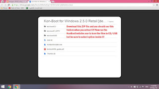
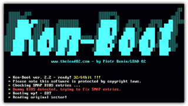
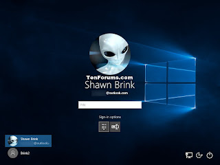

Hey there! What's going on? I'm here with a new post which basically shows you how to hack or get inside the PC/Laptop without knowing the password! Yeah, you heard it right actually without knowing the password.   
  
This trick works to remove the password from the system files in order to let you in without typing in password!  
  
**You need:**  
  

- A PC/Laptop with Windows XP/7/8/8.1/10
- A USB drive or CD 
- Kon-Boot v 2.5 for Windows
- Some brain! :)

  
**How to:**  
  

1. First of all, get an USB drive or CD to burn the files in it
2. After, you got CD or USB. Download the latest version of Kon-Boot [here](http://adf.ly/1akD9E).
3. Now, when you open the link you should go in the zip, download this zip and extract it and follow the instruction in given picture below.
    
    
    
4. Well, now you burned the files in CD or USB so it's time to test it!
    
5. Now, restart your PC/Laptop in which you forgot the password and when it restarts press F2/DEL to enter the BIOS. From BIOS set your first boot priority to CD or USB according to what you have.
    
6. Save to CMOS and restart and now it will show you to press any key to boot USB/CD before booting into windows.
    
7. Press the key and you should see a screen like this
    
    
    
8. Now, it will be boot into windows and you should see a screen like this 
    
    
    
9. Don't Panic! Don't enter anything just press enter and you're in.
    

  
**Enjoy the PC/Laptop once again without formatting anything! Thanks!**  
**Disclaimer: This is for educational purposes only. Please do not try to access other's PC in order to do anything. It's illegal!**  
**To prevent this hack, you need to add password to the BIOS. There's a way to hack BIOS password too. But don't worry it needs physical access to motherboard so it's little hard! Anyway, enjoy!**  
**See you soon in the next post!**
