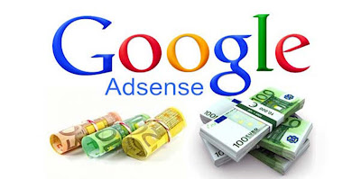
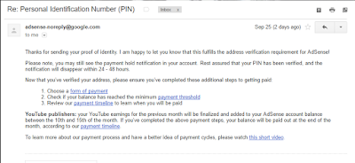

Welcome back to another post! Hi there! Today, we're going to verify the adsense account without getting the PIN? **HOW?** First of all, make sure you didn't get PIN by post at all the three attempts provided by Google. Now, there will be no attempt to request the PIN 4th time but they want you to fill and submit the form given by them [here](https://support.google.com/adsense/troubleshooter/1094206).  After submitting them your Government issued ID or Electricity Bill (Only if your exact location is mentioned in that bill). You will receive the mail within 48 hours or sooner. Here is the mail I received.

**What to do? If your Adsense account is on currently on different country and you're residing in different country and the country cannot be changed in Adsense?** **No proofs, No bills of your old address?** You need an Android Mobile and this [application](https://play.google.com/store/apps/details?id=app.bugbyte.fakeidgenerator&hl=en) to make fake ID with Address and other details! Boom! Now submit it for verification! Yup it works because I tested it myself! Thanks! Keep visiting!
