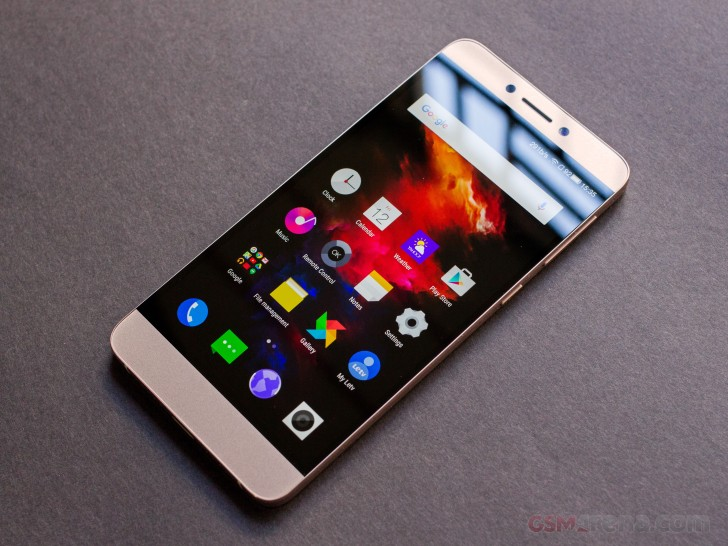

  

A Leshi Internet Information and technology company known as Letv (Before) and now as LeEco. It is one of major Chinese online videos company. They recently decided to appear in Smartphone sector and made few devices mainly budget but packs up all the flagships quality. This smartphone are not of the quality which China is know for that is copying. No, it's a premium device looking at it immediately gives you a price tag of or around Rs20,000 but it's just around Rs11,000. 
  
  

  

  

**Now let's take a look of its specification and built quality.**

**1\. Dolby Speakers and Sound quality.**

The loud speaker is placed at the right bottom of the phone unlike the Google Nexus 5 in which you may block speaker with hands or finger while holding it. The speaker are really loud enough to alert you in noisy environment making noise upto 86 dbm when tested. It gives out a sharp sound with light bass perfectly tuned. 

  

**2\. IPS LCD HD 5.5" Inch Display**

The display is just awesome to look at. Every pixel are nicely saturated with light contrast. It is Full HD at 1080 by 1920 pixels giving you a rate of 401 pixels per inch. The display is sharp and seems like OLED. But it's LCD thanks to it's clear black display technology. There's absolutely no bleed out from side when looking at black on white. It has a protection of Corning Gorilla Glass 3 confirmed by company on Le forums so no chances of scratches on that beautiful LCD though except sand.

  

**3\. Microphone**

A primary microphone located at the left bottom of the phone with dedicated microphone at the top middle records the sound at great quality. The voice from our side when calling is accurate and sharp to on listeners. 

  

**4\. Camera Quality** 

When it comes to camera it does a pretty nice job. It has a rear facing camera of 13MegaPixels and front facing camera of 5MegaPixels. It can capture enough details. However, pictures taken with flash are over exposed. Rest is all good. Front facing camera does a great job in good lighting condition however lacks while in low light condition. The beauty features in Camera app is awesome and you don't need to do edits and apply filters. Save you a lot of time.

  

**5\. Charging efficiency and Battery life**

Battery is big that can last 2 days if used only for calls and moderate texting app such as WhatsApp and not Messenger by FB (It's a battery hog). The battery capacity is 3000Mah and guess what? It gets charged from 40-100 in just 30 mins for me. I used the original LeTv adapter and Original LeTv Cable for charging, so thats 60% of juice in just 30 mins. It has fast charging option but you need to be a colder country or in air conditioned room as the battery gets hot if enable. Without enabling it also does a good job. Thanks to it C-type USB cable.

  

**6\. Sensors**

All sensors are implemented into it for daily uses such as Compass, GPS, Proximity and much more. However, there is no support for Gyroscope maybe due to it's budget price. So say No to VR(Virtual Reality).

  

**7\. Processing speed and RAM along with User Interface**

The processing speed is much faster than expected from such a budget device. It packs a Mediatek Helio X10 processor which has 8 cores clocked at 2.2 GHz. The multitasking speed is much faster due to the LPDDR3 RAM and that's too 3GB. WOW! It does operation very smoothly also thanks to its emmc 5.0 Storage. 

  

UI in this phone is known as EUI. The latest EUI 5.8 is based on Android Marshmallow. However, you can't feel the real Android M as you can on Nexus Devices. EUI is just smooth and lightly themed with many customizations. It is based on iOS the major mobile OS by Apple. 

  

**So here is the end of the list. Purchase it right now here at [Amazon](https://www.amazon.com/Letv-Unlocked-Android-Smartphone-MediaTek/dp/B00WQYF2H4) 32GB starting from $249 and 64GB starting from $419.**

**Grab this phone in India at much cheaper price at just Rs11,000/-**

**[Chinese Version(Eco/x509)](http://www.amazon.in/LeEco-1s-Eco-Gold-X509/dp/B01IKA0PXI/ref=sr_1_3?ie=UTF8&qid=1476424641&sr=8-3&keywords=letv+le+1s)                 [Indian Version(x507)](http://www.amazon.in/LETV-1S-X507-Gold-32/dp/B01FOLB8RS/ref=sr_1_4?ie=UTF8&qid=1476424641&sr=8-4&keywords=letv+le+1s)**
