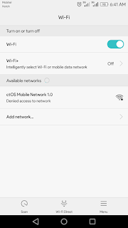

Hola, everyone. Welcome to Emad's blog.  
  
Today, we'll take look at the Huawei Devices such as Huawei P8 Lite, P8 and other such devices having issues with Wi-Fi.  
  
Are you facing this same issue in the picture given below? Then you're at the right place!  
  

  
**To fix this issue:**  
Make sure you've done the following before if not then try it, your luck may work sometimes.  
  
  

1. Restart your Phone and Router. Now, check if it fixes it. 
2. Go to recovery, then Wipe Cache. Reboot and see if it fixes.
3. Go to recovery, then Factory Reset your device. Now, check if it fixes it.
4. Remove your SIM Card tray and try connecting your Wi-Fi. Check if it fixes or not?

After checking all above and neither one of them fixes your device then it is Hardware issue. It's now the time to change the Wi-Fi IC board on your device.  
  
Contact Huawei Customer support nearby or visit nearest repair shop.  
  
You can also fix it yourself. Order your device IC board online and use iFixit guide available online to replace it.  
  
Thanks for reading!
