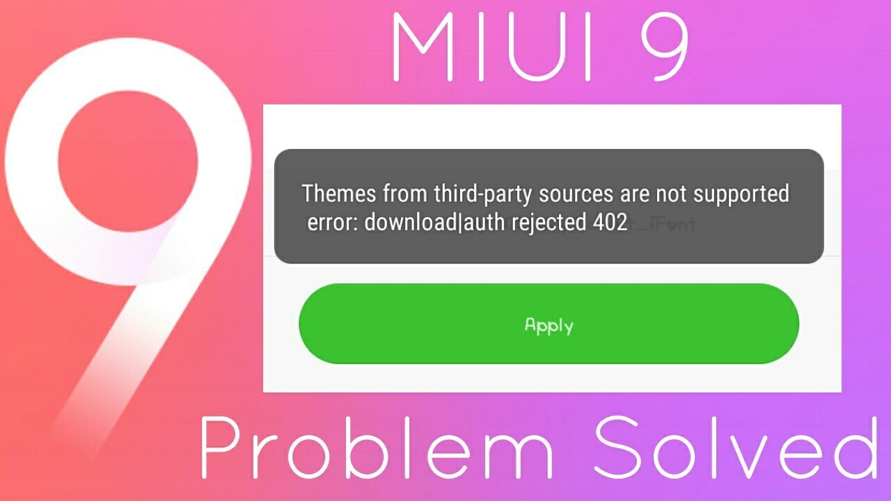

Welcome to Emad's Blog. Today in this article, we're going to learn how to fix third-party error on **Mi Theme Store.** 

Recently I downloaded the amazing iPhone X theme for Mi Note 4 and I imported it to find this error. I spent a couple of hours searching for the solution and finally fixed it. I decided to share it with you guys as very less source are available to fix this issue.

  

The message popped up while applying imported theme was like this:

  

(Not my picture, credit goes to respective owner)

  

  

**You need:**

1. [Mi](http://mi.com/) Device
2. [Mi Theme Editor](https://play.google.com/store/apps/details?id=com.mixapplications.miuithemeeditor&hl=en) by _MiMixApplications_

**How-To:**

1. Download the required theme from the internet. Here's the [iPhone X](http://en.miui.com/thread-858584-1-1.html) theme I'm talking about.
2. Now, open **Mi Theme Editor** and click on _Browse_ to select the theme you downloaded in step 1. 
3. After selecting, save the theme with your own name to your desired location. 
4. Now, go to **Mi Themes** and import the theme you saved in step 3.
5. Apply the theme and enjoy!

  

Sharing is caring! :)
