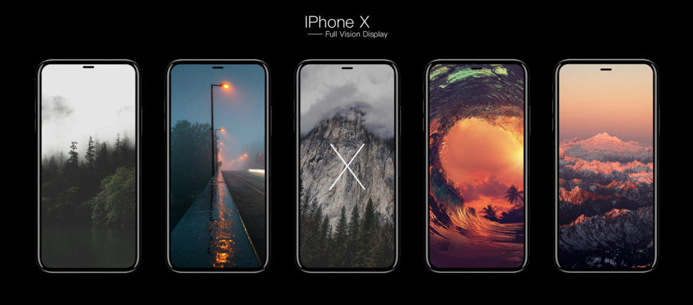
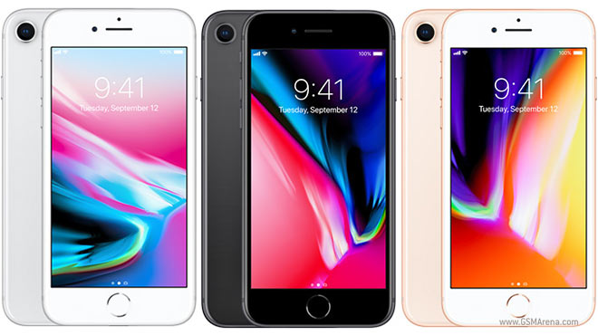
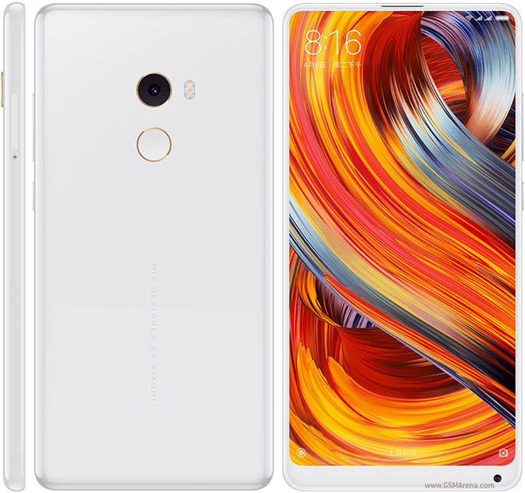

Cannot decide which smartphone is for you? In this article, I will listing the top 6 smartphones 2017, you should consider buying. I compared a huge list of smartphones and come up with my list. I love smartphones and maybe you too, but there are so many of them out there and you may get confused about which to buy. Well, I'm here to let you decide. Fill the comment down below about the smartphone you decided to buy and why!

Here in this list, I spent a couple of hours to make this top 10 list and in no way, it might not let you decide which phone is better for you! Let's start with #1.

## 1\. [iPhone **X**](https://amzn.to/2D60Up6)

It features a gorgeous display you can't resist. If the display matters you the most and basically loves Apple then what are you waiting for? Grab [iPhone X](https://amzn.to/2D60Up6) now.

**Budget**: $1000-$1100

## 2\. [Samsung Galaxy **S8**](https://amzn.to/2KpJFVR)

Android fanboy and love OLED edge displays? Well, here's the [S8](https://amzn.to/2KpJFVR) you might want to get.

**Budget:** $720

3\. Google [**Pixel 2 XL**](https://amzn.to/2uVZzMX)

A premium segment by Google. Amazing low light cameras packed with fresh and bloatware free fast updates Android. Get [Pixel 2 XL](https://amzn.to/2uVZzMX) now.

**Budget:** $649/64GB, $749/128GB

## 4\. [iPhone **8**](https://amzn.to/2D5RGt2)

**Budget:** $699

## 5\. [Xiaomi **Mi Mix 2**](https://www.amazon.in/Mi-Mix-6Gb-128Gb-Black)

**Budget: $**680

## 6\. [OnePlus **5**](https://amzn.to/2UL3Ilz)

**Budget:** $500

Disclaimer: All the above pictures used doesn't belong to me. All rights to the respective owner.  **Thanks for reading. Have a nice day.**
