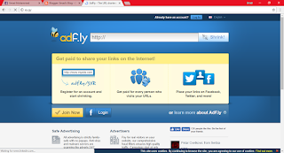

Hola everyone! Welcome to my blog. Hope your day is already going better? Take a seat and today we're going to talk basically on issues of Adfly here in India.  
  
Recently, while logging into my Adfly account I noticed that Indian government literally blocked it. Here is the screenshot of it just in case you wanted to see how it looks like.  
  

  
I was now searching a way to unblock it without actually using those free shitty VPN or proxy which slows down your internet and requires you to go through many steps to connect VPN every time. It sucks at least for me.  
  
After a long search online here and there, I found a better way to access [Adf.ly](http://ay.gy/) without actually using proxies or VPN. The trick is very simple as you just need to change the web URL of it. The actual URL is https://adf.ly and you need to change it into [https://ay.gy](https://ay.gy/) to access adfly without any hassle.  
  
Have a look here at this screenshot. Isn't it simple?  
  

  
Try it now and enjoy! If you like my article, subscribe to us and read my other articles as well it might be useful for you. Thanks and keep visiting us.
