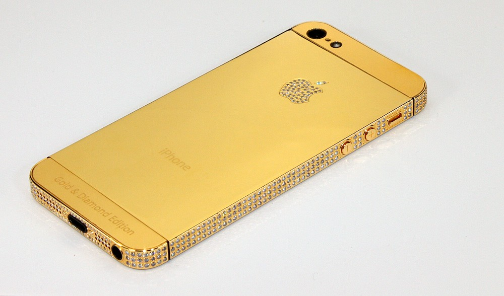

Hola everyone! Welcome to Emad's blog.  
  
Is your iPhone working slow? Lagging a bit? The performance it was giving you before is now not the same? Then you're at the right place. Today, I'm going to discuss about this issue and it's fix in this article.  
  
In some of the news, we came to know that Apple intentionally slowing down iPhones. But to some extent it might be true but as of now it isn't.  
  
The main culprit in the iPhone is battery. The battery in the iPhone ages in about 2-3 years and might be needed a replacement. When the battery doesn't get a replacement it's capacity is decreased gradually. Due to the decreased battery capacity, the CPU itself look up onto this issue to safe more juice and get itself under clocked to some speed other than maximum factory set speed.  
  
**FIX:** You just need to check if your CPU is under clocked at lower speed. If yes, then get your battery checked and replaced. It will work faster than before.  
  
  
**My Full Story:**  
I bought my iPhone 5S 4 years back. It was not performing up to the mark on iOS 11 but my friend's iPhone 5S was working just fine. I thought to check up the CPU cores, and fired the AIDA64 (Available at AppStore). I figured out that my CPU which Apple's A7 doesn't increase it speed more than 700MHz even though I was running several apps at a time in background. Therefore, I took it for a replacement of a battery. Got my phone back in a day and again fired the AIDA64 and boom the CPU speed is now goes to 1.3GHz. The fluid smooth iOS is working as expected. iOS 11 is now no more slow on iPhone 5S.  
  
  
  

  
  
  
Thanks for reading up my post. I'm hopeful and make sure that you don't waste your precious time and gained atleast some information from my posts. If you really enjoy the stuff, head up sometime again to look up new stuff here.
