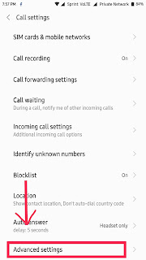

Hola everyone! Welcome to Emad's blog and in this article will be on how to change the incoming call background in Mi devices or any device with MIUI ROM.  
  
Let's begin. I will provide you a tutorial step by step to change the background of incoming calls.  
  
  

- Go to your **Dialer** from homescreen.

- Now press and hold **Menu** button which is left to the home button to enter settings. It looks like this. Now go to **Advanced Settings.**

- After going to Advanced Settings. You'll see something like this.

- Go into **Incoming Call Background** option and select **Lockscreen Wallpaper** from Default.

You can now change the Lockscreen Wallpaper which will be also your Incoming Call Background. 

  

Thanks for reading. Hope you like the article. If you wish to write on my blog, enquire from me at my [email](mailto:blackcommando36@gmail.com).
