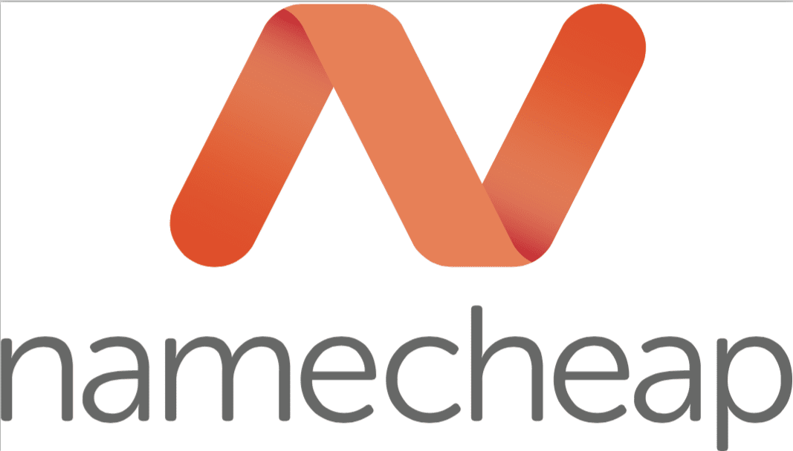
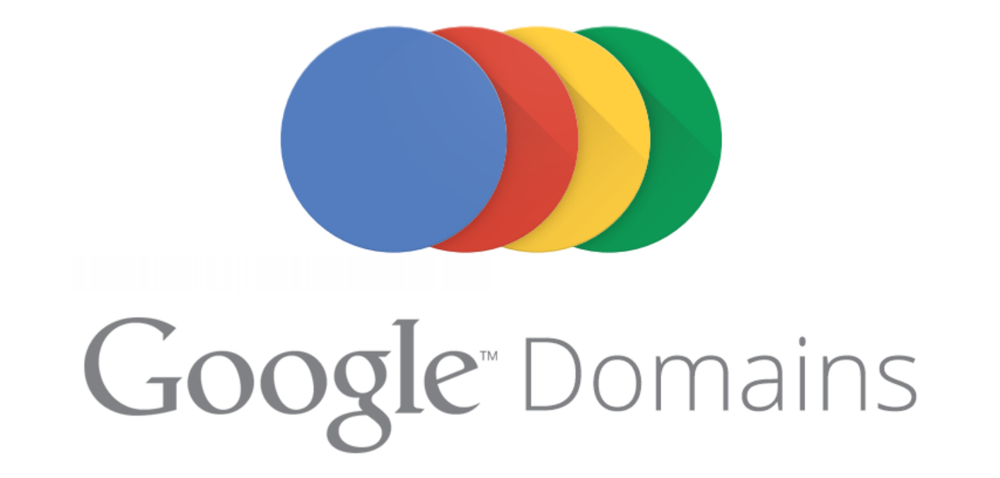

Hola everyone. What's up? Hope y'all doing fine. Today in this article we're going to talk about some top domain registrars. So folks, stay tight and check what's right for you!  
  
Starting from the number 1, we have the list goes as follows:  
  
  

- [**GoDaddy**](http://www.godaddy.com/): To be honest, it is one of the best domain registrars at least according to me. The servers are much more reliable, the price is affordable and their customer service is just hassle-free.

  

- **[NameCheap](http://www.namecheap.com/):** Another great domain registrar here. Namecheap has some great features to be noted hence 2nd in the list. Top notch hosting, easy interface and premium DNS.

/Namecheap-Web-Hosting-Review-56a6d0575f9b58b7d0e4ee18.png)

- **[GoogleDomains](http://domains.google.com/)** BETA: It has some of the unique features such as easy site creation with some reputed online website designing sites like Wix, Weebly, and Squarespace.You also get customisable sub-domains, new domain ending and private registration with no additional charges. The price falls under average.

  

Thanks for reading and spending your valuable time on my blog. Keep sharing as sharing is caring.
