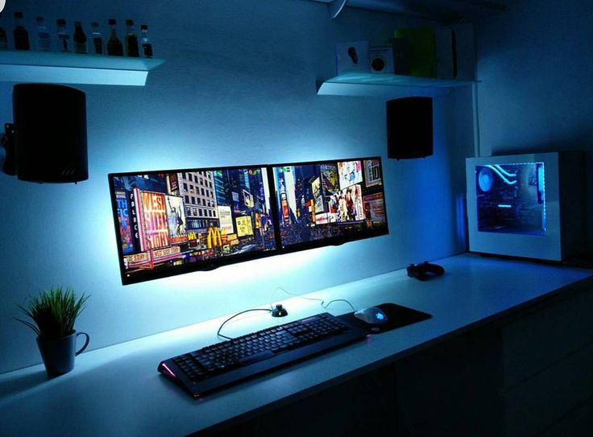

Hello there! It's a pleasing night here after all or say slightly foggy weather. Hope you're all doing fine.  
  
After a tons of request on how I made myself better at computer skills and basics I decided to write an article on it to help you out guys! Well, in modern world we've lot of our needs to be done on the computers. You can find thousands of things which are mainly done on computers. Now, we all use computers for making our work easier, faster and more accurate. Isn't it? But we should know that computers are man made and they also gets aged as we get day by day. It starts to give you errors on daily basis. There are again several reasons for the errors you might be getting while working on your computer making your work easier. For example, it might be related to either **Hardware & Software.**   
Above, Hardware relates to Physical component damage while Software relates to Operating System errors or applications error. Here, I'm trying to explain you that you must be knowing how to troubleshoot this simple errors on your own as we don't need to call a technician or someone better than you at computer basics to fix it for you. Computers are increasing and we are dependent on them on a larger ratio.  
In this article, you'll be able to learn a basic amount of knowledge about troubleshooting your own Personal Computer / Laptop on a regular basis. I'm going to specify some of the common errors which will initially help you recognizing the error. Also, I will be covering all the things you should learn or practice in the year 2018 to make yourself go with the today's technology flow. You know what I'm talking about right? There are many elder people asking me for the help they get with there Computer/Laptop and that will be actually easy to troubleshoot yet they aren't familiar with it.  
  

<table align="center" cellpadding="0" cellspacing="0" style="margin-left: auto; margin-right: auto; text-align: center;"><tbody><tr><td style="text-align: center;"></td></tr><tr><td style="text-align: center;">Setup by&nbsp;<complete>@tetygfx from Pinterest</complete></td></tr></tbody></table>

  

### **What are some Basic Computer Skills?**

A set of skills that helps us to work on computer effectively with higher speeds. It is required not only for the programmers, coders or say anyone who have work on Computers but everyone living in 21st century as of 2018. It includes **Microsoft Office, Typing Skills, Emails, Social Media skills, Basic Troubleshoot of Errors, Graphic Design & Editing on various sectors (Video & Images).**  
  

### What is the invaluable skill you can learn first?

**_Typing_**. 

Most of the work is done by typing. It is necessary everywhere. Preparing a worksheets? Entering some data? Searching for a file on your Computer? Writing an Email to your Boss? Texting your girlfriend on a date?

Well, you need this skill or else you will end taking so much time to do it as we all know time management is one of the most important management of life.

Remember, you're never too late to learn things. You can start all from scratch right [here](http://typingmaster.com/). (Click on pink text where it will take you learn this invaluable skill called _Typing_).

  

Have a nice day learning how to type!

  

### What are some other skills that I can learn to use computers effectively?

- **Microsoft Office:** You should learn to use the products of Microsoft Office which includes Spreadsheet, Word, PowerPoint, etc. It helps you in making Spreadsheets for making your work easier or say organized. Word will help you in letter writing with its amazing formats and tools to work with and on the other hand Powerpoint will help you in making some of the finest presentations for your lecture or meeting. It is also an invaluable skill you can learn within a good and short amount of time. You won't have a hard time to learn it as Microsoft itself is looking ahead to teach you about their products. Visit to their [training center](https://support.office.com/en-us/office-training-center).

  

- **Video/Graphics Editing:** When you're planning on to become an editor, creators of some videos or effects such as YouTubers today. This skill is a must. You can save up some money instead of spending on your Channel Logos, Editing of footages, etc. To edit videos, I recommended to use _[Sony Vegas Pro](http://www.vegascreativesoftware.com/)_ as a beginner, while for the images I mainly recommended you to use [Adobe Photoshop CS6](http://www.adobe.com/in/products/photoshop.html) (You may heard of it). These skills are not easy others but are surely worth it.

  

- **Emails:** Sending Email is often used widely across the world. All are familiar with the word Email after the letters. Email is actually a means of communication on a commercial basis. It is now used for marketing. Now, you should be using it for your personal use such as typing in request for a leave to your company's manager or introducing your friends to an amazing application you've ever used. Are you not confident enough to write to your manager or boss? Well, maybe Grammerly can help you out in writing a professional looking Email.

  

### The basic Troubleshooting of slow Computers/Laptop?

  

First of all, there are many cases when one feels that there computer is actually working or operating slowly in a while. They all wonder, what might be the issue? Should they take it back to the shop to repair it? While most of the issues that makes your computer slow is easy to fix. Here are some of the things that might be messing with your computer speed!

  

1. In most cases, restarting your computer might restores its speed. It happens when your RAM stores more programs running and has no space left for further processes hence making your computer a bit slow. In this case, you might need to run the program you only work on and close all unnecessary programs to make your computer work faster.
2. Slowing down of Computer is also caused by the less Disk Space. Check your Drive for unnecessary files and remove it accordingly to free up some space as well as to speed up your computer.

  

### An effective way to remove Virus from your Computer/Laptop

A virus is the thing that comes from unknown files or internet in your computer secretly and does its bad stuff such as **Secretly Stealing your Information, Displaying Ads unknowingly, Replacing  or deleting your files or even locking your PC and ask for money to unlock it.**

A virus are categorized under many different names such as Adwares, Malwares, etc.

  

_Did you know?_ 

_The top dangerous viruses of all time has the following names!_

1. _ILoveYou_
2. _Melissa_
3. _My Doom_
4. _Code Red_
5. _Sasser_

#### How to remove any kind of virus from your Computer/Laptop?

Yeah, don't worry. It's pretty easy. You just need to download the software I'm providing here and open it to scan the virus in your computer and remove it by just one click. How simple is that? It also makes your PC run faster by removing all those **Unexpected ToolBars**, **Extensions, Useless software displaying Ads, etc.** 

Download **[AdwCleaner](https://toolslib.net/downloads/viewdownload/1-adwcleaner/)** now and make your PC/Laptop run faster than ever before.

  

  

### Gaming?

How can I miss this topic? Everyone from Students to Adults love games. It help us to entertain as well as refresh us. Some plays heavy games while other enjoys light 2D games.

  

Some of the people out there always wonder why I can't run up the particular game? It doesn't work at all? Why is it so?

  

It's all about Hardware currently your PC/Laptop is built in. The time you get laggy gameplays, it's settled that you need to upgrade your PC/Laptop. To run heavy games with amazing graphics such as **Assassin's Creed: Origins, Need For Speed: Payback, etc.** you need a Graphics Processing Unit installed. It is also called GPU in short. 

  

Thanks to amazing internet and great developers around the world, now you can check whether if your PC/Laptop can or able to run the game you're thinking to purchase.

Visit [Can You Run It by SystemRequirementLab](https://www.systemrequirementslab.com/cyri) to officially check if you can run the game on the current PC setup.

  

Thank you all for reading and that's it for today! Show us some love by Sharing, and commenting down below on what you think about our Blog and how we should be improving it. All comments and shares are appreciated. Well, we'll see you again in another article coming soon!
