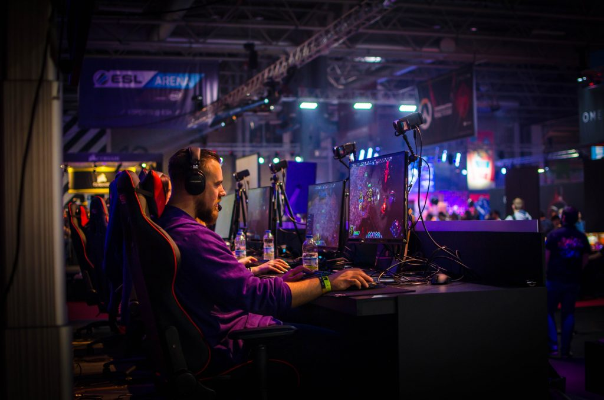
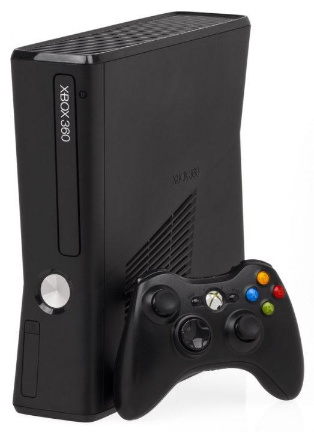

Yay! Whats up! We are back with another article and trust me this gonna help all the **Gamers** out there. What would you think when it come to games? It must be either a Gaming Console or the PC/Laptop. Are you able to distinguish properly between them and see what's right for you? It is pretty much sure that you'll have a hard time selecting one for you. Therefore, I decided to clear your confusions up and let you decide which you must go for.

<table class="wp-block-table aligncenter is-style-regular"><tbody><tr><td></td></tr><tr><td><strong>Gaming PC</strong></td></tr></tbody></table>

## VS

<table class="wp-block-table aligncenter"><tbody><tr><td></td></tr><tr><td><strong>Xbox 360 Console</strong></td></tr></tbody></table>

Let's begin the war. We will give you the pros and cons of both of them and will leave the decision on you. It's your choice now whether you go for a console or the PC.  

### Gaming Consoles

#### Pros:

- You never need to upgrade it as frequent as PC. Once you own a console, then it works for years.
- You never need to worry about other things such as updating software frequently as MAC or Windows need on PC.
- No complicated controllers like Mouse+Keyboard which is big hassle for many users. A simple joystick does it for you.
- You can enjoy the offline multiplayer with your siblings with ease.
- You can play games upto 4K if the game supports. 
- It takes less space in your room. 

#### Cons:

- You must buy a TV which can cost a fortune if you want to get all the performance from your console. 4K LED or OLED is the one you'll must probably go for.
- The Game DVD's can also be expensive when it comes to console if you're willing to play online and don't want to jtag your console. (You can spend and buy console for PC too)
- You cannot enjoy the browsing internet like you do on your PC. If you're a YouTuber then console is not your thing.
- Limited Storage and not customizable as per your preference.

### Gaming PC/Laptop

#### Pros:

- You don't need to always buy game. You can have fun with cracked exe's and ini files and enjoy the game. The PC version of the game also seems better.
- You can browse internet seamlessly and edit your recorded game plays.
- You also don't need to buy any other game play recording stuff. A software would do it for you.
- It helps you customize your graphics and upgrade your system according to your preference.
- You can give a new look to setup by assembling two or more monitors as per your preference.

#### Cons:

- Keeping an eye on virus, updates and various other things can be hassle for many people.
- It covers more area in your room.
- Gaming Computers need better cooling. Your room should be equipped with good ventilation.
- Not portable as console. 
- They make big hole in your pocket as they cost fortunes.

Now it's time for you to decide whether you're going for **Gaming Console** or **Gaming PC.** Let us know what you will opt for and why you did it. It will help us in various ways. An experience of other people always help us as a type of an advice.  

If you like our blog, share it. Sharing is caring and we hope you care. Spread it like fire and we'll see you again in another post. We are happy to introduce our new subscription in which you'll be able to know about our new post via E-mails. Thanks for reading and have a nice day!
