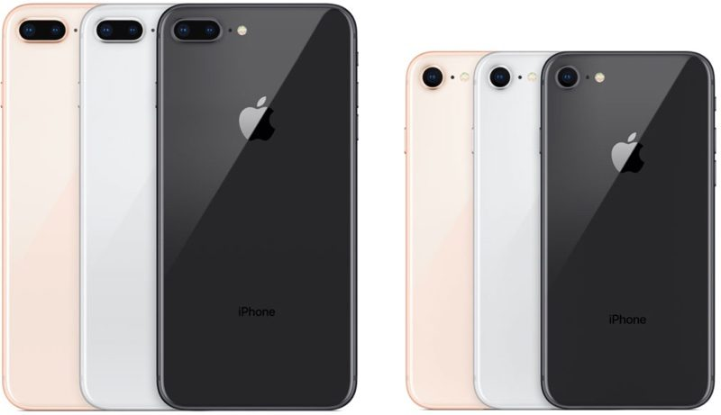

Hola, and welcome to Emad's blog. Today in this article, we'll discuss 5 things about the Apple's iPhone 8. This article will help you in deciding whether to you buy and will also list some of the importance of this device. This device went underrated when the new flagship of Apple's called iPhone X (Pronounced iPhone 10) released.  
  
Here have a look at the shiny and purely glass built iPhone 8 and I will discuss those 5 things followed the by the pictures of it. We get iPhone 8 Plus on the left and iPhone 8 on the right. However the difference is just camera as you can see.  
  

  
Beautiful isn't it? But don't underestimate its power of handling and its capabilities. The more beautiful it looks the more power it has.  

<table cellpadding="0" cellspacing="0" style="float: right; text-align: right;"><tbody><tr><td style="text-align: center;"></td></tr><tr><td style="text-align: center;">(Picture Courtesy:&nbsp;<a href="http://theverge.com/" style="font-size: medium;" target="_blank">The Verge</a>)</td></tr></tbody></table>

  
**5 Things You Should Know About iPhone 8:**  

1. iPhone 8 as well as 8 Plus both have a **True Tone** technology which makes use of 4-channel ambient light sensor to capture the perfect white balance as well as the colour temperature of light around you giving you a best natural looking shot. I've provided the sample of picture.
2. Apple claims that they redesigned the speakers on iPhone 8 and they are now 25% louder that what you get on earlier iPhones. Despite, of headphone jack it is a great feature.
3. Apple's New A11 bionic chip run faster than ever before. It processes much faster and is able perform heavy task with ease. However, it's a 6 core CPU combined with Apple-Designed 3 core GPU which helps you in playing 3D games.
4. Wireless charging which was previously missing from whole iPhone segment. It is big plus for many users down there in this world.
5. Lastly, the Apple's True Tone display. The pixel counts are amazing and looks so soothing to eyes. 

  
Hope you guys like it, don't forget to share and leave a comment on this article.  
Thanks! Have a nice day!
