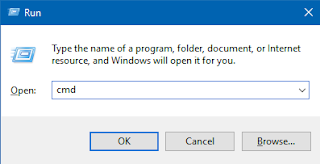

Yo What's up? I'm back here with another article. Thanks for all the love from your guys, Keep sharing and help me grow. I'll keep posting great stuff regularly from this year.  
  
Today, we will be looking at some of the mind-boggling tricks you can do on your Microsoft Windows. It will also come handy in many cases as we all somehow need to work on computers everyday. You can also learn it to impress people up. Umm, that sounds good right? Well, that's enough and let's take a look at some of them.  

#### 

- Change Windows 7 & 10 Password without knowing old Password

Forgot your password and you're still logged in? Just right click on _My Computer/This PC_ and select _Manage._ Now, on the left click on _Local Users and Groups_ and then you can see _users_ in drop down. After clicking _user,_ Select the user you want to change the password for and right click on it and then click _Set Password._ It will open a dialog box where you can set a new password. 

#### 

- Put Password on your Pendrive or Local Disk

This is pretty simple. You just need to put in the Pendrive if any or just go to _My Computer/This PC_ and select the drive you want to put password on. Now, right click on it and click _Turn On BitLocker_ and follow the steps in the dialog box. Make sure to remember your password to not risk your data inside it and save the key in a safe place so that you can access it when you forgot your password to the drive.

#### 

- Make undeletable folder to surprise your friend

In this, all you have to do is  run Comman Prompt. Pressing a short cut on keyboard which is  "_Windows Key + R"_ to open Run dialog box. Type in _cmd_ to open Command Prompt. Now decide the place you want to create folder in for example you want to create it in Local Disk E then the type "E:" without quotes in cmd.

  

  

After that, type this command to create an undeleable folder in Local Disk E. Note that you can't make a folder in System Drive that is C in most cases. You can now create an undeletable folder by typing in command "md con" without quotes and enjoy.

#### 

- Keyboard Shortcuts which can save you a lot of time

1. _Windows Key + D:_ It quickly switches to desktop by minimizing everything you're doing. It gets handy specially when someone comes to peek at your work. :)
2. _Fn/Alt + PrtSc__(Print Screen):_ It helps you to take a screenshot of current window and copy it. You can paste it in Paint application and save it to share.
3. _Shift + L:_ It locks down your computer to a password screen. Is someone calling you downstairs? Well, press this and go to avoid any intruders sitting and messing your work up on your PC.

#### 

- Hide any folder on your Computer

This trick come handy many times. If you want to hide your folder then you just need to right click on the folder you need to hide. Now, select Properties and find attributes section and tick the Hidden box. Now, go to _My Computer/This PC_ and in the upper tab select View and untick Hidden Items to hide the folder. If you want to see the folder again, then go to View and tick Hidden Items.

  

  

Hope you like it. Show us some love by sharing it. We appreciate the feedback you give us, Don't forget to share your thoughts in the comment box below.

  

We're also looking for writers to post their content on our blog. Contact us for more information.
