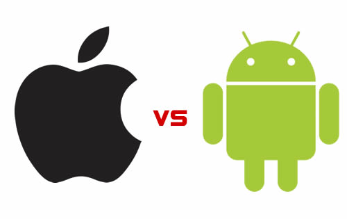

Hey there! Are you not able to decide what applications to install on your new device you purchased? Well, here are some applications which you can install on your device to make full use of your new smartphone. Note that, the application listed below are both for [iOS](https://www.apple.com/in/ios/ios-11/) and [Android](https://www.android.com/). In this article, we're also going to list the applications as well as their various functions to make sure you can chose if you really need it or not.  
  

  

  

#### 10 Useful Android/iOS Applications for your device:

1. Parallel Space **\[**[Android](https://goo.gl/xiacB8)**/**[iOS](https://goo.gl/WAwrMw)**\]:** It is now compatible with latest Android 8.0 (Oreo). This app is very useful for people nowadays. It helps you in managing multiples account of every single social networking applications such as WhatsApp, Instagram, Snapchat and so on. Not only, social networking but also Games like Clash of Clans, Clash Royale, and  8 Ball Pool. It is one of the best cloning application on Google Play Store.
2. Gboard \[**[Android](https://goo.gl/nbqLue)/[iOS](https://goo.gl/yMwBEQ)\]:** We all need want the better keyboard for better typing experience. The better the keyboard, the more we get interest in typing. Typing is a most for every smartphone users. All the applications make use of it. Here is the best Keyboard application which is better and stable in all cases. It is also slightly customizable as per your need.
3. TrueCaller \[**[Android](https://goo.gl/rgJMHq)/[iOS](https://goo.gl/wPwB7i)\]:** Another great application for daily use. It is the most advanced and popular Caller ID recognition application on the stores with over 500 Million downloads (Play Store). It also includes several feature other than recognizing the caller such as blocking all the Spam number near your area and spam messages. It is the must download application for all the people out there so that you never need to attend a spam call.
4. PicsArt \[**[Android](https://goo.gl/44nFXo)/[iOS](https://goo.gl/EZm8fs)\]:** Who don't do editing? Who doesn't want it? All of them wants to look good in picture hence the editing of pictures come handy but what you should do when you want to edits pictures right away even offline? This app will definitely take its turn in advanced picture editing with a simple User Interface so that even everyone can use and learn it on the go. Grab it now and make yourself look beautiful. This app also tends to be a Collage maker. A Bonus point for all.
5. SHAREit \[**[Android](https://goo.gl/7AVQwQ)/[iOS](https://itunes.apple.com/us/app/shareit-connect-transfer/id725215120?mt=8)\]:** A great sharing app developed by Lenovo. Every other friend have great video, songs or movies to share. They're even much bigger to be send over Bluetooth. In this case, the app SHAREit comes in use. It uses our WiFi to create hotspot and transfer files at high speed over WiFi. The speed goes maximum upto 60MB/s. Well, that's pretty amazing speed. Isn't it? Keep this app in your smartphone so that you never need to waste the time again sharing huge files over bluetooth.

  

**Disclaimer:** No paid promotion is done for this article. It is solely based on my personal opinion.

  

Hope you guys enjoy reading it. Keep visiting us for more stuff like this. Also make sure you subscribe to our Newsletter so that we can sent you our latest post right away on your Email. If you like this article, then share it out as sharing is caring. Thanks for visiting Emad's Blog. We appreciate your feedback and we're always looking ahead to improve our blog. Leave your comment down below on what you think we need improvement.
