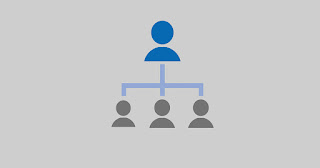

Are you tired of looking for ways to earn money online? Are you not enough satisfied for what they pay for your work? Well, here in this article we'll be gathering all such information of earning money online efficiently. We will be covering the most successful ways in which one can earn money for their work and that too they actually loves doing that work. It's a passion we can say that makes you love your work. This work can be actually turned into money.

 

## Getting your own Website/Blog for Beginners?

Nothing can be grown easily or say without working on it. One must work on it to grow it. You must be investing your work in it so that it can return you later. Earning money online is a great deal but it is not certainly for everyone. We'll be covering how to buy a website or blog of your own where you share your work. This work can be anything of your interest. For example, if you're willing to share own created anecdotes with your friends and public out there then you can start your own anecdote blog and share on it.

As I said above that nothing can be grown easily without working on it, therefore I recommended for beginners to start from scratch and chose free blogging websites out there where you can create your own Blog/Website with their subdomain and check if it suits you. Some of them that offer these services are [Blogger](http://blogger.com/) and [Wordpress](http://wordpress.com/). Blogger tends to be much friendly with beginners while Wordpress has great customisation abilities. All you have to do is sign up for this service and start up the blog or website on your own and start posting. Once you reach a good amount of traffic and satisfied with what work you do on your blog then you can opt for a custom domain and make it look professional. Time to invest in it.

### Buying a Custom Domain and expanding your Website/Blog

Buying a custom domain is spending some amount of money. You also need money for hosting. Hosting means the storage where your Blog/Website is stored. You pay for it monthly. Before investing this amount, make sure you're into blogging or whatever you do is fine for you. You must be sure that you will be able to stand out in these and can get something in return. Here's where you can buy your first custom domain.

- [GoDaddy](https://www.godaddy.com/)
- [NameCheap](https://www.namecheap.com/)
- [Bigrock](https://www.bigrock.in/)

And here are some great hosting plans

- [Hostgator](http://hostgator.in/)
- [BlueHost](http://bluehost.com/)

If you need all the combo pack, where you get Domain + Hosting then try one of those

- [Wix](http://www.wix.com/): It appears to be a great tool online which help you make one of the professional looking websites for you in no time and that too without coding. It offers premium combo packages with different prices. Also, it has integrated tools to edit your site in your way and many themes to select from. 
- [GoDaddy](https://in.godaddy.com/offers/web-hosting/best?isc=hos1in77&mkwid=sntlrMWuM_pcrid_243747839501_pkw_hosting_pmt_e_pdv_c_&gclid=CjwKCAiAqvXTBRBuEiwAE54dcJ_tyfV9j7EL7otkE7AEneyT0901Iy2aQlDuR3X7KSwSmFXbB1Q2wxoCDk0QAvD_BwE): Again, it provides hosting with a free domain and starting from the only RS99/Mo.

Once you get your own hosting and domain then you can choose the Engine to post on your Blog regularly. The most used one is Wordpress. It has a great User Interface and many customization abilities. If you're also good in Php then you can post it without these engines.

## How Advertisement helps you in earning money? What is the different Advertisement network that pays you much more CPM rates?

Ads. You see it everywhere nowadays! They are categorized into Banners, Pop-up Ads and Pop-Under Ads. Every advertisement network pays differently and it is measured every day with a new unit called **CPM.** 

Now, let's talk about money. CPM plays a major role when it comes to earning. CPM is a rate for 1000 impressions of the ad on your site. Suppose, the ad's CPM on your site is $2 then if you get 1000 impressions on this ad you get a $2 in your earning.

There are very fewer Advertisement Networks that pay you higher CPM rates and they require a good amount of quality traffic before they can accept your approval. Although, there are many other networks which provide with better CPM rates too. Below is the link where you can find both low CPM rate but high acceptance rate networks while others have high CPM rate but low acceptance rate networks.

> [Top 10 Highest Paying Advertisement Networks](https://sastaeinstein.com/2017/03/top-10-highest-paying-ads-network-for.html)

## Maximizing Your Earning by Affiliate Networks

You can't just rely on Advertisements on your blog/website to earn money. Ads rate changes every day and we can't really earn our living by it. You need to maximize your earning with some affiliate networks out there. 

### **Are you wondering how these affiliate networks work?**

Well, there is no rocket science here. In this case, you just convert your traffic from your blog/website into money using these networks. This is called Affiliate Marketing. Suppose, your blog/website deals with Smartphones then you can sign up for big E-Commerce affiliates such as [Amazon](https://affiliate-program.amazon.in/), [eBay](http://pages.ebay.in/affiliates/affiliate-offers.html), [Flipkart](https://affiliate.flipkart.com/), and so on. They pay you commission in respective percentage when order is placed by any user using your link.

Very soon, I'll be covering some of the best Affiliate Networking sites in my next post. Stay tuned and if you really like this post then go on, share it with anybody out there.
