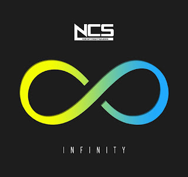

**Beats Drop!**

Hey, today I'll be sharing some of the best work by [NoCopyrightSounds](https://soundcloud.com/nocopyrightsounds). When it comes to YouTube Videos many are actually worried if they can use songs without getting a copyright strike. The thing is you should check whether if the song you're using in the video is copyrighted if yes, then you need to get permission from the owner or the person who owns the rights to the song.

The main thing is that some songs can be included in the video by giving the rights to the song owner by mentioning it either in the video or description that you don't have rights to it and all rights belong to their respective owner(s).

Anyway, some people don't want to take the risk as it can be a great loss too. The copyright strikes can even ban the YouTube Channel and that's when the NoCopyrightSound \[NCS\] comes to the rescue.

#### Collections of NCS Music for your YouTube Videos or Background Music:

**Note**: _Everyone works hard on something to achieve. Take some time to give credits to them in your Video so that other people should also know their work._ 

**Note 2**: _Use [Mp3Converter](https://www.mp3converter.net/) to convert the NCS Music Video into Mp3 and use it in your video or use the link provided by NCS in their description._ **_#1_** 

<iframe src="https://www.youtube.com/embed/yJg-Y5byMMw?rel=0" width="560" height="315" frameborder="0" allowfullscreen="allowfullscreen"></iframe>

**_#2_** 

<iframe src="https://www.youtube.com/embed/n4tK7LYFxI0?rel=0" width="560" height="315" frameborder="0" allowfullscreen="allowfullscreen"></iframe>

_**#3**_ 

<iframe src="https://www.youtube.com/embed/gDwVGS75sUA?rel=0" width="560" height="315" frameborder="0" allowfullscreen="allowfullscreen"></iframe>

**#4** 

<iframe src="https://www.youtube.com/embed/LHvYrn3FAgI?rel=0" width="560" height="315" frameborder="0" allowfullscreen="allowfullscreen"></iframe>

**#5** 

<iframe src="https://www.youtube.com/embed/3nQNiWdeH2Q?rel=0" width="560" height="315" frameborder="0" allowfullscreen="allowfullscreen"></iframe>

That's it, guys! Please make sure you spread the words and love with other people too. It will help us reach more people out there and peace!

Enjoy the Music. Love Love!
