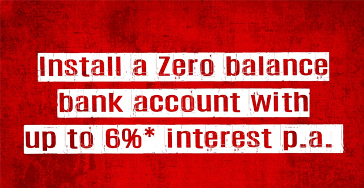

**There will be an infinity war between the digital banks in India before the Avengers: Infinity Wars hits the theatres in India.** It will be digital banks **PayTM vs Airtel vs Kotak 811 vs DBS** war. Let's get into without wasting any time.

Since India went digital there has been many changes that went great. Everything is now linked to your **Aadhaar Card** from your Sim Card to Pan Card. Leaving the cards aside, even the banks went digital in India.

I am here reviewing these digital banks up to an extent that you can get an idea about if you really need it if so which one to opt for. These are three digital banks, I'm going to discuss.

1. **Airtel Payments Bank**
2. **PayTM Payments Bank**
3. **[Kotak | 811](https://clnk.in/jVi2)**
4. **DBS DigiBank (Updated)**

## Airtel Payments Bank:

We all know about Bharti Airtel. It is one of the leading telecom operators in India. In a meanwhile, they first introduced the wallet and then moved to Airtel Payments Bank. To open an account, you simply need your Aadhaar Card and your biometric data to verify. After this, your account will be opened. However, Pan Card is a must for the one who is planning to do transactions exceeding ₹50,000. Let's keep all this aside and take a look at its features.

- Exciting Cash Back offers on Recharges did through Airtel Payments Bank
- Your Airtel Phone Number is your account number
- Earn **5.5% p.a** interest on your savings
- The instant opening of the account
- Send Money to friends and family easily
- Withdraw or deposit cash to your Airtel Payments Bank from their thousands of banking points
- Charges for Airtel Payment Bank are given [here](https://www.airtel.in/wps/wcm/connect/965b9e9d-35e4-4dcc-a806-50cb2da2f911/SA_ScheduleOfCharges_v5.pdf?MOD=AJPERES&ContentCache=NONE).

In short, this is good bank to go with. If you can't think of any other banks right now, then get this one with **Instant Opening** right away with just your mobile number.

**The best thing** in Airtel Payment Banks is that they have thousands of banking points for withdrawing cash easily unlike other which requires you to have the Debit Card.

## PayTM Payments Bank

Recently PayTM introduced its payment bank. It was an Electronic Wallet before arriving of PayTM Payment Bank. However, there is just an addition of **Bank** in newer app update and the electronic wallet remains and works as same as usual.

Due to RBI rules, the bank interface and wallet interface have to be separated. Now the bank tab is available at the bottom tabs separately and it requires a PIN to login into that tab. The default page after opening PayTM give access to Wallet itself.

The bank account number is alotted with your registered phone number on PayTM except you need to add 91 at the beginning. For example, your phone number is 9876543210 so the PayTM bank account number will be **91**9876543210\.  

> **Note:** KYC is required to use even the wallet. You can neither send money nor receive without KYC.

Let's take a look at what PayTM Payments Bank has to offer:  

- No account Fee or Charges
- **4%** p.a Interest paid every month up to 7.5% on Fixed Deposit.
- Fixed Deposit are automatic. If your current bank balance reaches over 1 Lakh then anything above 1 Lakh is kept in fixed deposit
- Real-Time Passbook
- Risk-free deposit as they only deposit in government bonds.
- **RuPay Physical Debit Card** which works everywhere in India @ ₹125
- Up to 3 withdrawal limit in a month.
- Charges for transfer of money are given [here](http://www.paytmbank.com/ratesCharges.html). **However, UPI, NEFT, IMPS remains free of charges.**

## [Kotak 811 | Bank](https://clnk.in/jVi2) (Recommended)

Coming into the competition, Kotak decided to join too. A new digital bank but they claims to be the first **Downloadable Account** for a particular reason. They also happen to be giving the interest rate p.a, the highest among all digital banks above. Let me give you some features of it too.  

Kotak 811 never ceases to impress their customer. They currently have the best in-class service. I've been a owning a digital account since it's first arrival. I never had issues with them either with charges or services. No bank charges extra, you should always go through their charges sheet before applying for them. Not only this bank, but every bank out there.

The only downside is, Kotak 811 charges you ₹ 3 per ₹ 1000 deposited after completing your **first transaction** or if you **already deposited ₹ 10,000 in a month.**

This is acceptable. This bank are digital. If you want to avoid those charges then I suggest you to open a Saving Bank Account at them with three packages of AMB (Average Monthly Balance) to be maintained i.e, ₹3,000 | ₹5,000 | ₹10,000

I also never had issues accepting linking this account with **[Google Adsense](https://sastaeinstein.com/2017/03/is-adsense-worth-it-how-much-you-get-paid-by-google-adsense.html)**[.](https://sastaeinstein.com/2017/03/is-adsense-worth-it-how-much-you-get-paid-by-google-adsense.html) Neither with PayPal & Payoneer. I use three of them and my money get transferred to my bank account without any issues.

- Almost open the account instantly just by Aadhar and Pan Card along with biometric for KYC.
- Zero Balance account that means no maintenance of balances.
- Scan & Pay within the App.
- Provide Cheque book.
- **6% Interest p.a.**
- **Visa - Virtual and Physical Debit Card** which will work almost internationally as Visa is widely accepted around the world. **@** ₹200
- Safe and secure.
- Visit nearby Mahindra Bank or Deposite Machine to deposit the amount in your digital bank.

Are you complete new to digital banking era? Do you want to earn ₹51 right away as a bonus for signing up for [Google Pay India?](https://sastaeinstein.com/2017/09/googles-new-payment-app-tez-refer-and-earn-money.html) Join now using the link and get ₹ 51 instantly after making your first transaction on Google Pay. Google Pay uses UPI and you can link any of the digital bank to that app and start receiving and sending money right away instantly up to 50,000 in a day.

Thanks for reading, sharing is caring. Share it with your friends and family. Drop the Digital bank you currently have an account in the comment box below so I can see which bank you choose!
