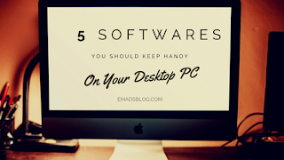

A desktop without software is often called useless. All you could do is browse things up & watch YouTube.  
  
You may do it, but you must be keeping some of the software handy on your desktop. It not only makes you look professional but also helps you a lot when comes to daily work.  
  
In this article, we'll be talking about 10 of the software applications you'll be installing today. Let's get started.  
  

  
  
**Did You Know?**  
  

> If you are on social media, and you are not learning, not laughing, not being inspired or not networking, then you are using it wrong.

  

## 10 Software Applications You Need On Your Desktop PC:

1.  **[Microsoft Office](https://www.microsoft.com/en-in/download/office.aspx):** This one is going to be a part of your life. You can prepare all those Presentations, Certificates, Letters, & Sheets, etc using Microsoft Office. It contains all the essential applications from Microsoft which includes Microsoft Word, Excel, PowerPoint and so on. It helps everyone from students to graduated ones. Just go on and enjoy working on it.
2. **[iTunes](http://www.apple.com/itunes):** Over 700 million iPhones active in the world. Just 300 Mil more to make a Billion. iPhones are just as useless the as desktop without any applications. Here's when iTunes comes to your rescue. iTunes can simply sync your Music, Applications, Photos and more to your iPhone right away. If you own an iPhone, iPad then this application is a must for you. Go ahead and watch how it works!
3. **[Adobe Premiere Pro](https://www.adobe.com/in/products/premiere.html?):** To the YouTubers, FilmMakers & Video Content maker out there, trust me this is what you need to work on while making great video stuff. This application packs almost amazing features for editing videos. Designed & work especially for noob YouTubers and Video editors. Go on and check it out. I make sure you'll love it.
4. **[HandBrake](https://handbrake.fr/downloads.php):** We all have smartphones and cameras to shoot our memories. To be honest, these memories can be long, and big in sizes. Thanks to our 12MP Dual Camera technologies. xD. This application called "HandBrake" can reduce the size of your captured videos without compromising on the quality. It saves time and data getting exhausted while uploading and sharing. Check it out.
5. **[Adobe Photoshop CS](https://www.adobe.com/products/photoshop.html):** Another Adobe product on our list. Adobe is too good at impressing us with their products. This time it's for Photos. You can do all those good looking things in the photos with this application. You can also have those funniest moments while editing photos in this app. Try it and I think you'll be impressed too.

  

If you like this article, let us know by the shower of your love on us. Share it on with your friends and family to shower the love on us. Don't forget that sharing is caring. 

  

See you next time in the next post! Catch up later.
