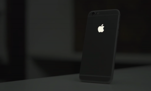

A for Apple! You've been taught in kindergarten. When you reached the age of 9, you already knew A for Apple is something different.

I am going to discuss 10 Facts which are Weird about The Company named "Apple".

A company whose Market Cap reached **$1.01 Trillion.** Isn't it a fact? Yes, it is.

<table style="margin-left: auto; margin-right: auto; text-align: center;" cellspacing="0" cellpadding="0" align="center"><tbody><tr><td style="text-align: center;"></td></tr><tr><td style="text-align: center;">Picture by iphoneincanada</td></tr></tbody></table>

Let's get into the facts we have been digging around to tell you. It's not a big list but certainly the most important ones you should be knowing even if you are not using any iPhones. iPhone users might know some of those but not all. I took my time to dig around some interesting ones to let you know.

Once a legend wrote...

> An Apple a day keeps anyone away when you throw it hard enough.

###  10 Weird Facts About The Company: Apple

1. Apple was the first to make a digital color camera. (**_Interesting)_**
2. Apple earns $300,000 in a minute.
3. Apple earns $85 profit on every iPhone 6 Plus sold.
4. Apple created fake projects for the employees. If the news leaks, they know exactly who did it. Pretty secretive.
5. In 2018, Apple has become **a $1 Trillion** company.
6. In India, 70% of the customers of Apple just go for its logo. Apple Logo certainly means they are wealthy.
7. Founder of Apple, Steve Jobs died due to the Pancreatic cancer.
8. Apple doesn't fix smoker's devices. If you have been smoking near your MacBooks or iMacs then your warranty might be already void.
9. Apple is insanely good at marketing. That's what it gets so many customers to buy its iPhone every year despite its price range.
10. Apple uses to get all its retina display supplies from Samsung. (**_Quite Interesting)_**

Do you have any facts about Apple? Leave the comments down below. If you like our article, please spread the love. See you in the next post soon.
