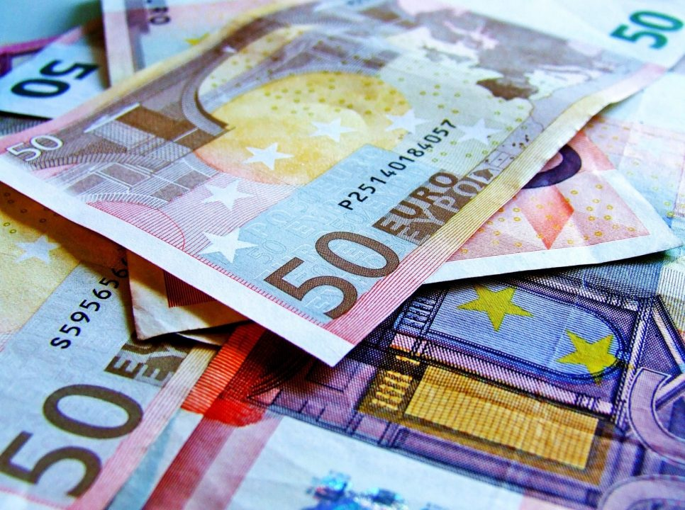

Do you always wanted to get a bank account but worried about maintaining your balance in the bank? It's now never an issue in India. We have several banks offering a service called "Zero Balance Saving Accounts". Below is the list of banks that offer this service. Also, it is paperless and completely online apart from some Bio-Metric verifications. 

- Kotak Mahindra Bank - **[Kotak 811](https://www.kotak.com/en/personal-banking/accounts/savings-account/811-Account/811-variants.html)**
- [PayTM Payments Bank](https://www.paytmbank.com/AccountOpening) (_Currently Banned by RBI from opening new accounts_)
- [Digibank by DBS](https://www.dbs.com/digibank/in/index.html) (**Recommended - Available for Bio-Metric verification only in selected cities)**
- [Airtel Payments Bank](https://www.airtel.in/bank)

All the above banks are opened instantly without any kind of paperwork.   
I have already written an article on the comparison of [Digital Banking (Zero Balance Accounts)](https://sastaeinstein.com/2018/04/airtel-payments-bank-vs-paytm-payments-bank-vs-kotak-811-digital-banks-war.html) You can read it if you wish to know the difference between these banks and select the one you like the best.  
However, there are certain things which are required to open this instant zero balance saving accounts. 

**You Need:**

- Aadhar Card (Registered at your phone number to receive OTP)
- PAN Card (Required for opening the account in Kotak 811 while required for increasing balance limit to 1,00,000 in PayTM Payments Bank)

**What is Bio-Metric Verification?**

Bio-Metric Verification is nothing but a whole process of verifying your identity. It is a security measure to verify your Aadhar Details using your Fingerprints enrolled when your aadhar was generated. You are then given full access to your digital saving account without any limitations on withdrawals and deposits. However, there is a mandatory daily withdrawal limits intact. Most of those banks send their executives to get your details verified at your doorsteps. All you need to do is ask for it within the application of the bank.

### What benefits you get from Zero Balance Savings Account?

- The first benefit is, of course, the nil maintenance charges. You are not charged a single rupee for not keeping any money in the account.
- Instant transaction features inside the application of respective banks. You will get access to **UPI, IMPS, RTGS & Fixed Deposits.**
- Interest rates of up to 6% on saving balance annually on Kotak 811. PayTM Payments Bank, however, pays 4% per annum monthly in your account.
- Kotak 811 offers you a **VISA** Debit Card (International), PayTM Payments Bank offers you a **Rupay** Debit Card (National), & DigiBank by DBS offers **Pay-Wave VISA** Debit Card (International). Kotak 811 and PayTM Payments Bank charges you for the debit card while DigiBank by DBS doesn't charge for the first year. 

**Downsides of Kotak 811:**

- Cash deposit at any branches of Kotak Mahindra Bank or Deposit Machine has limited to 1 transaction in a month or 10,000 rupees a month. and the same applies to withdrawal. Above 10,000 or 2nd transaction in a month can cost you 3.5 rupees per 1000 rupees deposited or withdrawn. However, practically Kotak 811 charges me exactly 59 rupees on any transaction above 10,000 or 2nd transaction. Here I can see that 3.5 per 1000 rupees is not applied even though it is written in [Fees & Charges](https://www.kotak.com/en/personal-banking/accounts/savings-account/811-Account/fees-and-charges.html) section on their page.
- Their iOS application sucks in real time. Many issues while sending payments and receiving it. 

**Downsides of PayTM Payments Bank:**

- No downsides in this Zero Balance Saving Account.
- All fees and charges are charged as per given on their website. If any, I will add it here.

**Downsides of DigiBank By DBS:**

- No downsides in this Zero Balance Saving Account.
- All fees and charges are charged as per given on their website. If any, I will add it here.

### **Why I recommended using DigiBank By DBS (Zero Balance Saving Account)?**

- No charges for depositing cash. Perfect Zero Balance Saving Account. 
- 10 Free Transaction per month at any domestic ATM or Non-DBS ATM. After that charged at 20 for withdrawal and 8.5 for Balance Enquiry as per RBI.
- International Cash Withdrawal at just 125 rupees. 
- Pay-Wave VISA Debit Card, you just need to take your card near the POS machine or just tap it and it automatically detects your card. Saves a lot of time. However, it is available when you purchase anything below 2000 rupees while anything above 2000 rupees requires you to swipe your card. Here is [how it works!](https://www.visa.co.in/pay-with-visa/featured-technologies/visa-paywave.html)
