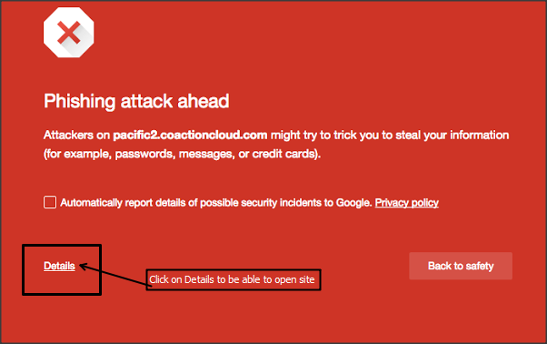

Phishing Attack can happen to anybody and anywhere. If you just have good knowledge about it then it's pretty easy to understand that there is something creepy ahead. 

The Phishing attack is the most popular technique or method to get somebody's account passwords and gaining access without their permission. Nowadays, phishing is popular when it comes to hacking different several accounts password like Instagram, FaceBook, Gmails, etc. 

### What Is Phishing? What It Does?

It is a method of hacking which involves modifying of popular social sites pages and hosting it on web server and then sharing links with the victim to get them logged in. Once they log in, the password is stored in the server and visible to the web server owner. He then gains access to the victim account.

The phishing pages for Instagram, Facebook and many other popular social sites are easily available on the internet. It can be downloaded and hosted to share links with people to gain access to their accounts without their permissions.

### How To Prevent it? 

It's simple. Today it is more simple. As phishing is illegal therefore 95% of web hosting providers immediately ban the accounts when phishing pages are uploaded on their servers to host. Also, all of the browsers now **Warns** you about the phishing pages ahead. 

For Example, In Google Chrome it shows something like this

Phishing Warning Google Chrome

Anyway sometimes if the page looks often legit and is hosted on some web server which are premium then it might not get your attention. They will be able to steal your information without even letting you know.

Double checking your URL from the Address Bar in the browser helps you in preventing this phishing attacks. A similar login page from Instagram can be made but it will be **Different** **URL .** 

> For Example, I decided to do the attack. I will go and upload the same phishing page for Instagram on my hosting server. It will now be hosted on the server. I can now share the page with sharing the link which will be something like this _"emadsblog(dot)com/Instagram"_. You should never login to any sites like that. They will just store your password and access it.
> 
> However, phishing pages are designed in the same way as the social sites are. They are hosted the same. Some other popular sites integrate login pages to signup for their sites. You shouldn't be confused for them. 

### What's Worst Can Happen With Phishing Attacks?

In the worst cases, the password to the social accounts isn't hacked. The net banking usernames and passwords are stolen in order to perform online transaction and even the Credit & Debit card information. The Phishing Pages can be of any disguise either of some big Banks, Social Sites, etc. Therefore, people often can't point out the difference between real and fake one.

### What I Should Do If You're Attacked By Phishing?

Nothing to worry about but act immediately. If you used your Credit/Debit or Net Banking information on such pages then contact your bank immediately to block your account/card temporarily. You can also log in and change password immediately. This applies to social sites too.

#### Wrap Up:

- You learned how this attacks work.
- You learned how to prevent it.
- You learn how to overcome it as a victim.

You might be interested in other article!
