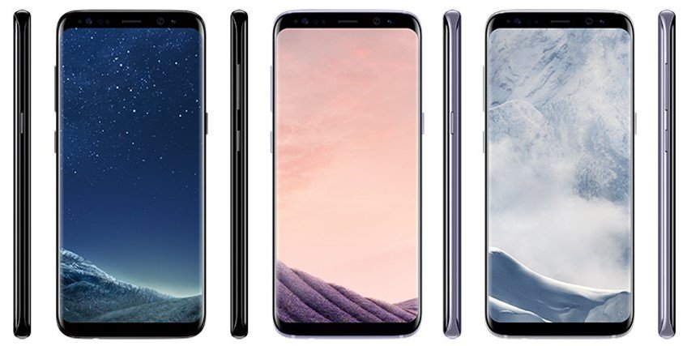

Are we talking about S8 again? Yes. S8 Long Term Review with Honesty. There was absolutely no phone with this crispy and gorgeous display before Samsung Galaxy S8. 

I had no phone before this phone that makes people go Awww, look at that phone. I mean come on those curves! :p

Here you go with my version of S8 Long Term Review. I've been using S8 from like a month or more now. I recently got hands to it again despite it's now it is a year old already back in May, I guess. This S8 never let me down except when it comes to battery.

I have already gave an honest review on this Phone before, [check it out now](https://sastaeinstein.com/2017/05/honest-review-of-samsung-galaxy-s8-s8.html). 

### Performance:

Even this being an S8 long term review, I can say that the hardware on the S8 is almost all good and fast enough to handle the processes and all the applications and games. Are you telling me that it's going to support [Fortnite](https://www.fortnite.com/android)? Yes, baby! The Culprit here that makes Samsung Flagships phones go slow is the **UI** Samsung uses in their own customized Android. I agree it is beautiful now at least better than the old boring **TouchWiz.**

The thing which makes S8 Long term review cooler and faster is Samsung Experience 9 which gave me real smooth feel while using the Galaxy S8 and recently I came to know about Android P getting on to S9 in beta stages. Hopefully the new Samsung Experience 10 would be more liquid smooth with Android Pie. In short, I'm impressed with S8 and Samsung's work on improving their UI.

### Display:

Actually, this display thing should be first! Anyway, I'm again going to compliment this screen. Man, this is love. A Quad HD curved screen looks amazing, believe me, or not. Not only the screen, the curved screen makes it look gorgeous on the sides and back and feel real premium in hand also thanks to it's lesser bezels and breadth. If you're **really, really** into display of the devices then I think you should go for this screen. 

### Battery:

The only thing I found pathetic is its battery life. The phone is with me for the month and itself it loses around 2% of its original capacity already. The phone manages the day only on moderate usage. Here moderately means, I don't play games like PubG, Fifa or whatever. All I use is some WordPress, Instagram, and WhatsApp. Although an hour or two on [Quora](https://www.quora.com/profile/Mohammed-Emad-Iqbal-Ali) and browsing things up.

**Conclusion:**

The performance of the device is the same even after the year despite there are newer phones in the market, this phone can be still a right pick even this year. S9 has nothing to show this time except for that dual camera setup and replacement of finger scanner. That's it. If you're going to buy it this year, go for it. The money will be worth it unless you're a heavy gamer or user.  Grab it now from Amazon at just 35,999.

_P.S: (Affiliation Link, I earn a small commission)_

<iframe style="width:120px;height:240px;" marginwidth="0" marginheight="0" scrolling="no" frameborder="0" src="//ws-in.amazon-adsystem.com/widgets/q?ServiceVersion=20070822&amp;OneJS=1&amp;Operation=GetAdHtml&amp;MarketPlace=IN&amp;source=ss&amp;ref=as_ss_li_til&amp;ad_type=product_link&amp;tracking_id=emadsblog-21&amp;language=en_IN&amp;marketplace=amazon&amp;region=IN&amp;placement=B07255DP3L&amp;asins=B07255DP3L&amp;linkId=688400382885f12591085e17aa6fbbdb&amp;show_border=true&amp;link_opens_in_new_window=true"></iframe>
