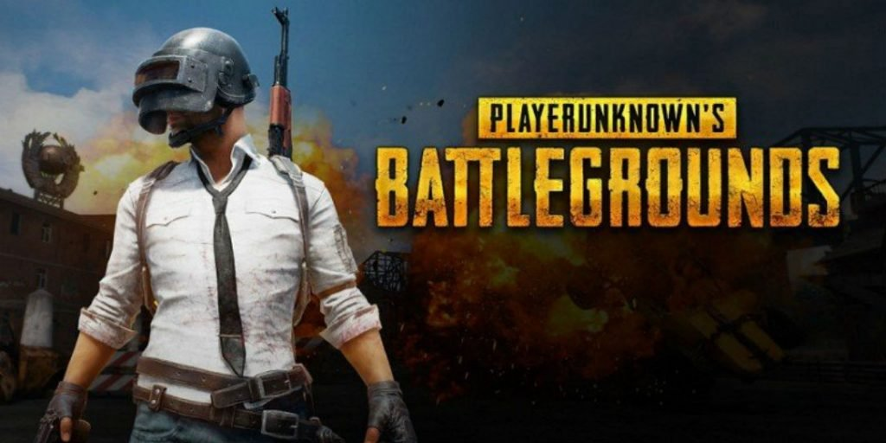

PUBg mobile is top grossing all over the world but for PC or Laptop on steam it is priced at $29.99. 

For this, I made this post to get PUBG mobile for PC completely free and enjoy it on the desktop on big screen.

In the meantime, Tencent decided to launch the only simulator for PUBG mobile. The game is now trending on PC/Laptop too. 

Tencent Gaming Buddy is currently in Public Beta stage. However, the graphics really lacks when you play it on PC as it is developed mainly for Mobile devices out there. Still, it's the only way to play PUBG Mobile on PC for free.

#### System Requirement:

- _Intel Dual Core_
- _Nvidia GeForce 8600 or Radeon HD2600_
- _At Least 1GB of free storage_
- _DirectX V9_
- _Min. 3GB of RAM_

## How To Get PUBG Mobile For PC Free?

- Download [Tencent Gaming Buddy.](https://syzs.qq.com/en/)
- After download, install Tencent Gaming Buddy. 
- Follow on-screen instruction to download PUBG mobile on PC.
- Once downloaded, load the game and enjoy PUBG Mobile on PC.

It's that simple to get PUBg Mobile on your computer. Thanks to Tencent Gaming Buddy. 

**You might also like:**

[Who Created PUBG Mobile?](https://sastaeinstein.com/2019/04/how-pubg-started-infographic.html)
