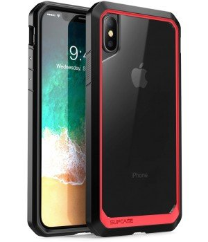

All of us carries a fear of breaking our beloved smartphones, isn't it? Many of us look for some premium mobile cases companies which put away the fear of breaking your smartphones.

As of 2018, there is a huge market of smartphones that leads to a huge amount of cases getting manufactured. But, what can really protect your smartphone?

Are those cheap cases able to protect your smartphones? There are plenty of companies manufacturing all type of cases.

Let's dig into this and look at those top 3 companies that really protect your smartphones to a great extent.

> Disclaimer: I'm not paid for reviewing any of these companies. I tested all of them and giving review according to my opinion.

# 3 Premium Mobile Cases Companies:

## ****[OtterBox](https://www.otterbox.com):****

It is my personal favourite when my priority is protecting the smartphone from falls. It never stopped impressing me with its sturdiness. It's hard outside and soft inside giving exactly the perfect amount of sock protection from the greatest of heights. Also, they have an amazing series of cases such as **Pursuit, Defender, Symmetry.** To give a whole protection I also recommended the Alpha Glass for screen protection by OtterBox. OtterBox cases always saved my devices from any falls.

\[gallery columns="2" link="file" size="medium" ids="500,501" orderby="rand"\]

Above one is the commuter series for the Galaxy S8. The only downside of the cases is that only some of the series are present in India on Amazon India. However, it's official site ships to India and shipping is free for all orders above $60.

> **[_Amazon India OtterBox Cases_](https://amzn.to/2TtOYE8)**

You can check OtterBox cases at Amazon India from the above link.

## **[SupCase](https://www.supcase.com/):**

Another brand with amazing quality. It focuses on design as well as protection. A good point here for people who prefer looks and protection as well. A bonus point in choosing Supcase is that they offer transparent thing with protection to actually show off your phone design which manufacturers work pretty hard on it. International shipping is offered by them at just $7.95, you can grab it one now on the Amazon India too. SUPCASE are robust in design and offer a clear view at the back. It is also light in weight and doesn't add that extra weight to your phone on the larger scale. 

> _**[Amazon India SUPCASE](https://amzn.to/2R8OAJG)**_

You can check the Supcase available for your device on Amazon India. If not, you have to order it from their official site and pay $7.95 for international shipping.

## **[Amzer](https://www.amzer.in):**

Want something premium and affordable? Amzer all the way. Amzer provides various varieties of cases to choose from. They offer the cases which are tough and works as same as any other premium cases work in protecting your smartphone.

Nothing gets better in getting a dual layer protection funky cases. Amzer does have it. They also provide customization option of your own. The printing is really impressive and the case quality is premium. No worries about it.

Some of the cases offered by them are,

\[gallery columns="2" size="medium" link="file" ids="505,506"\]

As Amzer is officially present in India there's nothing to be worried about international shipping. They deliver fast with top couriers in India that is FedEx & BlueDart.

> In the comments down below, let us know what do you think about putting on cases on your phone? Is it worth it?

 

### Wrap Up:

You have looked at those top 3 premium mobile cases companies to order the premium cases to protect your premium mobile phones. Really cheap cases don't do enough work in protecting your $1000 smartphone. You really need to invest in some pretty good amount to get one of the premium case protection for your device.
