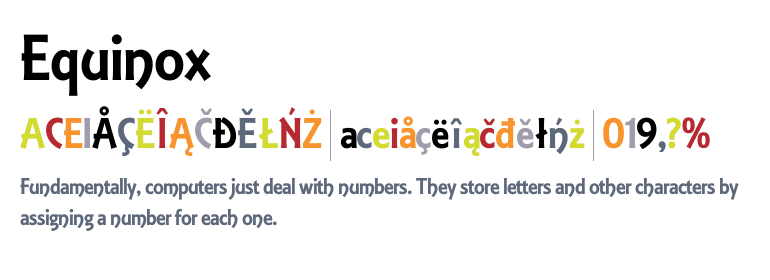
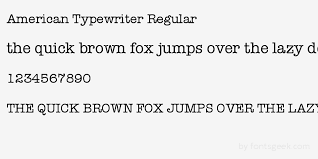

Bored of the old fonts on your device? I know how it feels. I'm here with some of the cool fonts for all Samsung Galaxy Devices or the device that uses Samsung Flipfont apk to install font on the device.

Changing font is not a big deal. Everyone knows how to do that in the settings however the number of fonts available is limited. In this post, I will show how to get more fonts and apply it the same you do to the other fonts already installed.

Let's get started. All the links are given in this post to download the Samsung Flipfont apk's right away.

# Cool Fonts For Samsung Devices \[APK\] - FlipFont:

- [Download Equinox Font - APK](https://apkmeet.com/en/apk/1365310-com.monotype.android.font.equinox)
- [Download ITC American Typewriter Font - APK](https://m.allfreeapk.com/american-typewriter-flipfont,929459/)  
    
- [Download Cavolini Condensed Font - APK](https://www.allfreeapk.com/cavolini-condensed-flipfont,634863/)  
    

## How To Apply These Fonts?

1. Download and install the APK above.
2. Go to **_Display --> Fonts --> (Choose Fonts to Apply)_**
3. Click **Apply.**
4. Your mobile will now have one of the cool looking fonts.

**Disclaimer:** The fonts are not free. Please support the developer if you're able to purchase it by installing it directly from Galaxy Apps or the Play Store.

### Conclusion:

- You get to know about 3 cool looking fonts for Samsung Devices
- You have learnt to apply the new fonts.

The Samsung Devices such as Galaxy S Series, J Series, N Series & many more are able to apply the fonts right away from the settings. However, other devices might need FlipFont support to apply the fonts directly from the settings.

If you know more cool looking fonts like these 3, let me know in the comment section below. I will add them right away in this post.

Take a little time to fill in the subscriber form so that you can be notified right on your Email about the new posts on this blog. I have amazing posts coming up soon. I am waiting to see you in the next post. Have a great day!

**Recommended Reading**

- [Download official Samsung Firmware (Alternative to SamMobile)](https://sastaeinstein.com/2018/09/where-to-download-samsung-stock-official-firmware-2018.html)
- [Enable VoLTE In Samsung Devices Purchased From Another Country](https://sastaeinstein.com/2018/01/how-to-activate-volte-in-samsung-devices-purchased-from-another-country-requires-rom-flashing.html)
- [Disable Region Lock In Samsung Devices](https://sastaeinstein.com/2017/05/how-to-unlock-samsung-region-locked-devices.html)
