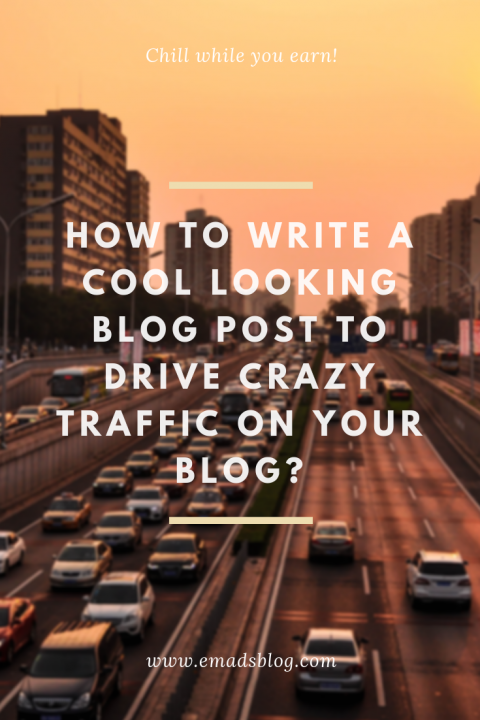

Do you want to know how to write a cool looking blog post like how all other professional bloggers do?

Want to drive some crazy traffic on your blog too? Do you want to see the revenue go up? That's it.

If you have all those things in your mind then it is what I'm going to teach you in this blog. 

## Writing A Blog Post:

- Prepare the topic. Take out the important points. Give yourself enough time to understand the whole thing going on then write a post.
- You can kick in several lines of text rather than combined looking text like in books.
- Drop in great and related pictures. Pictures says a thousand words.
- Your blog post must be unique compared to others. It should clear the concept easily.
- Use proper and enough **Headings** in the post. It will make your blog enhanced and more clear.
- Include **Wrap Up** or **Conclusion** at the end of the post to let your readers know about what they learned from the post.

## Using SEO:

- Get **Yoast** SEO plugin for your WordPress blog. It will take care of all the SEO optimizations.
- You just need to fill in the content on How it will look in Search Engines. Fill Meta Description, Focus Keyphrase and also put tags to help it get to the top while searched with Keywords.

## Enabling AMP:

- Get AMP plugin for the WordPress and it will automatically make your posts in AMP format. 
- As of today, there are many people surfing the web on their Mobile devices rather than desktops or laptops. Therefore, AMP is really necessary as it's name says Accelerated Mobile Pages.

Read More on [_Improving Your Website/Blog Ranking_](https://sastaeinstein.com/2018/10/how-to-improve-your-website-ranking-starting-a-successful-blog.html)_._

Look it is as simple as it. Now even this blog post looks amazing. Isn't it?

Perfectly organised. Clear Concept & overall SEO Optimized.

Therefore, you get huge traffic & higher revenue.

### **Wrap Up:**

- I taught you about writing a cool looking blog post that will grab visitors to your site and make your revenue go higher.
- I taught you the additional things to do which results in ranking of your post/page.

#### **You might be also interested in other posts:**
