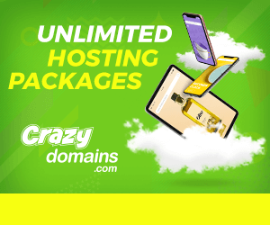

Thousands of websites on the Google claiming to give you A Complete Guide To Start Your Own Blog right?

But ask yourself if that's what you are looking for? I mean is it easy to get yourself started?

I researched the good amount of sites online that tells you **How To Start A Blog** but not clearly as easy as I thought.

When I was clearly a beginner, I wanted to start a blog too. All I did was go to Google and search for **How To Start A Blog?**

Several thousands of links appeared to me. I started clicking and browsing it. I get to know that it wasn't easy at all. When someone throws everything you don't know at you then it makes you demotivated thinking that you won't be able to do it.

That's when it struck my mind. Why not you make a clear version of this guide to help people out there which don't know anything about blogging.

Umm, I thought yeah! Why Not?

In this guide, I will break everything apart. It will be much easier for you to put everything in your brain and understand how everything works.

Let's see what you need before getting started.

# Before starting, you need to decide:

1. Free Blogging:- This is a free blogging service provided by either [Blogger](https://www.blogger.com) or [WordPress](https://www.wordpress.com). Both of them offers you a free blog. All your content is hosted by them only. They can do whatever they want. They can even delete your whole blog. Nothing is in your hands despite everything you write and post on the blog in at their risk. Secondly, your blog will end with their subdomain as it is hosted with them. Let's say you have chosen **"****My First Blog"** as your blog name. Its address will be like this **"myfirstblog.blogspot.com (or) myfirstblog.wordpress.com".** However, you can buy your own domain i.e, **"myfirstblog.com"** and redirect it in case of blogger. However, in WordPress, it isn't possible unless you upgrade.
2. Your Own Hosted Blogging:-In this type of blogging, you're your own boss. Everything on your blog that is your content, images and posts is stored on your own server. The server I'm talking about is what you have to buy and this is what they call it **"Hosting".** This is the second thing you do. First, you need to get a domain name of your own which that is I said above **"myfirstblog.com"** and then buy Hosting to host the domain name you bought on the server. 

Let's get deep into it step by step!

## Step 1: Buying A Custom Domain Name For Your Blog

- Get your domain baked right from the oven. **[CrazyDomains](https://www.crazydomains.in?a=mpMjgoDltrinx%2F9ReD3vuA%3D%3D)** will do it right for you. Check it out here. They have amazing offers. Domains starting from just Rs 250.
- To get started, make an account on CrazyDomains and get ready to buy a domain name of your choice.

- 
- It is always better to take .com domains if you're going to target worldwide audience using your posts & blog. While if your niche (Topic) is limited to a country only then go for .in domains.
- Choose your domain name wisely. Later, if you plan to change it then you will have to do a lot of redirections or lose all your traffic.
- Choose something short and sweet but also related to your Niche (Topic).
- For example, I'm starting a blog on the topic of **Parenting.** I will choose the domain name like this **"creativekids.com (or) mamalovekids.com"**
- Remember short and sweet. After choosing your domain name, check out your cart and buy it.

## Step 2: Buying A Web Hosting To Host Your Domain Name

- It is recommended that you should get hosting from the same provider as of your Domain name. In this case, you bought a domain from **[CrazyDomains](https://www.crazydomains.in?a=mpMjgoDltrinx%2F9ReD3vuA%3D%3D)** right. You must buy web hosting from them too.
- It's because it will make setting your blog less complicated. You don't need to set up nameservers for your domain name. Since both domain and web hosting is from the same provider then it will do everything itself. No nameservers and all. Hence, less complicated.
- Surprisingly, they have web hosting packages starting from just Rs 40. Amazed. Yeah me too. Get it now.

- Check out and buy it.

## You Have:

1. Domain Name
2. Web Hosting

All done. You have all the basic things ready now.

It's time to install the best Blogging Platform which is of course **WordPress.**

## Step 3: Installing WordPress On Your Web Hosting & Linking It With Your Domain

- Log in to your account of your provider. In this case, go to **[CrazyDomains](https://www.crazydomains.in)** and on the top right click on Sign Up/ Login.
- Make sure you selected **the Hosting Manager** from the drop-down menu.
- Enter your Username & Password of the account you made while buying Domain Name and click log in.
- On the **Home Page,** scroll down and click the word Software and then click on the **Installatron Applications Installer.**
- Scroll down to Content Management, then select WordPress icon.
- Click **+Install this application.**
- WordPress will soon be installed on the Domain name you selected.
- Select Location as the main root directory. Your blog will be hosted on the main directory that is **"creativekids.com".** In some cases, people want it on a different directory such as **"creativekids.com/blog"** as they will be hosting only landing page on the main directory.

## Step 4: Configuring WordPress To Get Started

- Set your Administrator username and password. Please remember to make these secure. (This is your new Website/Blog Login Credentials not your provider account credentials)
- For Administrator email, enter your **Email** to receive updates and notifications.
- Enter the **Title** of your website, this can be changed at any time.
- Enter the **Tagline** of your website, this again can be changed at any time.
- If you want even more security for your login info, enable **Two-Factor Authentication** and download the Clef app (recommended).
- For Enable multi-site, select **No**.
- For limit login attempts, select **Yes**.

Congrats, you configured WordPress.

## Step 5: Accessing Your Blog To Edit & Post New Content

- Your blog is now live, right? You now want to edit it and post some content.
- Visit your website like this. For example, **"creativekids.com/wp-login".**
- Just add **wp-login** at the end of your domain name.
- You will now see a WordPress login page in which you have to enter Username and Password to log in.
- Use Username and Password from Step 4 while creating your WordPress.
- You're now in the dashboard of WordPress.

> Looking to earn money from blogging. Read my article below to learn how to get Adsense approved.
> 
> 1. [**Adsense: Get Your Address Verified Without PIN**](https://sastaeinstein.com/2017/03/is-adsense-worth-it-how-much-you-get-paid-by-google-adsense.html)
> 2. **[How Much Adsense Pays?](https://sastaeinstein.com/2017/03/is-adsense-worth-it-how-much-you-get-paid-by-google-adsense.html)**
> 3. [**Top Highest Paying Ads Network**](https://sastaeinstein.com/2017/03/highest-cpm-ad-network-for-blog.html)
> 4. [**WordPress vs Blogger: Which Is Better?**](https://sastaeinstein.com/2016/12/how-to-start-a-blog-and-what-platform-we-should-choose-2017.html)

That's all how you start your own blog. If you did start one using my guide. Leave your blog in the comment down below. I would love to see.

Thanks!

Don't forget to share it and show me some love.
