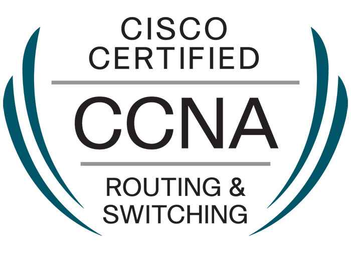
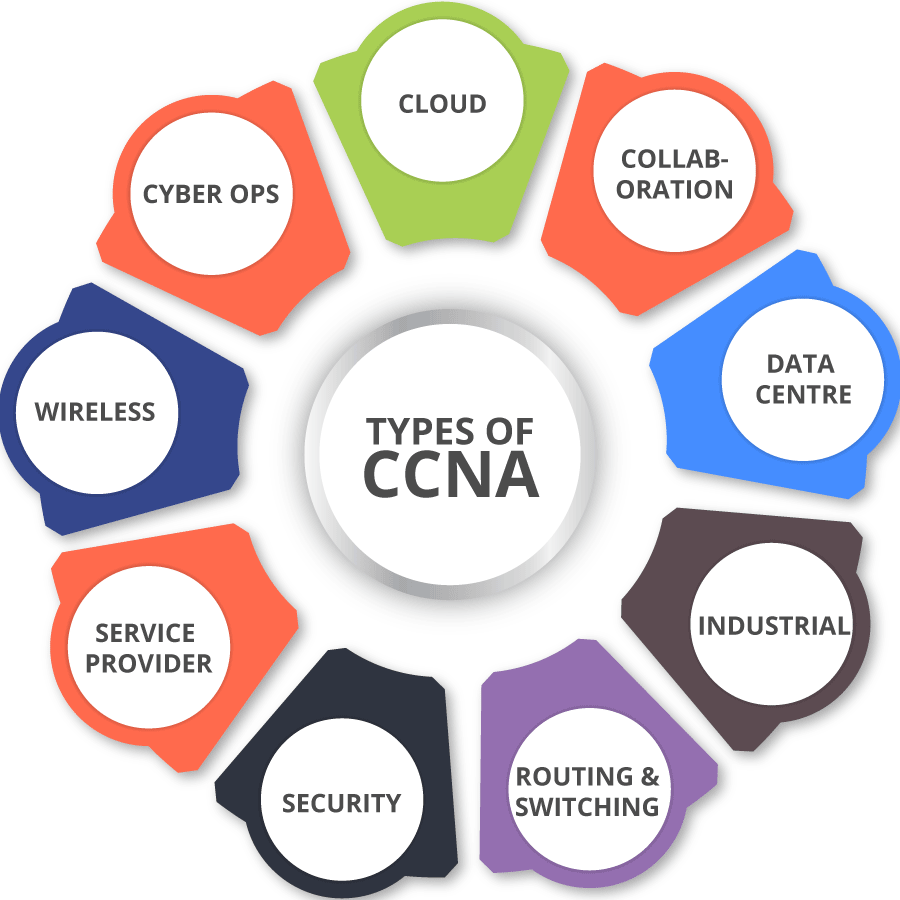

Looking for Cisco Certified Network Associate eligibility & details? In this article, I will be covering all benefits and details regarding CCNA course.

### What is Cisco Certified Network Associate?

Cisco Certified Network Associate (CCNA) certification validates your ability to install, configure, operate and troubleshoot routed & switched networks. CCNA certified professionals can make connections to remote sites via a wide area network (WAN), mitigate basic network security threats, and understand fundamental networking concepts and terminology.

## Benefits of CCNA:-

**6 Benefits of CCNA certification**

- No.1 Certification Course
- Ability to access multiple CCNA Certification Professional online communities
- Installation
- Configuration  
    
- Operation
- Troubleshooting

## Course Content:-

- IP data network operation
- LAN switching technology
- IP addresses
- IP routing technology
- IP services
- Network device security
- Troubleshooting
- WAN technology
- Personal Computer Hardware
- NAT & PAT
- Troubleshooting

## Course Details:-

1.NETWORK fundamentals

2.LAN Switching Techonologies

3.Routing Technologies

4.WAN Technologies

5.Infrastructure Services

6.Infrastructure Management

## Eligibility & Duration

- In most cases, 10+2 pass will be minimum qualification required to purse course.
- On an average the training program is 6 to 8 Weeks or Else 40-50 hours long.

## Conclusion

As you can see, there are numerous advantages to getting CCNA certified.It firms are the prime recruiters of networking technicians. You not only make yourself a better job or promotion candidate, but you also enrich and broaden your skills as a network engineer.
