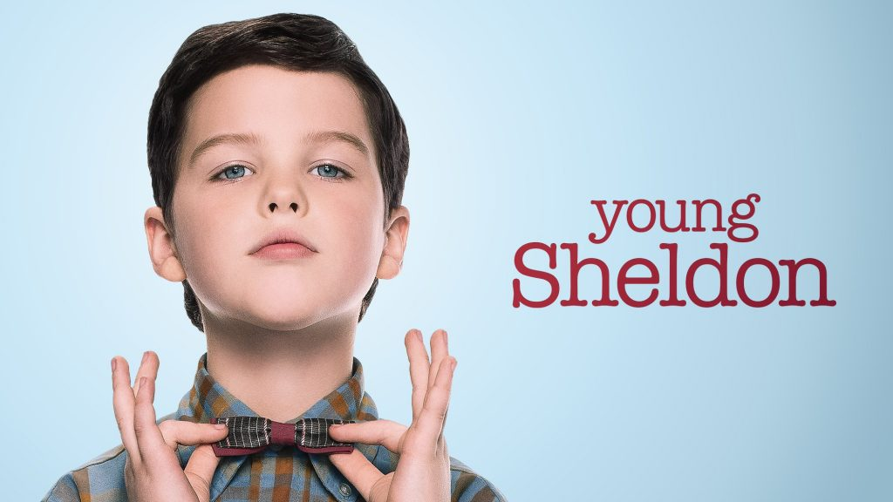
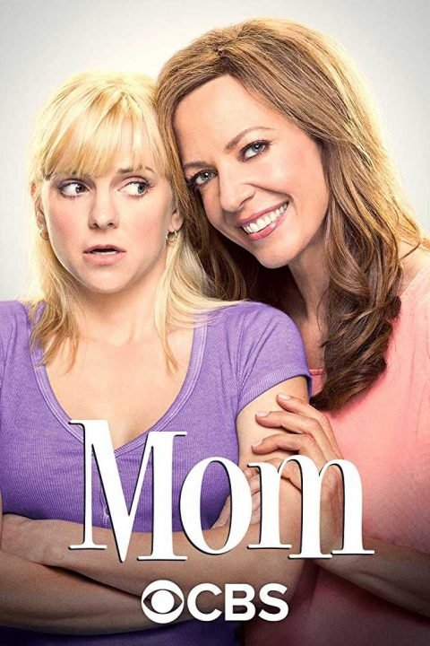
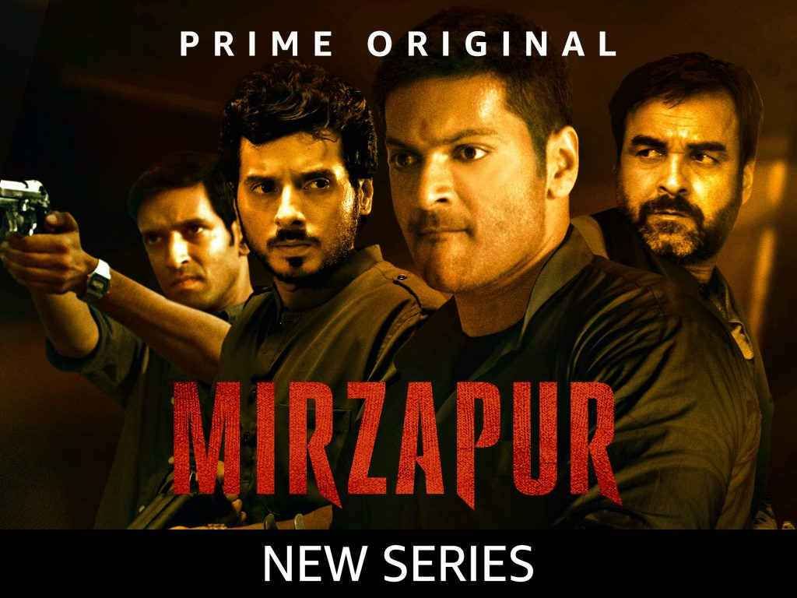

Done with Netflix? All shows comes up to be boring?

Don't worry, Amazon Prime comes to rescue with its exclusive 3 TV Shows. They too have their own exclusive shows available only on Amazon Prime. This 3 TV shows are the one you should definitely watch.

Let's get deeper into it. Starting with number 1.

## Top 3 TV Shows on Amazon Prime

- **Young Sheldon:** This show is definitely worth it. I felt like I ain't wasting money on Amazon Prime so far. It story begins with that smart ass kid. He goes to High School being a 9 years old kid. It is fun watching the show. This show got 2 seasons in a total of 34 episodes. To know more about this kid Sheldon Cooper watch the show now on Amazon Prime. Young Sheldon comes under Comedy Genre.

- **MOM:** From hitmaker Chuck Lorre comes his next big comedy – an irreverent and outrageous take on true family love – and dysfunction. Newly sober single mom Christy struggles to raise two children in a world full of temptations and pitfalls. Testing her sobriety is her formerly estranged mother, now back in Christy's life and eager to share passive-aggressive insights into her daughter's many mistakes.

- **Mirzapur:** Akhandanand Tripathi (Kaleen Bhaiya) made millions exporting carpets and became the mafia boss of Mirzapur. His son Munna, an unworthy, power-hungry heir, stops at nothing to continue his father's legacy. This show is Prime Original and is streamed by Amazon Prime exclusively. **Don't go deep into its language. I don't recommend it as family\-friendly show.** It is based on Crime, and Mafia thing.

For those who don't know Amazon Prime Video, Prime Video is an Internet video on demand serviced offered by Amazon. All Amazon Prime members have access to it's prime video. It also streams all movies, and TV Shows in several different languages all over the world.

**Read More:**
