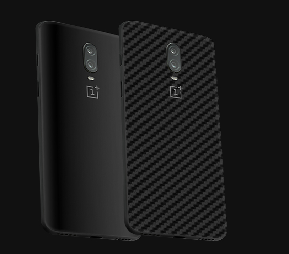

Hate cases? Bulky for you?

You're just as me. Eventually changing covers weren't part of my life anymore.

I just found them bulky and just ruined the shape, weight of the phone which companies worked like ages for you to bring their best.

All you do is slap a case on it and ruin the whole design.

It's human mind, they care what they paid for.  
Ultimately, it's a protection from scratches. Right? Skin is what comes to the rescue.

**[Skinnova GadgetShieldz](http://gadgetshieldz.com)** was very kind enough to send me the sample to test it out and present my honest review on it.

Clearly, I'm not comparing any other brand with them. I'm here with my best review as possible.

## Skin Review:

### Texture:

The skin I recieved was **Black Carbon Fiber** and texture was so good that I almost feel it whenever I hold the device. It is now less slippery, protected from scratch and that amazing feelings to your hands.

### Price:

Although spending 500 rupees is not all cup of tea for a skin right? But trust me, it is worth the money. The protection, The looks, The same design of the phone in your hand and all is worth it. You should go for it. The Skin material is super good and sticks well when applied with care and [instruction given on their website](https://www.gadgetshieldz.com/how-to-apply-skinnova-skins.html). If not, you're screwed.

### Looks:

I ordered Black Carbon Fiber skin and it's looks killer on the phone. The shiny appearance and textured looks from the back is just amazing to look at. When you also opt for Camera lens, it makes phone completely merge in the skin. If you're a guy who want looks as well as protection from scratches then this skin is for you.

### Application:

You need not to worry about the application. A simple video tutorial **[How To Apply The Skin - Skinnova GadgetSheildz](https://www.gadgetshieldz.com/how-to-apply-skinnova-skins.html)** will help you in getting started right away. _Just be very careful while applying the corners. You need a good amount of heat and perfect alignment._

> **Disclaimer:**
> 
> This skin doesn't protect the device from falls. If you're a heavy user or surrounded by childrens then I recommended not to opt for this skin. However, you can always add some protection with transparent TPU case over the skin.

### Overall Rating:

**8/10**

**Read More:**
