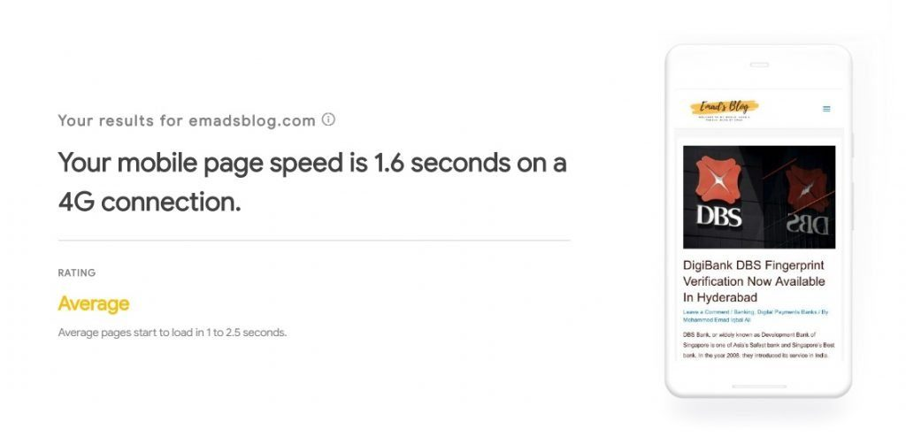

Plugins play an important role in every WordPress bloggers life. Plugins are almost considered masterpieces when it comes to customization of your WordPress Blog or Website. Here are 9 Wonderful WordPress Plugins.

Why?

Not all bloggers are tech savvy or coders who can go into the theme codes and edit the codes to their needs. The plugin does the job for them, apart from this job many plugins offer plenty of other benefits.

Plugins take care of **Search Engine Optimization (SEO), Redirections, Caching, Smushing Images**, etc.  

Also, do note that installing too many plugins can take up too many resources and CPU which eventually slows down the performance of your website and WordPress users might get irritated. It is mostly because many plugins are front-end and can add additional javascript and CSS which will require a lot of requests slowing it down.

**It is recommended to install not more 20 plugins**. However, you should install only the one you’re using and rest can be deactivated. If you want to know “[How Many Is Too Many?](https://premium.wpmudev.org/blog/too-many-plugins/)” then you can read that article. You don’t need to install all popular plugin.

## **10 Plugins Every Blogger Should Install**

### 1\. **[Analitify (Freemium)](https://wordpress.org/plugins/wp-analytify/):**

This plugin is used for watching website or blog statistics. It is the best as it uses a seamless integration with Google Analytics to provides the statistics in a minimalistic way. It is a combination of several amazing features like,

- Real-Time Stats
- Top Keywords Use To Find Your Blog
- Top Referrers (Social Media Driven Traffic)
- Stats for Top Countries
- Shortcodes support in Widgets and More **(Premium)**
- Campaign Stats **(Premium)**

Analitify ScreenShot

### 2\. **[Yoast SEO (Freemium)](https://wordpress.org/plugins/wordpress-seo/):**

It is popular among every blogger. Yet, some of them still don’t know about this plugin. It helps you manage everything about Search Engine Optimization.

It takes care of sitemaps, robot.txt and on-page & off-page SEO. You can also get a live preview of how your post will be looking on search engine beneath every post you’re writing in WordPress.

It provides full control over site breadcrumbs just by adding a piece of code and you’re good to go. It helps you in setting canonical URL’s to avoid penalties from Google.

There are still more left to expect it from this plugin. It offers features like,

- SEO & Content analysis which will help you come up with killer content optimized for Search Engines.
- Bulk Editor which helps you in making large scale edits seamlessly.
- If your blog has several members, you can also give specific areas of Yoast SEO plugin to handle.
- Integrates with Google Search Console to see how your site performs in the search engine.

- Social previews to manage the way your page is shared on social networks like Facebook & Twitter. **(Premium)**
- Redirect manager: It manages all redirect and manages all 404, 301, and such errors. It eliminates the need for other redirection plugins. **(Premium)**

### 3\. **[Advanced Ads \[Freemium\]](https://wordpress.org/plugins/advanced-ads/):**

If you’re using Google Adsense for monetizing your website which almost every blogger uses then you should definitely get this plugin. It is way too simple with 1-click activation.

You just need to put the ad code of either Google Adsense or any other affiliate networks for inserting banners or ad content.

It can also inject HTML, CSS and PHP codes. Advanced Ads deals with Amazon Ads with a rich content type or insert native amazon ads. It has everything customizable, you can also give a title above ads.

Advanced Ads uses shortcodes to display ads which reduce the hassle of copying and pasting ad units every time. It features the display conditions for ads. If you don’t want ads on 404, or other pages then you can put on a condition.

Why I love Advanced Ads is because it is simple and easy to use. On this blog, all I did is copy the Google Adsense AutoAds script and paste it into the plugin.

That’s it. They are automatically placed and I don’t have to do anything.

### 4\. **[Smush Image Compression & Image Optimization \[Freemium\]:](https://wordpress.org/plugins/wp-smushit/)**

It is an award-winning image optimizer. All it does is reduce the size of the images on your blog efficiently leading to more loading speed of your site. The most interesting part is that the image quality remains just like before. I bet you couldn’t notice any difference.

The outstanding features of this Plugin are:

- Lossless Compression that is compressing without losing the quality.
- Incorrect size detection. It can detect incorrect sizes of images on your website and highlight them. You can change the size to speed up your site.
- Bulk Smush - It can smush up to 50 images in one go.
- Process all your files - let it be JPEG, PNG, or GIF.

## 5\. **[Ninja Forms - The Easy and Powerful Form Builder \[Free\]:](https://wordpress.org/plugins/ninja-forms/)**

Most of the blog have pages and one of them always is “Contact Page”. On this page, bloggers collect user email and their message they want to convey. Apart from this, bloggers also use forms for subscriptions, surveys, and feedbacks.

Here’s where the Ninja Forms comes to rescue for many bloggers. They usually want to avoid codes and all other stuff to make amazing forms. Additionally, you can also build your mailing list with some of the top mailing service providers and one of them is MailChimp. The Ninja Forms does it for you with cool features like,

- Beautiful & Easy User Interface.
- Dedicated fields like Email, Phone Numbers, Date (with date picker) and addresses, etc.
- It features the ability to give user success messages and redirect them to any landing page of your site.
- You can export and import forms and favorite fields.
- The form is submitted using [AJAX,](https://en.wikipedia.org/wiki/Ajax_(programming)) therefore it gives user seamless experience without refreshing of pages. (It depends on PHP version too. If you’re using PHP Version below 5.3 then you may experience issues)
- A lot of Add-ons available and are regularly updated.

## 6\. **[Shop Page WP \[Free\]:](https://wordpress.org/plugins/shop-page-wp/)**

Since every blogger in India I know uses Affiliate Marketing to earn extra money besides monetizing their sites. However, some write a review on products and provide affiliate links within the post and some make their own page to let readers shop their recommended products/gadgets or whatever it may be.

For those who are looking to have a completely new page where they can recommend the products for their readers then Shop Page WP plugin does it.

All it does is, let you create a new page just like an e-commerce shopping page. Here’s how it looks.

Example of Shop Page made By Shop Page WP Plugin

Cool right?  
Let’s see some of the key features of this plugin:

- Allows you to create a simple shop page with grids of products.
- Simple and no hassles. It automatically resizes or crops your images to make the page look clean. You can visit my [Shop Page](https://sastaeinstein.com/shop) to have a look.
- You can use any affiliate links or simple links too. It can be anything like Amazon, eBay, CJ, etc.
- Custom shortcodes to feature the products outside of shop page that is on your other pages or in the post.

### 7\. **[W3 Total Cache \[Freemium\]:](https://wordpress.org/plugins/shop-page-wp/)**

It is one of the plugins which plays a role in improving your SEO and user experience.

Many bloggers want their blog to rank in the top of the search engine but some never give a thought to the loading speed of their site. The loading speed of your blog is an essential part of SEO, it helps you in ranking.

According to Google Page Load Time Study, the sites which take 6-10 seconds of loading time increases the bounce rate probability to 106% - 125%.

The only web host agnostic Web Performance Optimization (WPO) framework for WordPress trusted by millions of publishers, web developers, and web hosts worldwide for more than a decade.

It is compatible with any hosting types, Shared, Virtual or Private and takes care of caching feeds, objects, search result pages, & CSS/Javascript either on memory, on disk or CDN.

It also has browser caching using Etags, cache-control and future expire headers and provides Caching statistics for performance insights.

Get this plugin to cache the load your site faster to avoid those bounce rates. Even I use this plugin and it actually showed great improvements when it comes to my blog speed.

[Page Speed Test By Google](https://developers.google.com/speed/pagespeed/insights/)

Apart from this your hosting provider also plays a role in loading speed of your site. **This blog is hosted on Hostripples.**

### 8\. **[UpdraftPlus - Backup/Restore \[Freemium\]:](https://wordpress.org/plugins/updraftplus/)**

What if your hosting provider collapse? What if your site went wrong with an update or crashes with no obvious reasons? Most importantly, what if you get hacked?

Anything can happen, right? Like, we can say Prevention is Better Than Cure, therefore, I use UpdraftPlus to backup my site in just any of cases happen I don’t have to regret to lose all of my hard work and data on the site.

I can easily jump on to another great hosting providers and install WordPress again and using this plugin I will get my site back to life. Easy peazy, you see!

Some cool features of this plugin are:

- A simplified way of backing up and restoring.
- It can schedule your backups. Cool! Install the plugin and forget it. It does your job.
- Backups can be done directly to the cloud storages like Dropbox, Google Drive, Amazon S3, UpdraftVault & FTP, etc.
- It is supported on all current versions of PHP

### 9\. **[WP User Avatar \[Freemium\]:](https://wordpress.org/plugins/wp-user-avatar/)**

Not a fan of Gravatar? I feel you. Most of the bloggers don’t love Gravatar. As every blogger have their own personal views regarding something. No need to the argument here.

Gravatar is cool but I need something that works from the Inside.  
Hence, WP User Avatar plugin helps me in putting up any of my avatars to be displayed on my site.

It is the same for every profile you have on your site. Let’s it contributors, authors or whatever, you can manually give the avatars to each profile.

Key Features of this Plugin are:

- Easy upload and capture functionality.
- It keeps avatars on a custom folder rather than the media library.
- Keeps an avatar on DropBox or Amazon S3.
- It is easy to use.

That’s it. If you have more essential plugins one can add, you’re free to suggest them in the comments below. I will be updating the article.
