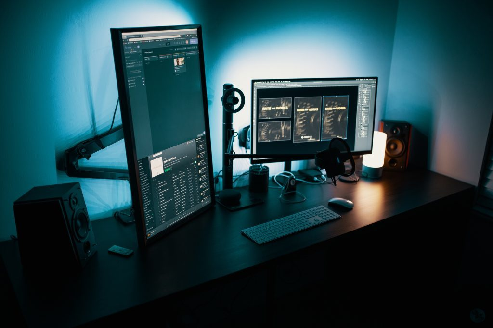

For playing games, the first thing in mind that pops up is either Smartphones or a gaming PC isn't it? To narrow down on the choices, a hardcore gamer always tends to remain with Gaming PC while a moderate gamer does game on smartphones.

If you happen to be a moderate gamer, then you might be looking for [Smartphones Under Rs 30,000](https://sastaeinstein.com/2019/04/top-10-smartphones-under-30000.html) which will help you with your gaming as well as all other things a smartphone can do.

> **Disclaimer**: This article is about making a CPU and not the whole PC. You need to buy Monitor and all other accessories additionally.

After the first thing popping in your mind and the decision is fixed to Gaming PC, the second thoughts are Building A Gaming PC. You may have no experience in building a rig before however, it is worth learning to do it. It is pure fun and on the way you learn a plenty of things like troubleshooting your own PC if something went wrong.

Without further ado, let's get deeper in to building a brand new gaming rig.

## Building A Gaming PC

Building a gaming PC all by yourself isn't that hard. You can always hop on to YouTube to watch and learn then build the stuff.

**However, in this article,** I'm not going to share the whole DIY guide to build a Gaming PC but I will be sharing with you the essential parts you should buy and gather to build the PC. It minuses your hassle in selecting the right part for your PC and you can focus on building it.

## MotherBoard/MainBoard:

Choosing a motherboard can be tricky. It should be compatible with the rest of the specification you are going to opt for. Clearly, in this article, I'll be listing all the parts compatible with each other.

**MSI 7A36-005R A32M Motherboard**

[Check Price](https://amzn.to/2WDGa36)

As our budget remains, Rs 30,000 to be exact therefore we need to cut down the list of all motherboard and opt for the best one in the market although that falls in the budget.

MSI 7A36 tops our list and most probably supports the later requirements with ease.

## Processor/CPU

This is the heart of the PC. If you're a gamer, you should have already heard of FPS (Frame Rate Per Second). The processor has the main role in giving those smooth FPS while playing graphics intensive games like Fortnite, PUBG, & CS: Go.

We decided to go for **AMD** and it is the best performer than **Intel** of course. We went for this which is pretty much clean and better performer yet follows our budget.

**AMD Ryzen 3 YD220 \[3.7 GHz\]**

[Buy Now](https://amzn.to/312D3RB)

## RAM

Now, RAM is again a crucial part of the PC. The more the ram, the more processes in the background can be run. When it comes to gaming, a whole lot of RAM especially in GB's are consumed and if you don't have enough RAM then it might drop the performance of your PC. Therefore, we went for Crucial 8GB DDR4 2400MHz RAM.

**Crucial 8GB DDR4 2400MHz**

[Buy Now](https://amzn.to/2JU63FE)

## Graphics Card/GPU

We need something with the amazing CPU and we thought the GeForce GT 710 is almost a better combination in this budget Gaming PC to run any game smoothest.

With this card, we can almost run every game with slight setting tweaks and even the modest games run perfectly on higher or medium settings.

[Buy Now](https://amzn.to/2KlYNSA)

## HDD/SSD

Storage is an essential thing when it comes to Gaming PC as the games on PC aren't 1 or 2GB and it goes like up to 50GB for some games and that too it will be the installation file only.

Therefore, we need storage for such installation files and other things like movies and pictures on Hard Disk Drive while essential programs and Windows OS files, and games run on the Solid State Drive for smooth and faster performance.

[Buy Now](https://amzn.to/2YYKSWC)

Buy Now

## Cabinet

It is where you put all the stuff you are buying right now. For gaming, we have to make it a gaming PC. Isn't it? So, we come with this amazing Gaming Cabinet which looks pretty clean with RGB lights at front and even stylish.

[Buy Now](https://amzn.to/2ETAx6O)

## Power Supply

Although it doesn't come with cabinet most of time and the cabinet we listed is one of them. You need to purchase the PSU as it doesn't come pre-installed with the cabinet. Here, is the best PSU for power to your Gaming PC.

[Buy Now](https://amzn.to/312vL01)

## DVD Drive (Optional)

In this modern world, we couldn't find a reason why one would buy a DVD or even store their backup in a DVD. Anyway, having a DVD drive on your PC is a great idea. Sometimes, not everyone are equipped with bootable USB drives to install windows on your brand new PC. If you know about bootable flash drives then skip the DVD.

**You can find it on Amazon pretty easily. If you want,** [check it out.](https://www.amazon.in/LG-24x-Internal-Writer-Black/dp/B016MMCJL2/ref=sr_1_3?keywords=lg+dvd&qid=1559603304&s=gateway&sr=8-3)

## Total Expenditure

<table class="wp-block-table alignwide has-subtle-pale-pink-background-color has-fixed-layout has-background is-style-regular"><tbody><tr><td><strong>Product</strong></td><td><strong>Price</strong></td></tr><tr><td>Mainboard</td><td>₹ 3740</td></tr><tr><td>Processor</td><td>₹ 8000</td></tr><tr><td>RAM</td><td>₹ 2800</td></tr><tr><td>Graphics Card</td><td>₹ 3000</td></tr><tr><td>Solid State Drive</td><td>₹ 2230</td></tr><tr><td>Hard Disk Drive</td><td>₹ 3107</td></tr><tr><td>Power Supply</td><td>₹ 2620</td></tr><tr><td>Cabinet</td><td>₹ 2474</td></tr><tr><td><strong>Total</strong></td><td>₹ 27971</td></tr></tbody></table>

## **Conclusion**

In this article, you learned about the products you need to build a Gaming PC with a budget of Rs 30,000. All the products listed above are compatible with each other and I promise that this PC will be much powerful in this Budget.
