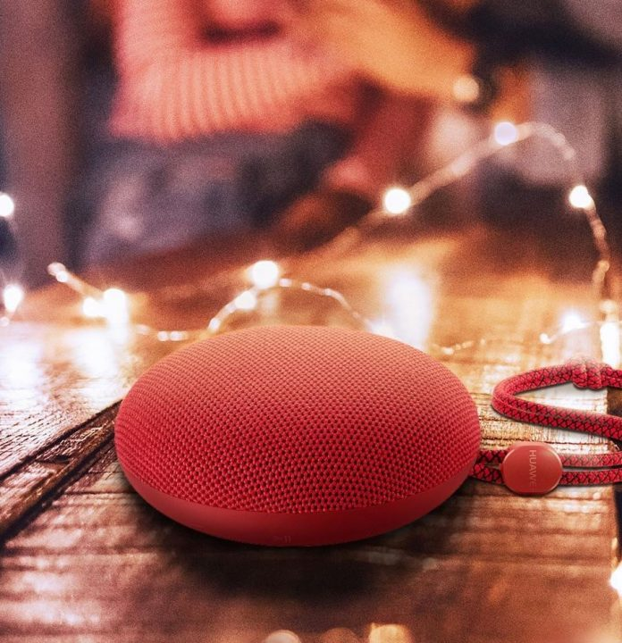

Music is much better than what you hear in the normal speakers. Normal speakers are great but they don't give out the best output yet sometimes music becomes noise.

The music consists of Treble, Bass and natural alto. With all of these, you can actually get a feeling of listening to music or tune. Ever wanted to listen to pure music and every inch of tune then these speakers are for you.

Huawei Sandstone Portable Bluetooth Speaker (Red)

## Pros

1. Compact & Portable Design
2. Lightweight
3. Rich & Surround Sound Quality
4. Attractive Colors
5. Medium Bass & Trebel
6. Crisp Clear Microphone
7. Good Battery Life
8. Water Resistant with IPX5 Rating

## Cons

1. Not an attractive pricing. It is fairly on higher side.
2. It sounds good in small parties or gatherings.

## Huawei Sandstone Portable Bluetooth Speaker Review

The Huawei Sandstone Portable Bluetooth Speaker is one of the best looking portable speakers in the market. It is rather good when tested and surprised me with its sound. The sound clarity is pure and you can easily hear the bass and treble along with the music while other speakers just throw out the sound with lyrics.

In this speaker, you can actually listen the song the way producers or singers does. Not only the sound, it surprised me with it's hands free capabilities. The microphone amazed us which is present in the speaker. While on call, the speaker's microphone is actually so good that the person on the other side hears may sound very clearly.

Upon testing it with splashing water on it, it works amazingly well. There were no signs of sound distorting when testing in water. The charging ports are completely sealed with rubber cap. Thanks to its water-resistant capabilities which helps you in listening to music anywhere including on Rainy Days or in a pool party. You can also use it while Hiking, Driving or Cycling.

It is made of rubber & plastic and cloth on the top and looks impressive in design. It is portable and can be attached to backpacks or even fits in the pocket (if you have big pockets).

The large magnet driver and high sensitivity vibrating diaphragm gives you deep bass and penetrating sound with sharp treble and natural alto. The battery is impressive and gives you a lot of music playback hours. It is fitted with 700 mAH of battery which gives you about and over 6-8 hours of music playback and can be fully charged within 3 hours easily.

## Availability & Pricing:

It is available in India to buy at the price of Rs **2759** on [Ubuy](https://www.ubuy.co.in/catalog/product/view/id/10694771/s/huawei-sound-stone-portable-bluetooth-speaker-cm51-ipx5-water-resis?gclid=CjwKCAjwmZbpBRAGEiwADrmVXq5C2raCn7Nlph4c0Xem_904dqQz7H2oE4ItAwjpff7dy62BsTcNeBoCLNIQAvD_BwE). While for the countries it is available on [Amazon](https://www.amazon.com/Huawei-Portable-Bluetooth-Speaker-Resistance/dp/B079NL1FLD) for about $30.

**Read More:**

- [GoNoise Noise Shots Sports Truly Wireless Earbuds Review](https://sastaeinstein.com/2019/03/gonoise-noise-shots-sport-honest-review.html)
- [GadgetSheildz Full Body Screen Protector For All Smartphones Review](https://sastaeinstein.com/2018/12/gadgetshieldz-screen-protectors-review.html)
