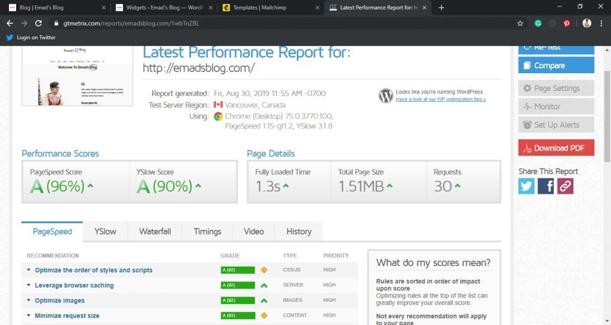

Every blogger who just started out didn't cared much about the speed of their blog or website. They think that it isn't much of their problem but it is. You don't need always need a good and amazing content to let your readers stay on your site or visit you site in first place. Even though if you're writing amazing content and making headlines irresistible to let the readers click on your site then also **the visitors can leave your site** **within 3 seconds.**

Today in this article, we will be showing you how you can actually make WordPress site faster with the help of plugins and themes. These plugins and themes will help your blog or website to speed up WordPress overall.

[

###### **Get Premium Themes & Plugins Starting $5**

Get access to Premium Plugins And **Receive Support From Me Up To 1 Year!**

](https://sastaeinstein.com/service)

> According to [Duda](https://www.duda.co/blog/10-incredible-stats-facts-need-know-pagespeed/) stats on Page Speed, 40% of people abandon a website that takes more than 3 seconds to load!

Yup, that's it. This is why a faster loading site is important. Secondly, coming to Google they revealed back in 2010 that speed of a page if also a factor that determines a website's ranking. Also, the website page which loads slow is penalized by search engine and can effect your ranking.

**In Short, you're missing out on Organic Traffic you'll be receiving and the ranking as Google won't rank you on the top even if you do the best SEO practices out there.**

Let's check out how you can increase your website speed by following simple steps to a certain extent. First we will discuss what actually are the factors which can slow down your WordPress Site

1. Not Optimizing Images & Using Lazy Load Feature
2. Not Using Caching Plugins
3. Using Heavy Themes
4. Cheaper & Not Reliable Hosting

We have discussed enough now. We will go in details on the above terms with respect to plugins and themes. Read further to learn more.

## 1\. [Smush - Image Optimization Plugin](https://premium.wpmudev.org/project/wp-smush-pro/)

Smush is a plugin by [WPMU DEV](https://premium.wpmudev.org/) which helps in compressing all the images on your blog or website to make your website blazing fast for the readers visiting your site. Smush is a award winning plugin and does it job automatically by resizing and optimizing every single image in any directory on your WordPress website or blog.

Smush plugin has over 1.4 Million+ downloads and over 1.2 Million+ installs. It is an amazing plugin for a reason. **It reduces the image size to the half and you can't even spot a single difference.** Over a whopping 36.5 Billion images have been optimized using Smush Plugin. It is clear that using Smush for optimizing images on your site will not only make your website faster but also help in ranking higher.

Other amazing features offered by Smush are,

- Bulk Smush
- Lazy Load (Prevent Loading All Images At Same Time)
- Detect And Show Incorrectly Sized Images

However with **Smush Pro**, you get CDN which is blazingly fast and removes load from your server hence increasing a lot of speed for your website.

> I have GPL licensed **Smush Pro** plugin to help all budding bloggers to get them access to Pro features of the plugin at a very reasonable prices. As some developers of the plugins limits access in GPL license therefore, Smush Pro offers all pro features except **CDN**.
> 
> Disclaimer

[

###### **Order Smush Pro - $20**

Smush 2x More Than Regular Smush (No CDN)

](#)

* * *

## 2\. [WP Rocket - Advanced Caching Plugin](https://wp-rocket.me/)

It is one of the recognized and powerful caching plugin for WordPress by WordPress experts. Almost all the WordPress experts recommend using this caching plugin as it significantly improves your overall WordPress site speed.

It has amazing features which helps in improving the speed of the WordPress site,

- **Page Caching -** For Ultra-fast loading time, and improving SEO simultaneously increasing conversions
- **Static Files Compression** - It minify and reduces the size of your HTML, JSS, CSS files for reducing load time.
- **Cache Preloading**
- **Images on Request** - Offers images to the readers only on request i.e, when they start scrolling.
- **Developer Friendly** - If you're a developer then you're free to make advanced customization easily.

They are features on all 7 heavens!

The SeedProd, Codeable, Beaver Builder, WPPronto, CoSchedule, Themeisle, WPlook Studio & MainWP. All of em, recommend using this plugin. Still, don't believe? Try the plugin yourself or check out my screenshot from GTMetrix after using WP-Rocket Pro

[

###### **Order WP Rocket PRO - $10**

Get updates up to 1 year for free!

](#)

* * *

## Using Light Themes To Increase Speed

Light weight themes not only looks good but also reduce your website load time. Therefore, it is necessary to invest into a good theme from the starting so you don't have to spend long time into changing themes later from scratch. Starting with a good theme boosts everything up. Let's check out which themes are better to start with.

## 1\. [WP Astra Pro](https://sastaeinstein.com/refer/astrapro)

Astra is everyone's favorite and not only because it is lighter than other theme but it provides with lot of customization while other light themes don't. Astra is lighter and faster. It can be installed for any type of website and customize it to your liking right away.

Astra is made for super fast performance and especially crafted for page builders. I just love the combination of Astra Pro and [Elementor Pro](https://sastaeinstein.com/services) **(Also Available For $5)** together. Even this website is purely made with this combination.

Astra can be customized without any code. All you have to do is install Astra on your wordpress site then do all the customization with built in customizer live. As easy as eating peanuts!

In the PRO version, you have plenty of settings that are unlocked such as,

- Custom Layouts
- Sticky Header
- Page Headers
- Nav Menu
- Mobile Header
- Typography
- Spacing
- Site Layouts
- Scroll To Top Feature

[

###### **Order Astra PRO - $10**

Get Astra Pro Free Updates Lifetime!

](#)

* * *

That's all for today! Hope you learn something from this post. **Speed is important.** Apart from Hosting, I am sure now you have the fastest WordPress Site.

If your hosting is slow and laggy, then I prefer using Hostinger which is very fast and have around 99.9% uptime guarantee with 24/7 support. Not only this, they have an introductory offer going on and therefore, hosting starts from a mere **Rs 49 per month** for a basic plan while **Rs 129 per month** for a premium plan.

