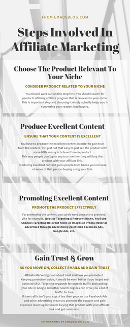

Hello folks, I am tired of people asking questions everywhere about **Affiliate Marketing**. Everywhere they come up with questions like, does affiliate marketing from amazon or affiliate marketing Flipkart works? Therefore, I'm here with the Affiliate Marketing for Beginners guide.

Many other questions, like **"How Do We Sell?" "What Do We Do?" 'What Do I Need?".**

I decided to compile everything in a single post which is going to be easy for beginners to understand the basic needs of being a successful affiliate marketer if they work hard.

**Looking for the easiest way to make money without working? No Chance, dude!** No easy money. For the money, you need to work in such a way that it should be smarter as well as harder.

Setting up a site which gives you earning from affiliates needs plenty of time. However, in this article, I'll show you how exactly you can reduce this time and work smarter to achieve results quickly.

## Affiliate Marketing For Beginners

**"I'm totally new to affiliate marketing! Where should I get started?"**

This exact question was mine when I was introduced to this topic "Affiliate Marketing". I then got a chance to work with some experienced bloggers and affiliate marketer to understand the concept behind Affiliate Marketing with Amazon or Flipkart or pretty much any network that offers referral type or affiliate program.

Let's start with Basics!

## Basics: Understanding Affiliate Marketing

Affiliate Marketing is not a big deal. It is a type of marketing in which you will be marketing other's product in your own way or on your own platform (i.e, Website, Video Sharing Site) targeting right users with your own promo material designed your way to make your visitors convert into buyers.

In short, **you promote someone else's product in your own way to your relevant viewers. In doing this, you get a commission on a percentage basis on per sale or if it is membership then on a recurring basis.**

The simple steps involved in Affiliate Marketing are explained in the infographic below.

  
  

Now I hope you're familiar with Affiliate Marketing. Let's move further.

## Popular Affiliate Programs

As you can see there are options in Affiliate Marketing Programs,

- [Affiliate Marketing With Amazon](https://affiliate-program.amazon.in/welcome/getstarted)
- [Flipkart Affiliate Program](https://affiliate.flipkart.com/) (Indian Users)

The above affiliate programs are the most popular and easy to use. You can [make a website easily](https://sastaeinstein.com/2018/12/beginners-guide-to-start-a-blog.html) and then [write an amazing content](https://sastaeinstein.com/2019/07/write-blog-post-fast.html) within the product niche you're going to target from above affiliate programs.

With this idea, you should focus on getting ranked in the search engine to drive traffic and income as well from the Affiliate program. The more traffic you have, the more likely people will buy using your link after interacting with your content.

## Other Affiliate Networks

There are plenty of affiliate programs in a hundred different niches. Almost every targetted niche can fit with affiliate programs. Some of the other affiliate networks are,

- [Clickbank](https://www.clickbank.com/affiliate-network/)
- [ShareASale](https://shareasale.com) (Need Requirement Before They Accept Sites)
- [Commission Junction](https://www.cj.com) (Major companies like GoDaddy, Grammarly, etc uses CJ for providing affiliate for their products)
- [MaxBounty](https://www.maxbounty.com/)
- [RakutenMarketing](https://rakutenmarketing.com/channels/affiliate/)

These affiliate programs will help you find the right product as per your niche.

## Start Earning With Affiliate Program

Earning with this program also have plenty of ways. I am discussing it below to help you understand what it requires you to start earning with any affiliate program. Although you should be making a niche blog if you're a beginner and begin affiliate marketing with Amazon

- Earning With Targeted Niche Review Blog (Either Small or Medium-Sized Blog)
- Earning With Review Videos On YouTube With Affiliate Links In Description
- Make A Whole New Site Targeting A Single Affiliate Product And Promoting It With Advertisements.
- Creating a 3 seconds creative video or image with the affiliate product link and promoting it with advertising.

Many of you will definitely choose to make a website on a particular niche and then start affiliate marketing. Let's see how we can make one easily and without zero hassles.

## Making A Website For Affiliate Marketing

Nowadays making a website is not a big deal. Everyone with a little knowledge of using a computer can easily make one. Thanks to the **inbuilt website builder** that comes with hosting and domain packages.

Also, installing WordPress and then creating a site with some page builder like **Elementor, WP Beaver Page Builder, Brizy, etc.**

The Astra Starter Site is pretty much amazing as it allows you to import the whole site template as yours and edit it. This is amazing.

1. Plan and research the niche you are planning for.
2. Gather keywords and it's volume. Make a list of posts title and keep it ready.
3. Make a sheet and plan for publishing 1-3 posts every week.
4. Brainstorm some domain names related to niche and it should contain the main **keyword.**
5. Finally, search for that domain. I recommend either **GoDaddy or Hostinger.**
6. However, upon choosing **Hostinger Premium Hosting Plan** which is just Rs199/mo or $2.15/mo. It offers **Unlimited Websites Hosting, Free Domain** & **24/7 Support.** They have website builder free with this plan as well. But if you want WordPress then they also have a 1-Click installer which helps you install WordPress in 1 click.
7. Setup themes and necessary plugins. Check the recommended [plugins for Affiliate Marketing](https://www.wpbeginner.com/showcase/10-best-affiliate-marketing-tools-and-plugins-for-wordpress/) here.
8. Get ready to post on your website along with affiliate links.
9. Make sure the content is excellent.

## Monetizing Website Apart From Affiliate Marketing

When you monetize your site with an affiliate program, it is not necessary to avoid all other types of monetizing methods. You can still apply for most used Monetizing methods for websites with content.

- [Google Adsense](https://adsense.com) ([Here's How You Can Get Approved Quickly](https://sastaeinstein.com/get-website-approved-adsense.html))
- PropellerAds (Best one & Highest Paying after Adsense)
- [More Ad Networks](https://sastaeinstein.com/top-highest-paying-affiliate-networks-you-should-sign-up-now-to-earn-money-online.html)

These above methods are the most used for monetizing blogs and websites. In this monetizing method, the ad networks display advertisements on your website which you can place manually with other ad networks while Google Adsense features Auto Placement of Ads.

Therefore, for the ads placed on your website, you're paid on impressions as well as clicks or say engagements.

## How Can I Earn Up To $500 A Month And Become A Successful Affiliate Marketer?

It takes time and consistency and requires smart moves. It all depends on your niche and the traffic you generate. Here are some tips you should be keeping in mind to start earning faster with affiliate marketing. I suggest you start a site or blog on affiliate marketing with Amazon by making a niche site.

- Don't listen to your brain or heart. Choose niche and keywords only after researching on it. It's not like, this product looks cool so, I'll promote it. No, this is not how it works.
- Focus on one niche and one itself. The whole site should be on one niche to get faster results.
- You should target keywords and optimize SEO along with posting consistently to get rank into Google or Search Engines faster so you get traffic for particular keywords you're targeting.
- There will be a lot of work for you to do. Staying organised is one of the keys to be a successful affiliate marketer. Make a plan in the sheet as I mentioned or use Editorial calendar to plan everything out.
- Manage affiliate links with plugins as mentioned above.

That's all for today if you've any discussion then don't hesitate to comment down below.
