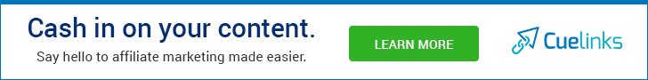

Lots of products and lots of competition. The main aim of the affiliate program is to encourage the sales of a particular product by giving away fixed amount or percentage of commission to people who drive them sales with their own platform.

In this article, we will be handpicking the best affiliate programs to make money. The bloggers will be creating content on their blog to drive sales to an affiliate product which in return will get commission on the basis of sales, leads or clicks.

If you're not looking for monetizing your blog or website with affiliate marketing program then you can check out [Top Ads Networks That Pays High Rates](https://sastaeinstein.com/2017/03/top-10-highest-paying-cpm-ad-networks-you-can-use-on-your-blog.html) to monetize blog and earn enough money.

The factors involved in choosing the best affiliate programs can be easily sorted out, like for example a good affiliate program might have this particular features,

- A good program should be offering a great commission rates as per the product price
- They should have an irresistible product which you can't stand behind to purchase it at first place.
- Good programs should be paying commissions on time.
- Their customer service should be responding to any problems occurred immediately or in shorter period of time.
- They should be providing a lot of affiliate material like banners, links, and blurbs, etc.
- A good program always has easy interface for the affiliate center or dashboard

That's all you see. These were the things you should look out for in an affiliate program before joining them. It's hard to lookout for such affiliate programs for bloggers especially the budding ones. Therefore, I'm here compiling the list of the top affiliate marketing programs for bloggers.

By now, you guys should be like,

<iframe src="https://giphy.com/embed/pPhyAv5t9V8djyRFJH" width="100%" height="100%" style="position:absolute" frameborder="0" class="giphy-embed" allowfullscreen></iframe>

[via GIPHY](https://giphy.com/gifs/wtf-obama-wth-pPhyAv5t9V8djyRFJH)

But it's important to know how a good affiliate should be like. In the future, you may be able to distinguish between a bad and good affiliate program without searching for one like you did now.

## Best Affiliate Programs: HandPicked For 2019

I know there are plenty of Affiliate Programs out there. There are some that approves your site before you can work with them. As my blog has number of readers who are just beginners out there so I decided to put up the handpicked Affiliate programs that doesn't requires the approval thing.

I will mention the Affiliate Networks that require Approval along with the list of them. Without further ado, let's get started.

### **[Amazon Affiliate Program](https://affiliate-program.amazon.com/)** (Instant Approval)

This affiliate program tops the list. Everyone knows Amazon. It is one of the biggest conglomerate and it is doubt they run the world largest online shopping website where millions of people place orders every day. On Amazon at an average, 300+ orders are placed every single second.

Therefore, this is the perfect place which people trust and doesn't have any other thoughts while placing the order. Once, you have the niche site ready with content, you're good to go. You can place the product relevant to your niche in your content so people after engaging with your content goes directly to buy the product you placed on your website's content.

Also, this is the easiest way to do the affiliate marketing as they have everything. There's no chance that products based on your website niche isn't available on Amazon making it one of the best affiliate programs for beginners,

**Let's talk about their commission structure** shared by [Chron](https://smallbusiness.chron.com/amazon-affiliate-commission-structure-63046.html)

- **1.0%** for video games and game consoles
- **2.0%** for televisions and digital download games
- **2.5%** for computers, computer components, DVD and Blu-Ray 
- **3.0%** for toys
- **4%** for Amazon tablets and Kindle devices
- **4.5%** for paper books, healthcare, personal care, sports, kitchen, car and baby products
- **5.0%** for digital music and video downloads; grocery items, handmade items or musical instruments
- **6.0%** for headphones, beauty products, musical instruments, business and industrial supplies
- **7.0%** for clothes and accessories, Amazon TVs, Amazon Echo products and jewelry
- **8.0%** for furniture, lawn and garden, home improvement, pantry and pet products
- **10.0%** for Amazon fashion items and Amazon Coins

Amazon Pays you well on time. However, there is threshold of $10 if you choose the payment method as Direct Bank Deposit & Amazon Gift Card while $100 if you choose to get paid by Cheque or Check.

Don't worry if you're unable to make $10 in a month then the total earning will be carried to the next month. They usually pays all affiliate sales earning at net 60 days. If your earning reaches the threshold by the end of March then you will be get paid in late May.

## **[ShareASale](https://account.shareasale.com/newsignup.cfm?)** (Approval Needed)

**Note:** ShareASale consider many factor before approving the site and one of them is traffic. If your blog or website isn't generating enough traffic then it might reject your approval.

ShareASale is another amazing affiliate program out there who pays on time and pays actually better. They have lot of merchants and you may find merchants relevant to your niche easily.

They have all types of Affiliate Marketing programs like **Pay-Per-Sale, Pay-Per-Click, & Pay-Per-Lead.** Similarly, they have merchants in all niches and some of them are **Home & Garden** merchants, **Fashion** merchants, **Green** merchants & **Business** merchants. You can check out for more merchants right away on their website.

The best thing about ShareASale is that they have No-Software Policy, On-Time Payments and over 3900+ merchants in different niches. They have instant support over the phone as well making it the best in class affiliate marketing program.

**Let's talk about their commission structure.**

ShareASale takes about 20% of transaction fee from the affiliates. For example, if affiliate sold a product and earned $20 then ShareASale will charge a transaction fee of $4.

Commission paid by different merchants differs on ShareASale unlike Amazon. On ShareASale, there are merchants where you can apply their program individually. After joining ShareASale, search for the merchant based on your niche and you'll be able to see the commission percentage they pay you.

For example, your blog is based on E-Commerce guide and you want people to start their E-Commerce store right away easily.

Now, you know the merchant who let people setup their store with their services right away easily and you'll be recommending the merchant to your readers. Let's say **Weebly.**

If you recommend Weebly to your readers then Weebly via ShareASale pays you **30% of commission** per sale.

## **ClickBank** (Instant Approval)

It's almost similar to that of ShareASale. However, they also have vendors selling digital products like e-books, softwares, themes, memberships, etc. Affiliates are given with Clickbank referral link called HopLink which directs the traffic to the vendor's site.

If a customer purchases the product after being redirected using that Hoplink then they are paid a commission that is percentage of the sale which is directly credited to their clickbank account right away.

Clickbank features amazing tracking features and they pay on time. They have tons of categories to choose from and also you get **As Seen On TV** products too.

With Clickbank, you just need to prepare the content in order to promote the product. You can do that easily with blog by linking in between of content and redirect them to the merchant page. Once, they are there then every merchant have beautifully crafted pages with each and every detail of the product well explained therefore, it is much likely that your reader will make a sale.

**Let's talk about their commission structure.**

For vendors, there is a one-time fee for joining that is $45.95 while there is no fee for affiliates. Therefore, Clickbank attracts many affiliates and therefore so does vendors. It's a win-win situation.

The [Clickbank support page](https://support.clickbank.com/hc/en-us/articles/220365887-Earning-Commissions-Getting-Paid) tells about the commission and it's calculation.

Every ClickBank product has a commission rate that is set by the vendor, ranging from **1% to 75%.** When you drive a sale to that product, ClickBank processes the sale, applies its charges, then calculates the commission rate based on the remaining net sale amount. Here's an example of how much you'll earn on a one-time purchase product with a 55% commission rate:

Retail Price: $29.95

Subtract 7.5% + $1: -$3.25

Net Sale Amount: $26.70

55% of Remainder: $14.69

Therefore, as the referring affiliate for this sale, you would earn **$14.69**.

Recurring products can have different commission rates for the initial purchase and the rebill purchases, but the calculation is performed in the same way.

The maximum commission you can earn on a single sale is **$150.**

Now coming to getting paid by Clickbank, there are plenty of payment methods. Clickbank also have a payment threshold which is to be set by you within **$10 to $1,000,000**. By Default, it is set to $100 and if you want to withdraw money early then you can set it to minimum amount that is $10.

Clickbank offers the following payment methods,

- Check
- Direct Deposit
- Wire Transfer
- Payoneer

## **[Cuelinks](https://clnk.in/jypr)** (Indian Readers) (Instant Approval)

If you haven't heard of Cuelinks yet then this is the best affiliate or say monetisation solution for your blog.

Cuelinks is a not an affiliate program but it is the one that helps you in selecting the best affiliate program within their dashboard and then use it on our blog to generate revenue.

How cool is that? Super cool, right? Just sign up for Cuelinks and get started.

 

That's all for now. All the above programs were the best affiliate programs for bloggers. Many bloggers in this modern blogging era drives traffic to their blog in exchange of free knowledge with e-book. This is a great idea and a win-win situation for you and your readers as well.

If you're a blogger and wants to write an E-Book to share with your readers and also promote it to drive free traffic and turn your blog in to a brand then I suggest you to use **SQRIBBLE - Powerful E-Book Creator Studio****.** You can use this studio to write an E-Book with zero hassles and design it perfectly to make it look appealing for the readers and helpful at the same time.
