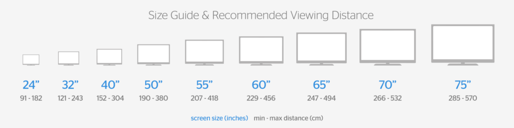
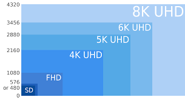
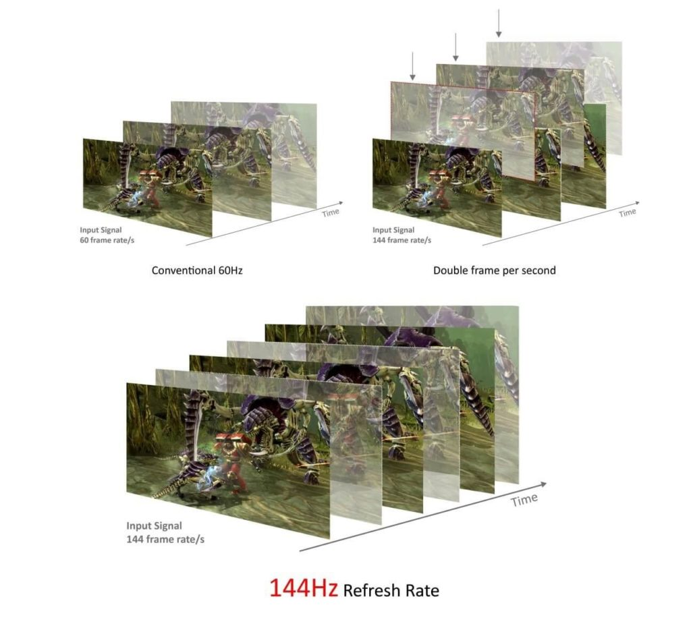
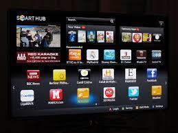
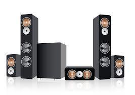
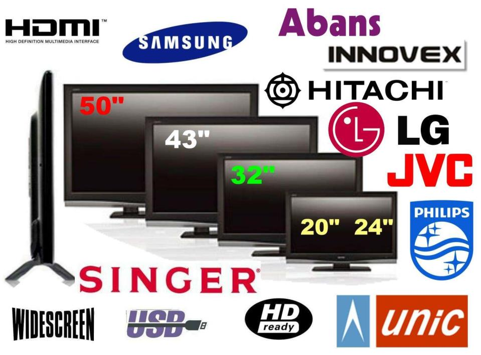

# Best LED TV: Our Top Picks

## OnePlus TV 4K Q1 55"

[Check Price](https://amzn.to/2MnjhL8)

## Mi TV 55" 4X Pro Ultra HD

[Check Price](https://amzn.to/2VT9m3d)

## Top Product 3

[Check Price](https://amzn.to/31tv4fg)

A TV is a thing which is with us for a long period, and still the best source of Indoor entertainment for the whole family. Once you have purchased a TV it is going to stay in your home at least for 5-7 years. 

**We do not change it very often, but what if we have picked the wrong TV at the time purchase?**

It is very costly to buy a brand new TV and all the money would go waste if you pick the wrong choice for you. Don't worry, we have spent hours finding all the factors which one must consider before buying a Brand-New LED TV.

Our team has covered everything from size to screen color to smart TV needs, etc. You just go through this and you will be ready to make a perfect decision about purchasing the LED TV. 

Without wasting any time let’s take a look at some factors now.

## Things to Consider Before Buying LED TV

The biggest factor that comes to mind while purchasing a new LED TV is the screen size of the TV. 

Users must consider how big the family is, compared to the size of the room in which they are going to place the TV. After that the location where the TV would go.

After considering all this choose the biggest TV size that is suitable for all these factors and according to your budget as well. The ideal size for LED TV in a normal size room is 32 inches. It is the size which most people go with. 

After 32-inch people have options of 40 to 75 or more inches, but all that depends on the size of the room and location of the TV. For smaller rooms, there is also an option of 24-inch available. 

But with a smaller size, you may have to suffer some features of TV as well. Some companies are unable to put all the latest features in a smaller size of LED TVs.

## Screen Resolution: 8K, 4K or FHD?

For a long period, we have heard and seen the standard resolution of 1920 x 1080 which is full HD.

Resolution is the number of pixels that forms the picture on your LED TV screen horizontally and vertically. In simple words more the pixels, more the picture would be sharp and clear. 

Now all the companies are moving towards the 3840 x 2160 pixels which are Ultra HD or 4K. The overall experience of this resolution is, it provides more detailed and sharp picture quality which makes the TV experience more enhanced. 

Some companies have also launched their 8K resolution TVs but purchasing 8K resolution at this time is very early. No doubt the picture quality of this resolution is the best till now, but the content of this resolution is very limited so the option for a resolution to look on a TV is 4K. 

4K resolution is also perfect for gamers and users who love to watch animated or action movies that have a lot of details in them. 

## Refresh Rate

The refresh rate is the rate at which a TV refreshes the picture behind the screen. The video we watch on the TV screen is not a video, it is a combination of pictures which refreshes at a certain speed and looks like a video. 

The more the refresh rate the better, it is the only thing for the smooth and clear video quality. IF you have the bigger screen but a low refresh rate, your TV experience will suffer. 

The normal refresh rate is 60Hz which is suitable for almost all of the people. Unless you are doing some high-end work on you Smart TV or watching highly animated, or big games which requires more refresh rate. 

If one likes to play games on PlayStation or watch highly edited Hollywood movies than it must go for 60+ Hz in refresh rate.

## Smart or Non-Smart LED TV

TVs have become more than just watching, with a Smart TV now you can do so many other things as well. You can check your social media connect your TV with USB, memory cards or Wi-Fi. 

Users can even install apps like Netflix, Hotstar, Voot, etc. It is all possible because of Smart LED TVs, they use the interface like our mobile devices use which allows us to use all these features. 

You can watch YouTube, surf the internet and the most interesting thing is the voice-based remote. With this remote, you can operate your Smart TV with your voice. It even connects with your Smart Speakers and Smart Homes.

If you are planning to purchase a new and latest Smart TV you must check, [The Best Smart LED TV.](http://shoppingsolution.net/10-best-led-smart-tv-in-india-in-2019-2020/)

If you have already purchased an LED TV, you can convert it by installing some devices like Google chrome cast, apple TV, media player devices, etc. All you need is a free HDMI port or USB port to make the connection.

## Sound Quality

The TV experience is not complete without the proper sound in it. Must check if the LED TV you are purchasing has a Dolby Sound System then you are good to go with that option. 

Otherwise, the sound will not be up to your expectation and in the long run, there are more chances of getting a distorted sound. 

All the branded and famous companies use the only Dolby sound system, it is one the best sound system that you can have in an LED TV.

## Brand of LED TV

Choosing the perfect brand is not only about the name and company of LED TV. It is also about the add-ons that you are getting by choosing that brand over all others. User must go with the brand like Samsung, Sony, LG is budget is not the issue. 

The least number of complaints are seen in these brands, these are the best brands of LED TV. But they are costly as compared to other brands. 

Other brands like **[Mi](https://amzn.to/32quqkb), [Kodak](https://amzn.to/2Bj3maq), [TCL](https://amzn.to/31m6yNf), [Kevin](https://amzn.to/2nUmCYI)** are also good. But some of them are new and if you want to purchase a big TV with full features on a low budget then these brands are there for you. You can have the same features and size on literally half the amount of some other company than **[Sony](https://amzn.to/32ofQcU), [Samsung](https://amzn.to/31rFwUs).** 

After considering all these things you are now able to choose a perfect TV for your home. All the information which is provided here is completely based on customers using these and their reviews. 

**Recommended Reading:**

- [Xiaomi's Best LED TV You Should Buy](https://sastaeinstein.com/2018/02/indias-most-awaited-smart-tv-mi-led-smart-tv-4-detailed-specification-review.html)
