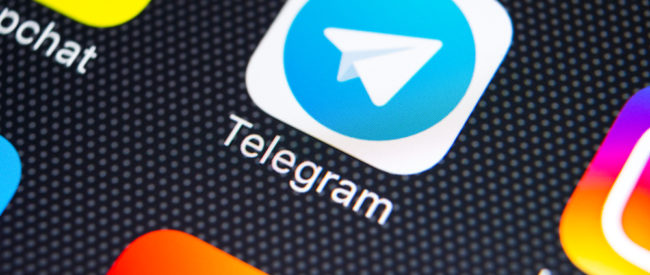
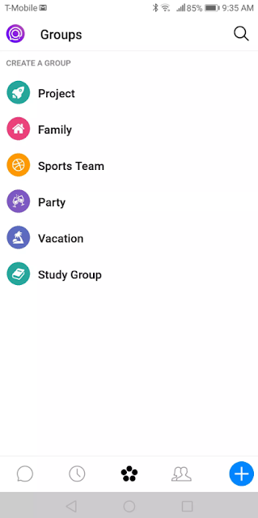
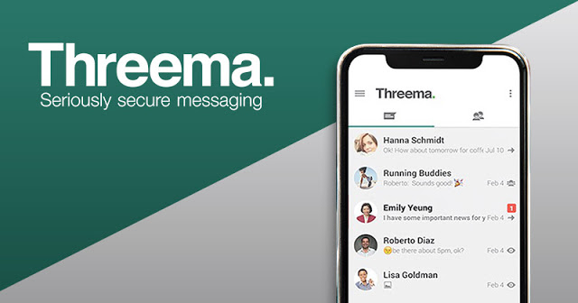
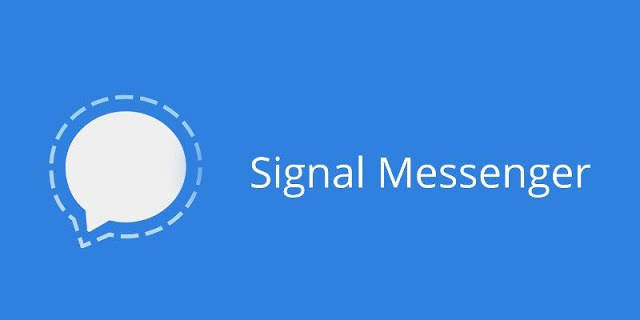
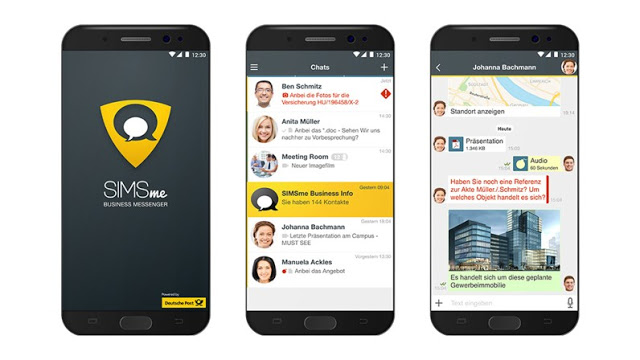

It's hard to miss WhatsApp when it comes to hosting a dinner, a trip with friends or colleagues. This instant messenger service counted in 2018 more than 1.5 billion active users in the world. The doubts towards IM popular application increase, especially since WhatsApp is a iliated to the Facebook headquarters, and it transmits data to Facebook. 

Many users are protesting against the company and the fact that it has access to your phone number and your usage data, which allows it to broadcast targeted ads on your devices. Data protection experts o en advise users to use safer messaging services. But what would be the alternatives to WhatsApp?

## 1\. Telegram

Telegram is a company of the two Russian brothers Pavel and Nikolai Durov, who made their name by founding VK or "in touch", a platform similar to Facebook. These two brothers had to leave Russia and the Kremlin began to control their Internet services more severely, and then created the Telegram platform. 

This alternative to WhatsApp has taken over the technology of the WhatsApp messaging application, continuing to develop it. Telegram is cloud-based , which means that the user can upload their Telegram content to different mobile devices as well as to a computer. 

In addition, large amounts of data can be exchanged continuously. The amount of data that can be exchanged on WhatsApp, on the other hand, is limited to the capacity of the medium used.

Telegram is essential because it is a safe application. Developers o er two different types of encryption : for all private and group chats, there is server-to-client encryption that is used to encrypt message data between the sender and the server, as well as those between the server and the server recipient. 

The encryption of the so-called "secret chats" is done from end to end : thus, only senders and recipients can have knowledge of the messages. Telegram itself has no access to these contents and therefore, can not retransmit them, even if they are at a given time located on a server, between the sending and receiving the message.

Messages sent with end-to-end encryption are not cloud-based and therefore can not be loaded from di erent devices by the recipient. There is also a parameter within Secret Cats, which allows messages to self-destruct a er a certain time. These messages can not be copied or transferred either, and when a user closes a message, the message automatically disappears from their device.

In this context, it is important to mention that WhatsApp uses end-to-end encryption for all messages shipped in its current version. Since this type of encryption is impossible with content on the cloud, Telegram must compromise on data protection in order to o er the best experience to its users. 

Many users have gone from WhatsApp to Telegram, not for better security, but because of Facebook's acquisition of WhatsApp.

With Telegram, there is also no assurance that the company will continue to follow this course of action or that it will not be bought by another company. On the contrary, the structure of the company poses concerns of transparency. Users who prefer data protection to comfort should move towards another alternative to WhatsApp.

## 2\. Spike

Spike is a dialog-based e-mail application, designed primarily as a collaboration tool, but thanks to its group discussions , it also works as a high-end alternative to WhatsApp. 

The program, developed by an Israeli so ware company, transforms the electronic inbox into a modern dialogue platform without complex elements such as the subject of the message or the signature. 

However, your own e-mail account remains the central fixed point , which is why Spike registration is not linked to the indication of a personal mobile number, as is the case for other alternatives. at WhatsApp.

The Spike newsgroup usage system is reminiscent of WhatsApp: created at the push of a button, all users who also have a Spike account can be added to a group. In this case also, the only requirement is the indication of the corresponding e-mail address.

Over joining a group, all users can exchange real-time messages that are readable by all. The number of groups you want to use depends mainly on you (but in the basic version there is a limit of ten groups). Unlike the usual use of an email client, this WhatsApp alternative, like other email services, reports that a user types a message by displaying three consecutive points.

Of course, Spike also allows you to exchange private messages with one person: not only written messages can be sent, but also voice messages. 

Spike can also be used to make video calls . The Spike team attaches great importance to data protection, so all data is encrypted before transmission via AES-256 and is also stored on the servers . Each message has its own unique key.

One of the main advantages of Spike is that the communication tool can be used not only via the multiplatform web application, but also via native applications for iOS , Android, Windows and macOS. 

Once the account is created, private conversations and group conversations can be easily tracked and conducted from any device.

All versions are completely free for private use, only people who want to use Spike in their business or for commercial purposes must subscribe a monthly subscription.

## 3\. Threema

Threema is a Swiss instant messaging application. Like most alternatives to WhatsApp, Threema stands out as a secure application for data protection. 

Like WhatsApp, the encryption of Threema content is therefore end-to-end . In addition, messages are deleted from the server as soon as they are received by the recipient. 

With Threema, groups and contact lists are only transmitted on mobile devices, not on the server. When Threema synchronizes your contacts from the contact list on your Smartphone, this is done anonymously on the server. 

Unlike WhatsApp, Threema does not store or communicate any metadata. This alternative to WhatsApp takes the data protection of users far more seriously than its competitors. Threema's servers are located in Switzerland and therefore subject to strict data protection guidelines.

Threema not only convinces about data protection, but also stands out with some useful features. Threema o ers a voting function that allows users to share polling tools, votes, and evaluation very easily. You will be able to agree places, dates of meetings with friends thanks to this tool. The program also o ers a PIN lock function for private cats.

The problem with Threema, as well as with all the alternatives to WhatsApp, is that the number of users is quite small, and the fact that the application is paying . 

You can buy one or more licenses of the application on your download service or the Android version on the developer's store. It is also possible to pay via PayPal or bitcoins.

## 4\. Signal

Social website of Open Whisper Systems is not very well known, like most alternatives to WhatsApp. The proprietor of Signal, Open Whisper Systems, has taken over the basis of end-to-end encryption so ware, whose code is free and has been used to develop Whatsapp, Telegram and Threema. 

Edward Snowden and the team around cryptographer Moxie Marlinspike, founder of Open Whisper Systems, use Signal and have an excellent reputation in the IT security industry. 

Open Whisper Systems is fully funded through scholarships and donations, not through advertising.

Security is highlighted with Signal, and we expected no less from the instant messaging service created by such security experts. Private messages as well as group messages are encrypted end-to-end with Signal, and as with Threema, phone numbers are made anonymous for transmission with the server. 

On the other hand, the user is obliged to share his contacts with Signal during registration. This is optional with WhatsApp, however, it is almost unusable without sharing contacts. Signal stores very little metadata, and especially not who communicates with whom.

For security reasons, Signal does not have a backup function. Unlike Threema, users can transmit backups from one device to another with the same operating system. 

For other operating systems, you have the option to export one of the Cats one by one. Signal also offers an export function for Android. It is also possible to secure content on another device, but this process takes much longer than a typical backup. 

The advantage with this is that the backup does not fall into the wrong hands. For the same reason, you can not take screenshots on Signal.

Apart from the free source code and the absence of the backup function, Signal stands out from Threema by its encrypted call function. 

Signal seems more interesting than Threema in terms of different aspects: the messaging is free code and has a call function. Users, for whom data backup is important and who prefer servers to be located in Europe, should also favor Threema.

## 5\. SIMSme

This application was developed by the German Post , which has released its own SIMSme messaging service. 

In the meantime, the service was sold to Brabbler AG, which is already represented in the market with ginlo instant messaging. For SIMSme users, nothing should change, at least in the near future.

Like most WhatsApp alternatives, SIMSme offers its users the encrypted sending of messages and files, free of charge and without advertising. 

You can increase the protection of your own data by scanning a QR code in a personal interview with a contact and verifying their identity. Well, In order to send and receive best WhatsApp status visit [vediostatus.com](https://www.vediostatus.com/romantic-status) and choose anybody from your WhatsApp contacts list.

The messages that self-destruct are a particular feature of SIMSme: photos, videos and chat messages can be deleted automatically when the recipient has seen them. 

It is also possible to send messages at a predetermined time. To do this, simply set the desired send time in advance. 

Two other features of the application: the user can learn about the news via content channels and, thanks to the proximity of the application with the post o ice and DHL, the shipping information of the parcel service can also be easily received via SIMSme. 

However, this feature is currently only available to users based in Germany.

The application is available in a free version for private users and in a paid variant for business customers. 

Companies have the opportunity to have the appearance of the application tailored to their own brand. Unlike private users, business customers can also download versions for tablets and PCs.

## WhatsApp Alternatives: Are They Competitive?

The biggest drawback of all alternatives to WhatsApp is the low number of users in Western countries. Almost no one wants to try to convince their friends to use a new email application. 

It also becomes difficult when it comes to opting for a new application for a workgroup, because it's common to forget to check this specific messenger. 

But this must not be an argument against safe couriers. You can safely install multiple email applications, and notifications will appear next to each other on the home screen of your smartphone. 

The more you use an email application that does not use metadata, the less reliable the application usage data. You still have time to convince your friends and colleagues to use these alternatives.

**Recommended Reading:**

- [Best WhatsApp Status](https://sastaeinstein.com/2018/07/whatsapp-quotes-status-free-2018.html)
- [Myths of Hacking Facebook](https://sastaeinstein.com/2017/03/myth-of-hacking-facebook.html)
