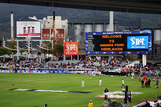

Every Indian is already a big fan of the game Cricket. It's no wonder. We all Indians don't live in India, some lives in other countries with the same craze as all Indians about the cricket.  

Well, in this article I'm going to show you How to watch **IPL T20 2018** on Hotstar from other countries. Hotstar is popular in India. Almost and around **5M** watches Live IPLT20 streaming online on their smartphones, computers and tablets and that too in India.  

    Hotstar is available on PlayStore/AppStore as an Application where it broadcast the live IPLT20 Cricket Matches. The main thing is that it works only when you're in India. It has geo-location restrictions, therefore, it broadcast live cricket matches only to Indians living in India.  

## **How to remove Hotstar's Geo-Location Restrictions?**

It's simple. You just need to follow the steps I'm showing you below.  

- **Visit** [**VPNjanjit**](http://www.vpnjantit.com/free-pptp-india.html) **and note down the following i.e,** _**Server, Username, & Password.**_

> _**Servers**:_ in1.vpnjanjit.com (or) in2.vpnjanjit.com

> _Username:_ vpnjanjit.com

> _Password:_ It changes from time to time. Visit the link to get new password.

1. Go to _Control Panel_
2. Click on _Network and Internet_
3. Go to _Network and Sharing Centre_
4. Select "_Setup a new connection or network"_
5. Now choose "_Connect to a workplace"_
6. Then select the first one which mentions **VPN**
7. Enter the credentials you noted down in the first step.
8. You are successfully connected to an Indian server. Everything site you visit actually thinks you're from India including Hotstar.

## **Interesting Facts About Hotstar**

Hotstar is another giant video streaming platform where thousands of shows and series are hosted including India's top shows. They host all popular TV Shows from India, Star Plus, HBO, National Geographics, Colors and of course all Star Sports channel which streams the most popular game in India, i.e, Cricket.

- Hotstar have currently 300 million monthly active subscribers
- 100,000 hours of content is available on Hotstar
- 267 Million people streamed **India Premier League Cricket Tournament 2019**
- Hotstar paid **$600** **Million** to stream IPL for 5 years

**Update:**

If VPNJajit is not working, here we have another Fast VPN which is free but requires you to sign up for their service. Their servers are super fast and are located in Chennai, India.

Visit [HideMe](https://hide.me/en/network/india-vpn) to know more about it.

Enjoy watching IPL!

If you like the article, then share it with your family around the world. Introduce them to cricket and show them about how they can watch it live from anywhere in the world.

If you have any issues, drop the comments below to get help ASAP.
