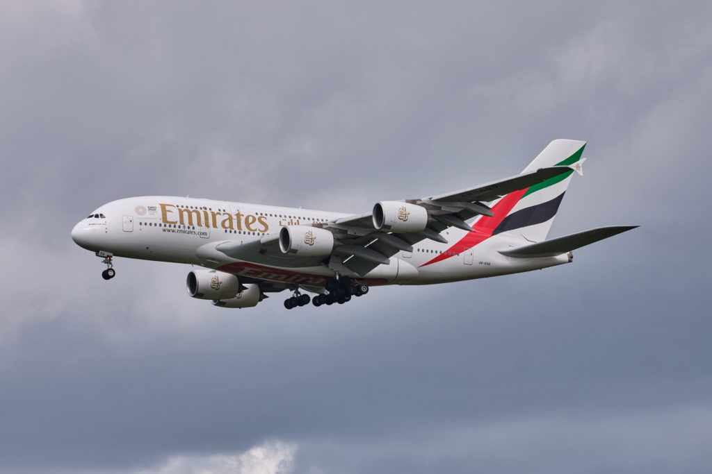

Flying can be hilarious sometimes! We get thrilled to the place we are visiting and also kind of disappointed that you'll have to spend a lot of time in the air above.

If you're the one certainly who cannot afford to travel in business or first class then it's actually pain in the ass to fly an economy.

Upon several requests from my fellow readers, I am here sharing my experience with flying 5+ hours flights and the reason to **why you should be picking flights by aircraft types.**

The huge aircraft with capacity of 500 passengers? Any idea? If you're an [Aircraft](https://sastaeinstein.com/tag/aircraft/ "Aircraft") Agnostic then you might already know the aircraft.

For those who don't, here's the **[Airbus A380](https://sastaeinstein.com/tag/airbus-a380/ "Airbus A380") by Emirates.**

Huge right? Look closely, it's a damn **Double Decker** aircraft!

Fun fact is that, Emirates is the largest operator of [Airbus A380](https://sastaeinstein.com/tag/airbus-a380/ "Airbus A380") and owns whopping 142 such aircrafts.

I was lucky enough to travel with [Airbus A380](https://sastaeinstein.com/tag/airbus-a380/ "Airbus A380") (Economy Class) back in 2013 for the shortest duration ever for this gigantic Airbus.

I flew from **DXB, Dubai** to **Hyderabad, India** on this [Airbus A380](https://sastaeinstein.com/tag/airbus-a380/ "Airbus A380"). Believe me or not, they use to fly [Airbus A380](https://sastaeinstein.com/tag/airbus-a380/ "Airbus A380") for a mere 4 hour flight.

Now back to the main headline, why I am saying all this? Yes, there is a shitty experience with Economy classes with many airlines.

So far, I flew with many airlines which are countable though.

1. Emirates (Best Economy Class Ever Due To Their Perfect [Aircraft](https://sastaeinstein.com/tag/aircraft/ "Aircraft") Selections)
2. Saudia (Another good economy class, not best)
3. Oman Air (Fairly on lower side, the flights are packed)
4. Air India (Sucks, you'll regret flying)
5. Air Arabia (Worst, you have to pay for everything inside)

**What is the mission of this post is exactly?**

You plan, you pack and now it's time to fly.  There you go, stuck in choosing what Airlines to fly and how comfortable it will be.

Of course, there are many out there who aren't frequent travelers but also they don't want their flying experience to suck either at check-in, inside the aircraft, service or the check-out.

## What [Aircraft](https://sastaeinstein.com/tag/aircraft/ "Aircraft")s Are Most Comfortable?

The question is very self-explanatory. I have already listed some airlines above and their experience for those who are in hurry and now we go in depth of why I "Quoted" them bad or good.

If you're flying with any of the airlines, you can always check what aircraft your flight will be in.

**The Best [Aircraft](https://sastaeinstein.com/tag/aircraft/ "Aircraft") Seating Is In,**

1. [Boeing 777-300ER](https://sastaeinstein.com/tag/boeing-777-300er/ "Boeing 777-300ER")
2. Airbus A320

If you're going with economy class, then these aircraft above are just pure good in terms of comfort. Larger seat and leg space are offered.

## My Story of Picking Flights By [Aircraft](https://sastaeinstein.com/tag/aircraft/ "Aircraft") Type And Why You Should Do The Same?

Yes, I am that particular guy who intentionally picks the flight tickets by rechecking and confirming on which aircraft I'll be flying. Since last 2 years, it's a trend now that each airlines make a stop in a country where the airlines base is situated.  I changed the travel plans once travelling from Hyderabad, India to Muscat, Oman. It was Oman airlines (WY236) and then I immediately checked the flight details with FlightRadar and there you go boy, I found the aircraft which was Boeing 737-91M(ER) to be accurate and being from the 737 Max family, I became skeptical about flying on that flight.  I changed my route and the airlines, all because I wasn't sure to be travelling in Boeing's 737 family at all where in past almost many crashes happened. Apart from this, 737-91 is smaller and way congested in the economy class. No proper seating arrangements and very small flight. I then changed my route from via Oman at first to via Dubai. I took Emirates EK525 to fly from Hyderabad, India to DXB, Dubai. I finally flew with [Boeing 777-300ER](https://sastaeinstein.com/tag/boeing-777-300er/ "Boeing 777-300ER") and I loved it.  For people out there who are [Aircraft](https://sastaeinstein.com/tag/aircraft/ "Aircraft") Agnostic, I advise them to check the aircraft details prior to make a reservation or booking with the airlines since they can charge for changing flights later after a reservation is made. If you're aircraft agnostic, you can check flights flying with particular airlines, for example, doing a simple google search for \[Airlines Name + Your initial destination + Final Destination\] brings you the flight numbers. You can then search this flight number on flightradar24 to check what aircraft it is. I check aircrafts before flying because of the following reasons, 1. I need to ensure my safety during the flight and yes all airlines make it sure but mistakes happen so I avoid recent tragedies occured on some selected aircrafts. Like in my case, boeing 737. They stopped the production of aircrafts but they are still flying, so fair deal, I just avoid them.  2. Secondly, I need large seating areas even in Economy classes. A lot of less people are actually able to fly business or first but rest sticks with Economy. The 737-91 aircraft from Oman air is congested and packed in economy class. The knee touches the seat at front. I'm not flying in such aircraft where I have to spend hours sitting. I know several people in my circle who picks flights by planes or say aircraft and mostly do this due to the reasons I mentioned above.  Yes, I advise the readers to make a note of what aircrafts they are flying in, but I am neutral on this as well. I know and understand that many leading airlines make very sure of your safety and you might not need to worry but it always good to stay 2 steps ahead.

## Closing Thoughts

It is not necessary always to pick flights with aircraft types. Your safety is always given first priority by Airlines. However, if you're an aircraft agnostic then I may suggest you to look at it before flying. Also there are many people who wants to fly comfortably and they can too check aircraft types before flying.

Comment down below your thoughts on this. I'll be glad to open a discussion.
