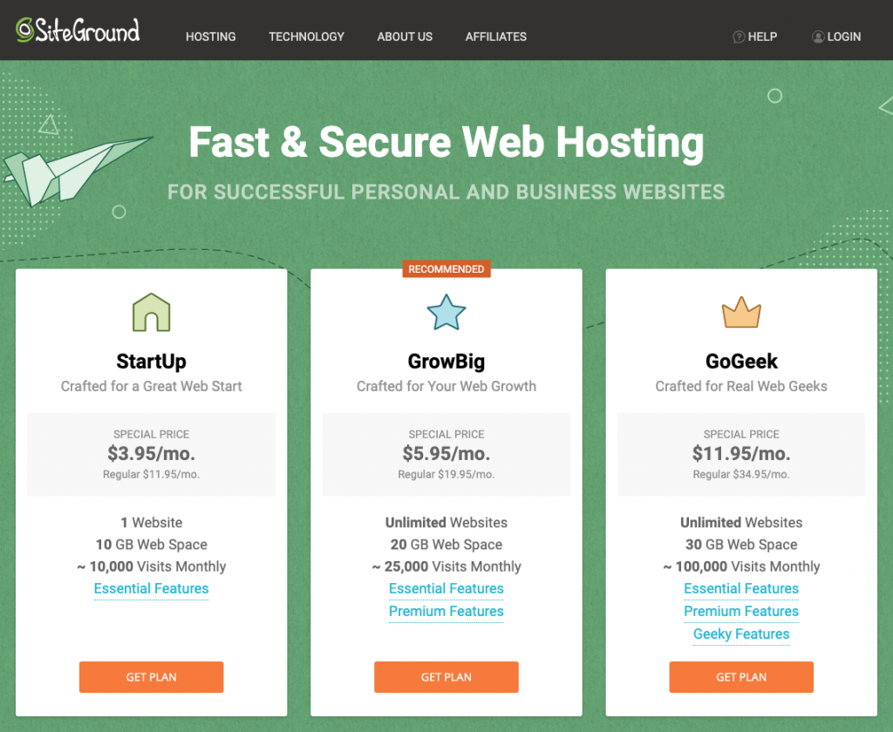
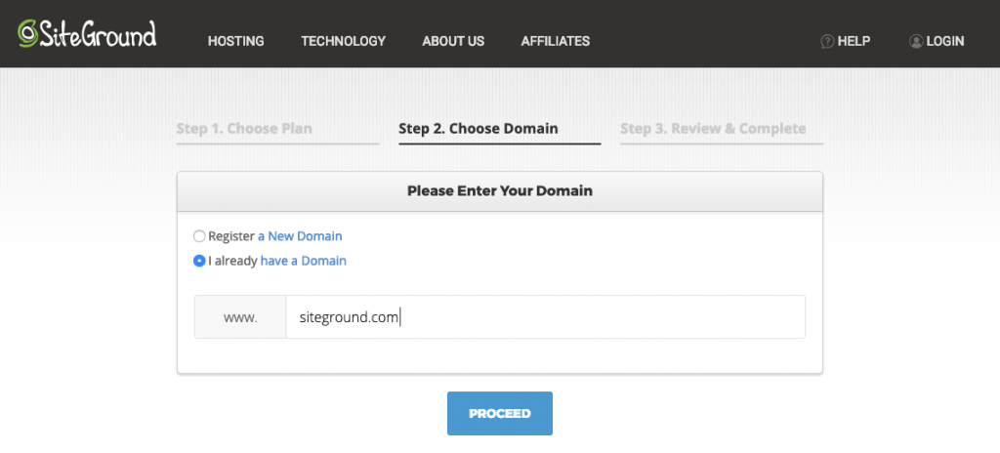
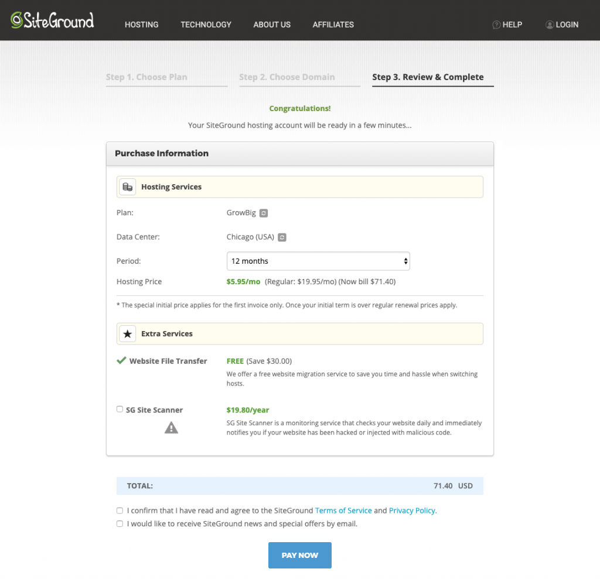
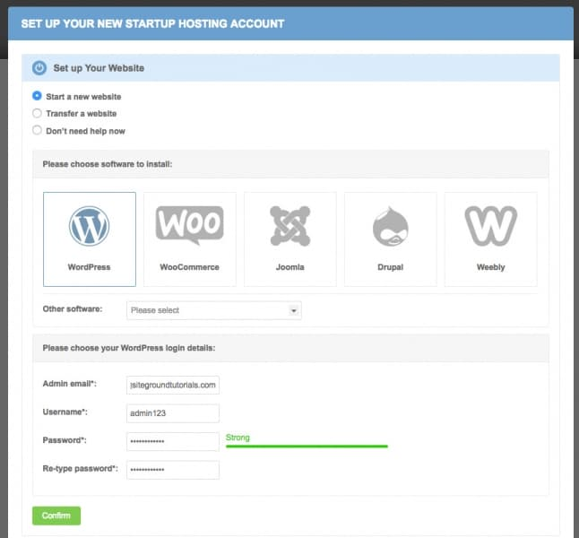
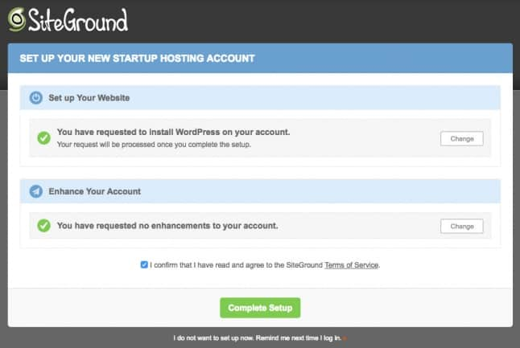
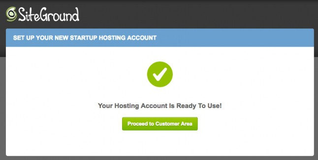
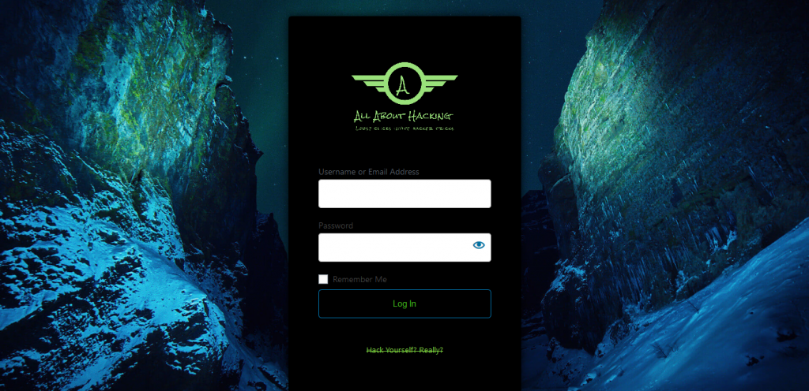

It's 2020 and starting a blog for yourself is easier and lot more affordable only when you know how to do it in the right way. There were tons of emails and messages asking me how to start a blog in 2020 and earn money.

It's better to get your own blog either a personal or for your business both works. If you have some lying talent out there and willing to share it with people and at the same time looking to earn some money with the [monetization technique.](https://sastaeinstein.com/make-money-blogging/)

Previously, I have written an in-depth covering [how to start a blog in India on Hostinger Hosting.](https://sastaeinstein.com/how-to-start-blog-in-india/)

The previous one shows how to create a blog step by step. If you're new to making a blog, you should follow the previous article.

**Before going into the article further,** I wanted to bring this up to you. There are ways around to start a blog free and earn with it. _A little investment should be made to get your own hosting and domain if you're totally serious about._ 

It will be a hassle to move later and your blog isn't yours when it is free. I have a total of 3 hosting packages for you depending upon your seriousness of starting a blog and earning money from it.

div > .bdt-pricing-column">

### SiteGround

$ 3 95 Monthly [Get Now](#)

- Free SSL & Email
- Free CDN
- Daily Backup

Powerful div > .bdt-pricing-column">

### Hostinger

$10.99 $ 2 89 Monthly [Get Now](https://sastaeinstein.com/go/hostinger)

- Unlimited Websites
- 2X Performance
- Optimized For WordPress Blogs

This Blog Is Hosted By div > .bdt-pricing-column">

### BlueHost

$7.99 $ 2 75 Monthly [Get Now](#)

- 50GB SSD Storage
- Free SSL
- Standard Perfformance

Popular

## A Guide To Start A Blog With SiteGround

Before starting to create your very first blog, you will need to sign up for [**SiteGround**](https://sastaeinstein.com/go/siteground/ "Siteground") and purchase their hosting. Although I guide you throughout the process, their **customer service** is amazing and always assist you perfectly.

## Signing Up For SiteGround Hosting:

### Step 1: Choose A Hosting Plan

The [SiteGround](https://sastaeinstein.com/go/siteground/ "Siteground") offers 3 amazing plans as per your requirement and the first plan is a **StartUp** plan for those who are planning to start. If you're getting started with just a single website or blog, you can go for this plan.

1. The **StartUp** plan is perfect for people with one website that are starting now.
2. The **GrowBig** plan is a great value for money offer, including the option for multiple websites and the SuperCacher that greatly improves website speed.
3. The **GoGeek** plan is perfect for people with e-commerce and larger sites, or more geeky development needs like more server resources and GIT integration.

### Step 2: Choose a Domain Name

After choosing the hosting plan, it offers you to choose your domain name or if you have existing one, you can enter it as shown below.

### Step 3: Review And Complete The Order

Unlike many other hosting providers, SiteGround advertised discount applies to any of the initial periods chosen during the sign up process. Being able to get the low price for the one year period is a fact that increases conversions greatly in comparison to other providers where the lowest monthly price applies only for the longest period. **Therefore, SiteGround is a best choice for hosting.**

## A Guide To Start A Blog With SiteGround

After purchasing the hosting from SiteGround, you'll be now able to sign in to the members area and will be shown your hosting package available. Since, it will be your first time signing in therefore you will be asked if you want to **start a new website** on your account. You'll see the following.

Just after doing the following above, a section will appear where you will be entering a new login information and saving it somewhere safe as shown above. This **will be your WordPress Login Information.**

Once you entered all the information, click on the **Confirm** button as shown below.

That's how simple it is to install the **WordPress** on to your hosting with [SiteGround](https://sastaeinstein.com/go/siteground/ "Siteground"). Once you click on confirm, you will be shown this page.

## How To Login To Your WordPress Blog?

To login to WordPress, you just need to type in your domain follow by /wp-admin. **For example,** abc.com/wp-admin. You'll see the following page to put in the login details you chosed in the [previous step above](#logininfo).

To customize your login screen, you can follow this [custom login screen guide](https://www.wpbeginner.com/plugins/how-to-create-custom-login-page-for-wordpress/). Now after logging in, you will be able to setup the site as per your need. You can install themes and plugins.

## Wrapping Up

There are many hosting you can choose from, however they should be reliable enough to hold onto them and give you enough resources to provide smooth experience to your website or blog and to the customers. In my opinion, SiteGround has been very reliable hosting providers from ages. Their pricing are strategically kept and the performance is top notch. You may not need to think twice before opting for there service.

[Get 3 Months SiteGround Free On Signup](https://sastaeinstein.com/go/siteground)
