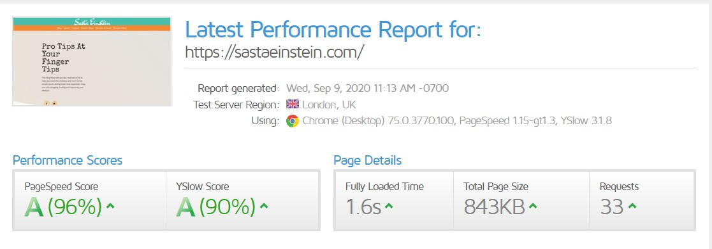
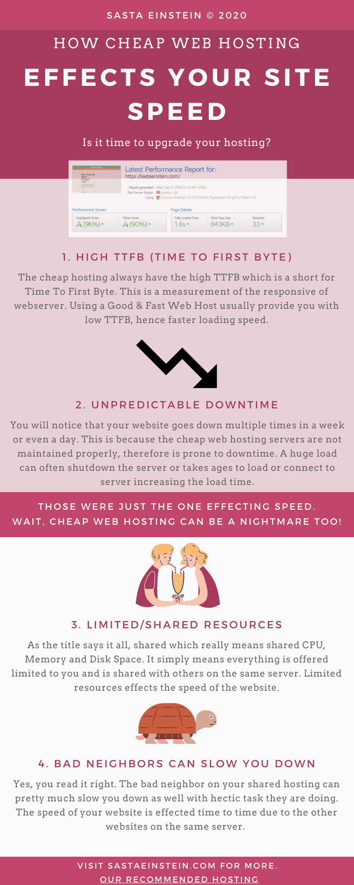

Cheap Web Hosting can be a big pain in the ass for many people out there. It is simply because we overlook the differences and the potential and chose the price to be the deciding factor for our website and now the speed completely sucks. The website is sluggish and you yourself are not willing to browse your own website or blog, leave alone the visitors. It can be daunting nightmare to manage such sites at the back end too with limited resources they are capable of and the low disk space.

The cheap web hosting really effects on the speed of the website hence effecting various things along the way such as,

1. **SEO (Search Engine Optimization)**
2. **Pretty Bad Support**
3. **Can be vulnerable to security issues such as DDOS attacks**

Overall, it's a long list and you don't want to know it to move away from cheap web hosting. The cheap web hosting clearly are cheap for a reason. They attract the customers and make a trap of "**Unlimited Everything"** with a small asterisk on the top declaring their own "**_Terms & Condition"_** which most of us likely to ignore it anyway.

Likewise, there are many bloggers and YouTube content creators reviewing the cheap web hosting like the one as it is the best in the market to get a mere affiliate commission. They themselves would have never used it.

However, I recommend **[Hostinger](https://sastaeinstein.com/go/hostinger)** as the best Web Hosting in terms of **performance** and **speed.** Yes, clearly I use Hostinger. This site is proudly hosted on Hostinger and performs exceptionally well. Checkout my GtMetrix Stats below,

Some of you might be wondering, if I am lying you about the Hosting I use. For those, I am attaching my Hostinger hPanel screenshot below. The reason I am uploading the screenshot is for your own ease and site's like **WhoIsHostingThis** aren't able to tell which hosting I am using when site is protected by Cloudflare Protection.

I have also compiled the Infographics on how a cheap web hosting can adversely effect the speed and performance of your website and why cheap web hosting is totally a big NO.

**Read More:**

- [How to create a blog on WordPress? \[2020 Edition\]](https://sastaeinstein.com/start-a-blog-2020/)
- [Start a blog in India (Step-by-Step) guide](https://sastaeinstein.com/how-to-start-blog-in-india/)
- [Hostinger Shared Hosting Full Review](https://sastaeinstein.com/cheapest-hosting-for-blog/)
