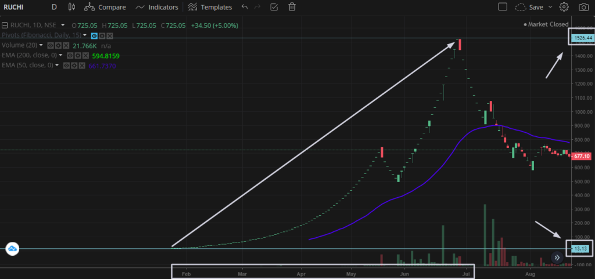

> _Futures, stocks, and options trading involves substantial risk of loss and is not suitable for every investor. The valuation of futures, stocks, and options may fluctuate, and, as a result, clients may lose more than their original investment. All trading strategies are used at your own risk._
> 
> **Disclaimer**

Every time I stumble upon my email, there's dozen of email in one go, asking "**How much will I need to Invest In Share Market?", "Can I invest Rs 100 in the** share market?", "What is the minimum amount of money I need to invest in the **share market?"**

### **Table of content**

- [What is the minimum amount to invest in Stock Market?](#h-what-is-the-minimum-amount-to-invest-in-stock-market)
- [What Stocks Can Beginner Invest In?](#h-what-stocks-can-beginner-invest-in)
- [Conclusion](#h-conclusion)

I decided to step off by replying to each one of them and instead write a post on it separately so it clears all the beginner's doubts trying to enter the Stock Market.

If you haven't still read my previous posts on Stock Market, then please go ahead and read them to get a better understanding of the Stock Market.

- [How I Started Trading In Stock Market? The Basics of Investing In Stock Market](https://sastaeinstein.com/basics-of-investing-in-stock-market/)
- [How To Pick Stocks For Investing?](https://sastaeinstein.com/how-to-pick-stocks-for-investing/)
- [A Super Guide To Investing Other Than Stocks For Increasing Your Wealth](https://sastaeinstein.com/investing-other-than-stocks/)

## What is the minimum amount to invest in Stock Market?

**To be honest,** there is no minimum amount to invest in Stock Market. You can enter into Stock Market with pretty much any amount.

**How exactly?**

In Stock Market, there are thousands of companies listed. Each and every company is traded in the stock market at different prices as per their valuations.

For example, **INFOSYS** is trading at Rs 1293 (at the time of writing this post)

You decided that you want to invest in **INFOSYS** since you see that the company might do well in the future,

For investing in 1 Share of INFOSYS, you will need Rs 1293.

Well, see it all depends on the **SHARE PRICE** of particular company.

Now, for example, let's take **Vodafone Idea** trading at Rs 10.95 (at the time of writing this post)

You decided to buy the share of Vodafone Idea since you think that their merger can do pretty well in future and the company can make profits soon.

In this case, you will need **Rs 10.95** to buy one share of Vodafone Idea.

In short, it all depends.

So, instead of asking "How much money I need to invest in stock market?"

Ask yourself "Which companies I am going to invest in?"

**AND PLAN ACCORDINGLY!**

## What Stocks Can Beginner Invest In?

Well, this is a very good question but it is solely biased. However, you can pick the stocks fundamentally. I have covered the topic on [how to pick stocks](https://sastaeinstein.com/how-to-pick-stocks-for-investing/) and it will help you in deciding.

If you're an investor with less money to put in the market, then I strongly advice you to pick **Penny Stocks** (Stocks Under Rs50).

However, you need to be very cautious in picking such stocks. Since there are small, they are usually not very good in valuation. They are also involved in huge debts and aren't very respectable in the market.

**List of Penny Stocks That Might Do Well In Future:**

1. **Pulz Electronics** (NSE: PULZ) (CMP: Rs 13.45)
2. **Prima Industries** (BSE: 531246) (CMP: Rs 15.80)
3. **FCSSOFT** (NSE: BE - FCSSOFT) (CMP: Rs 0.80)
4. **Wellness Noni** (CMP: Rs 5.27)

These above stocks are fundamentally good and can be kept for long term (1-2 years). You don't need to do anything, you either lose small amount over time or make huge amount.

Take an example of **Ruchi Soya Industries**, this penny stock was trading at Rs15 and in over 3-4 months of time, it skyrocketed to above Rs 1000 per share. Take a look at yourself. It was a multi-bagger.

## Conclusion

I hope you got the point. The point is it's never about "**How Much Should I Invest?"** and it's all about **"How Much I Am Willing To Invest?"**. It all depends on the shares.

The simple formula is pick the shares you think that have potential. Think out of the box, think long term.

For example, **I picked Battery Stocks** for long term. Why?

Simple. In future, the demand of electric cars can increase even though no one is talking about it now. These electric cars ofcourse run on batteries.

In India, especially with "MAKE IN INDIA" tag, the batteries will be manufactured by our own companies like AMARAJABATTERIES, EXIDE INDUSTRIES, and so on.

This is how you think, shortlist, Then study the company fundamentals, and then decide to invest your specified amount as per your budget.
