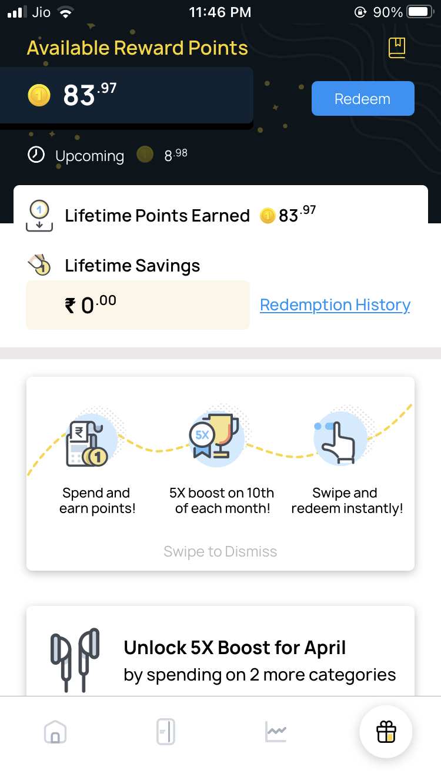

**Note:** _Apply for OneCard Credit Card from the link provided to get 80% approval chances. They are most likely to approve when you're referred_. [**Apply Now!**](https://sastaeinstein.com/go/onecard/ "OneCard")

**A Metal Credit Card,** are you serious? Yes, I am serious. It's 100% metal and if I am not wrong, I dropped it to double check and it's metal for sure.

The crazy looking combination of matte finished black along with glossy finished black gives it a killer look. Moreover, this is a **VISA Signature** card.

My first impression upon the design of card was amazing and it meets my expectations completely. It is just perfectly polished and balanced and feels extra premium than all the cards I owned previously. Enough talking, take a look at yourself.

One of the previous card offered by PayTM, I reviewed that as well. Checkout the [PayTM First Credit Card Review](https://sastaeinstein.com/paytm-first-credit-card-review/)

## Features & Benefits of OneCard

The key benefits which made me opt for this credit card apart from it being Metal are,

1. **ZERO Joining Fee**
2. **ZERO Annual Fee**
3. **ZERO Fee For Redemption of Reward Coins**
4. **Interest Free Period of 48 days**
5. **Can convert large payments into EMI**

Yes, you read that right. There are no fees at all. You just need to apply and check if you're elgible and that's it. Upon spending through this card, **you get points.** This points are for lifetime, and you can redeem them whenever you want. You get the exact amount of points for your purchase and there is no expiry for that earned points.

  
You can repay your expenses in certain category with these points earned. **In addition to this,** you get 2x reward points on top 2 spend categories.

Here's how simple the reward section looks like in the OneCard Powerful application.

**You also get the surcharge waiver for the fuel in case, you use the Credit Card at Petrol Pumps.**

## How To Apply For OneCard? What Exactly Is It?

OneCard is a credit card offered by **IDFC Bank** and it is one of a kind. It is a VISA Signature credit card but certainly doesn't offer much rewards like regular VISA Signature cards do.

However, if you're like me and doesn't care much about rewards since I use them less and only use credit card when I am out of money or my payment is stucked somewhere then this is the card for you. 

Apart from that, it's metal. I said, one of a kind. I don't care much about rewards though.

**[To Apply For OneCard, you need to visit this link.](https://1cardapp.page.link/AsBc)**

It's fairly easier to apply for OneCard Credit Card since when you download the application and proceed with your details then itself they process the application and let you know if you're eligible within 5 minutes.

However, if you're not then it's highly likely that your **Credit Score** is not upto the mark. Anyway, you will be in their waitlist and will be notified if you're eligible later in the future.

I exactly don't know how OneCard eligibility is being monitored but I believe it's on the basis of Credit Score since it's a credit card.

**I personally** applied for OneCard in December 2020 and was in their waitlist even though my **Experian Credit Score** was around **815/900.** Yes, OneCard checks your credit history with Experian rather than CIBIL.

Even though my score was high, but the outstanding cards/loans accounts age was relatively low and I suspect that might be the red flag for them to consider me.

You can read more about [how they evaluate OneCard Applications](https://getonecard.app/legal/evaluate/).

## When Will I Get The Physical Card?

Once your application is accepted, you will issued a virtual card inside the OneCard application and you will also get an approved limit depending on your Credit Score.

Since I am still a student and have no job or source of income but I do have good score, therefore, I got an approved limit of around 40,000 to spend which is pretty much good for me since I use credit cards less.

**Update:** _Exactly after 6 months completed, I recieved a limit enhancement of Rs 20,000 which makes my overall credit limit to Rs 60,000_

From inside the app, you will be able to order your physical metal card and it will be delivered to you within 3-4 business days and the courier is **Bluedart.**

## Are There Any Hidden Fees or Something You Should Know?

**No,** there are no hidden charges or fee so far.

However, if you want to close your card within the first 6 months of virtual card being activated then you need to pay **Rs 3,000 as cancellation fee.**

 **Interest rates are** around 2.5% to 3.5% per month if you failed to repay the amount on date or past the interest free days.

**If you lost** your OneCard, the re-issuance fee for first plastic card is Zero then second onwards, it is Rs 145. If you need a metal card again, you should pay Rs 3,000.

## Conclusion

Hope you got to know about this beautiful OneCard Credit Card. It is an amazing entry-level credit card and if you are looking for such card, then OneCard is definitely the good choice.
