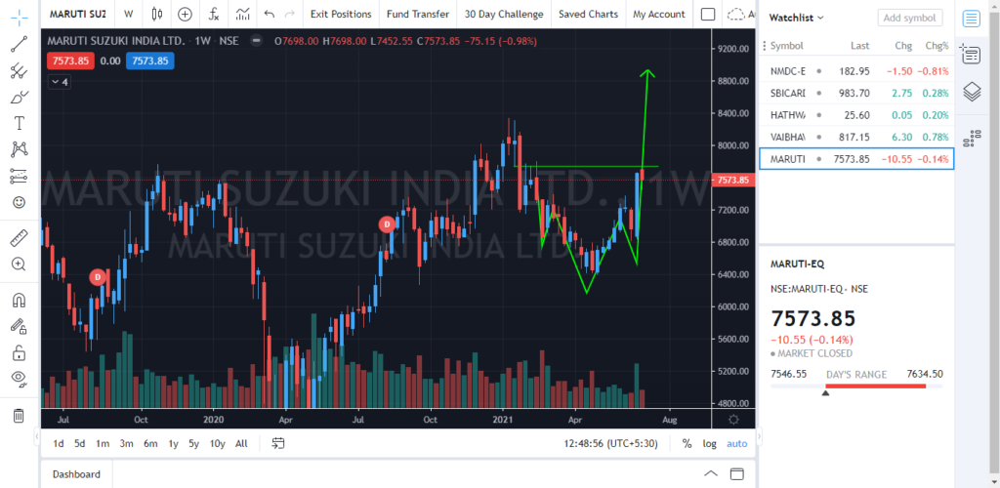
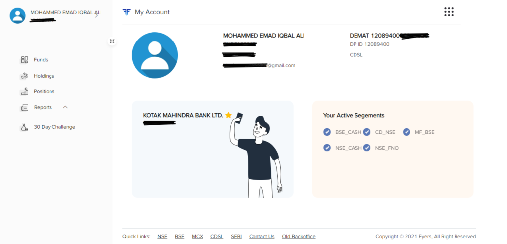
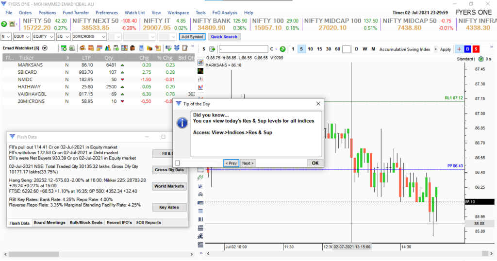
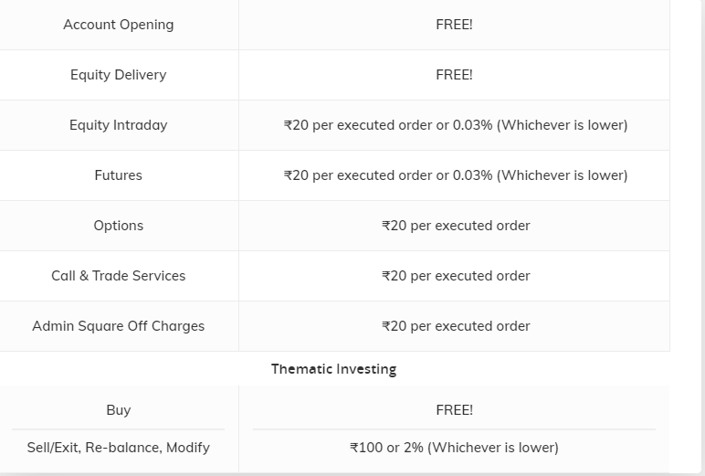
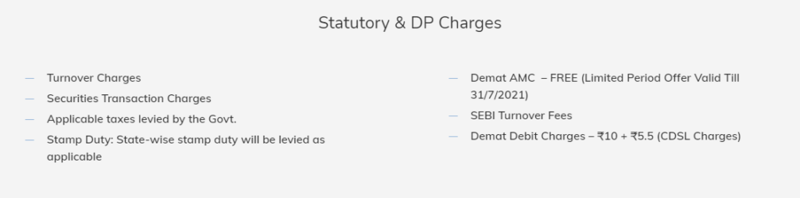

[Upstox](https://emadsblog.com/upstox-review/), you already know this broker since this broker has been actively promoting their platform everywhere. From this season IPL to advertising on Social Platforms.

We also know [Zerodha](https://emadsblog.com/zerodha-full-review-is-it-really-the-1-broker-in-india/), and this broker is our main for a long time. We as traders or investors, obviously workaround with multiple DEMAT/Trading accounts since we have multiple types of trading/investing to deal with.

If you see my example, I primarily use Zerodha to trade in Currency and mainly only in USD/INR and not cross-currency.

Now apart from this, I need different brokers for my positional trading and BTST positions.

This is the only reason, as far as I know, traders/investors have multiple DEMAT accounts with different brokers. One of them is also due to few features offered by some and not offered by the current broker they use.

## Fyers Full Review 2021

I was flabbergasted upon the features offered by the Fyers and the recent campaign they are running, I couldn't just resist getting an account for myself.

I was active on Twitter and the tweet just popped out of nowhere from [Tejas Khoday](https://twitter.com/tejaskhoda) and he was the behind-the-scenes of Fyers.

When I went to see some tweets and was amazed that they were offering a DEMAT/Trading account **Free of Cost** for a lifetime.

Yes,

- **No Account Opening Charges**
- **No DEMAT Annual Maintenance Charges**
- **30 Days Challenge, If you win you're refunded with your brokerage charges upto 10k**

Not just this, I just went to check it out and its features were just awesome and yes apart from their back office, everything is just so good and I will let you know why.

Firstly, they promised that they will be working on making **Back Office** more attractive and easy to use with a lot of cool filters and information.

[Open Account With Fyers (Free AMC Lifetime)](https://open-account.fyers.in/?id=XM03764)

### Features of Fyers

- **Fully Trading View Integrated Terminal** (Decide Yourself)

Fyers Web Terminal & yes, that's Maruti Inverse Head & Shoulder :p

- Clean & Easy Interface  
    

Fyers Backend (My Account)

- The Amazing **Fyers One** terminal that too free of cost

Fyers One (Windows)

* * *

### Fyers Charges Explained

Fyers is just another discount broker therefore, there is no big change in their charges as well. Fyers also charges **Rs 20/order** across all segments except **Equity Delivery**.

For Equity Delivery, there are no charges. You can get detailed charges below

[Fyers Brokerage Charges](https://fyers.in/pricing/)

Fyers DP Charges

### How Good Is Fyers And Is It Trustworthy?

I have been using Fyers for weeks now, and I haven't got into any single trouble. Yes, however, the Fyers App is a little glitchy but I think they are working on it.

The only issue I got with App on iOS, I was shown different prices when the market is closed. Upon, opening the chart or going into details of a scrip, it shows the correct price.

Yes, Fyers is trustworthy and is a SEBI registered broker. You can check out their details below

_SEBI Registration No: INZ000008524  
CDSL : IN-DP-432-2019  
NSE Member Code: 90061  
MCX Member Code: 56100  
BSE Member Code: 6697_

### Trading Experience With Fyers

When it comes to trading, the app and web terminal perform flawlessly. Especially **for scalp traders,** the drag and drop feature of Fyers is just amazing.

You can instantly place StopLoss, Buy and Sell on the chart itself. Basically, it is everything in **Trading View.** It's like buying the premium pack of Trading View but connected with your broker.

I am a fan of Trading View, and I never experienced the Full Premium Features with other brokers like Upstox and Zerodha. They just provide it as Charting Tool not fully integrated where you can also use Trading View watchlist which has good filtering options.

Yes, Fyers still have a long way to go and it is not as fast as Zerodha especially if you use App to trade. However, the Fyers One and Fyers Web Terminal are flawless and wonderful to trade even with huge quantity and as fast as your want.

Fyers also partnered with Algo Enabled platform called TradeTron and been offering good offers on it.

[Open Account With Fyers (Free AMC Lifetime)](https://open-account.fyers.in/?id=XM03764)

The offer of FREE AMC is valid only till the 31st of July 2021. Hurry Up!

## Conclusion

Overall, I recommend you open your DEMAT account with Fyers. I hope you liked this Full Fyers Review and it helped you with your decision. For newbies, it is a good opportunity since they are opening your account for free and also you don't need to pay AMC for a lifetime.

That's a steal deal for many since you don't need to worry about closing accounts due to Annual Charges even if you planned to stop trading or investing in the future which happens a lot with newbie traders.

You can just come anytime back and resume your trading without the hassles of closing an account and taking off and then opening an account again.
