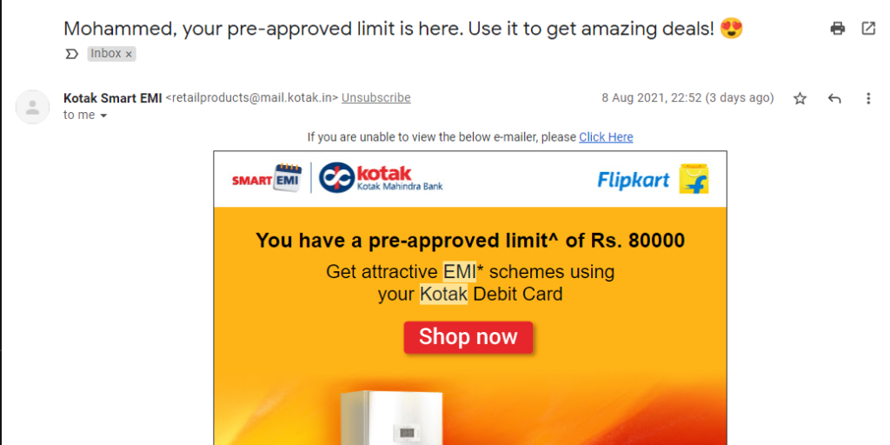
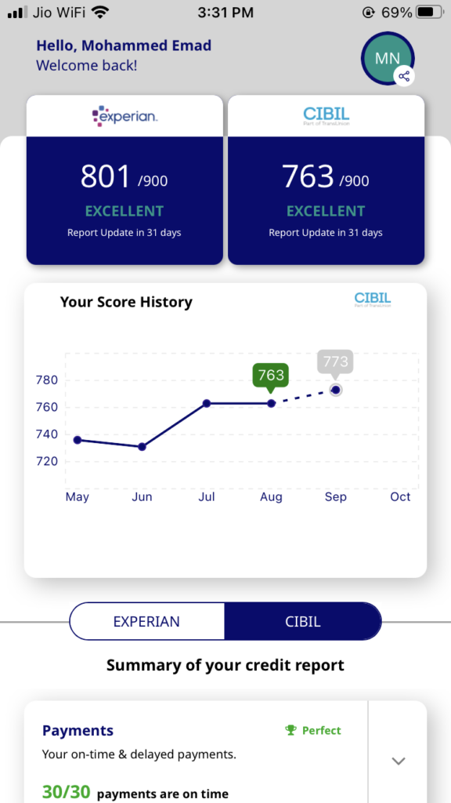

About 90% of the people I met aren't aware of the **credit score.** Every time they go like, what's that? That 10% who are aware doesn't have a very good Credit Score. In this article, I will show you to improve credit score fast.

This struck me with an idea to compile a post on **How To Improve Credit Score** and share the secret sauce that helps get a perfect above **750** CIBIL score.

Many of you might be thinking that anything above 750 is very hard to get? Well, it isn't much harder if you follow and stick to the rules.

Most importantly, the rules are much easier than you think they are. Let's dig more into it and discover the secrets to improve credit score fast.

## What Is Credit Score (CIBIL, Experian, CREF)?

It's simple as it sounds. A **Credit Score** is definitely a score that helps **Credit Lenders** judge you based on the score. A credit lender basically needs to verify about you whether you can pay the loans on time or if you have a history of it doing in the past.

The credit score is used by **Non-Banking Financial Institutions** and as well **Banks** to make sure you have good repayment history in the past and on this basis, they determine that whether you are likely to default or not.

This is how simple it is. Just 3 numbers but decides if you're worthy of any type of loan out there so you shouldn't underestimate this CIBIL or any credit bureau score.

## Why CIBIL Score Matters?

This is by far the most asked question to me. Many of them are surprised to see my score touching above 750 even when I am just 21. At the age of 21, being a student and without consistent income, I am offered plenty of offers from different banks and NBFCs.

Recently, Kotak Bank offered an **80,000 credit limit** from their Kotak Smart EMI. With them, I can get anything on no-cost EMI or EMI from Amazon or Store Walk-in with my **debit card** and they will convert it into EMI for me. I don't even need a credit card.

Below is the screenshot, you might want to refer to.

The point here is, CIBIL score plays an important role. Once you have a perfect score, you don't even need to ask or search for loans, loan comes walking to you.

However, loans are debt and if you don't know how to use **debt, then you can be in a serious problem.**

Now if the score is low and falls below 700, then it is most likely that the majority of lenders simply won't consider taking a look at your application. They will plainly reject it and your interest rate will be much higher even if you manage to get the loan or credit card.

**Do you also have a perfect score?** Check out [OneCard Credit Card, India's First Metal Credit Card.](https://sastaeinstein.com/onecard-credit-card-review/)

## How I Should Improve Credit Score Quickly?

Improving your credit score can be a pain in the ass, to be honest. You never know, what's the real culprit behind the decrease in the points of your credit score. However, there are some certified measures you can keep in check to keep your score maintained and even increase rapidly.

CIBIL does offer a paid subscription with which you can monitor your Credit Score whenever you want instead of getting one free report per month. Anyway, let's not go there.

**Who am I to tell you, how to increase the score?**

Well, I myself have been following all the tips lately and has been able to achieve a whopping **763** CIBIL Credit Score from **720** within a span of 2-3 months. Below is the screenshot of my current score for your reference.

[OneScore App](https://www.onescore.app/)

### Tips To Improve Credit Score

- **Pay your complete due** **and on time or early but within DUE DATE.**  
      
    You need to pay complete due. Some of you might be thinking that it's okay to pay just the minimum due but it's not. You're being charged interest on regular basis on remaining amount as well as your score is getting effected. It is better to pay off the complete due every month instead of Minimum Amount Due.  
    
- **Never Utilize The Credit Card To The Maximum Limit**  
      
    Yes, you heard it right. Never do this. Your credit score is effected if you hog on all the limit given to you. Although, it's minimal impact but it does impact your credit score and your score might reduce in the long run. If your total credit limit is **INR 1,00,000** then use only **30% of it or at the max, 50%** but anything above 50% might effect your credit score.  
    
- **Keep a mix of loans. Get both unsecured & secured loans**  
      
    This might not be the most important point but it is always good to have mixed loans. This is because, Credit Bureau see's this as a positive sign and can boost your credit score effectively in the long run.

* * *

> "Also remember, you have to repay any due amount within due date as 35% of all the score is solely based on timely repayments."
> 
> ~ Emad

* * *

- **Use Credit Card Regularly Even For Small Purchase And Pay** **On Time**  
      
    Even if you have don't have the need to use the credit card, but do it anyway for small purchases and repay it on time. This will again boost your score in the long run.  
    
- **Use Your Credit Card For Your Benefits**  
      
    I usually pays all my bills using my Credit Card and use the original amount of my bills in some short term trades and earn extra returns and withdraw them before my due date to pay back and keep the profits. You can use the amount in [equity market](https://emadsblog.com/does-investing-in-stocks-make-you-rich/).

## Wrapping Up

Getting a perfect score is not a big deal when you already have credit cards. However, when you don't have one, and also poor score or no score then it's pretty hard to get a credit card. In this case, you need to first get a secured credit card under a Fix Deposit also called FD Card.

You can then build up your score and later apply for the unsecured credit card. I hope this post is informational for you. Thanks for your time.
